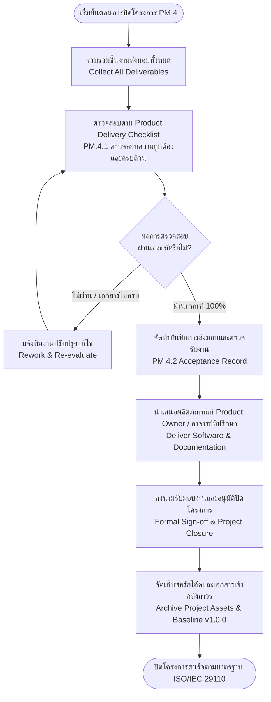

# รายการตรวจสอบการส่งมอบผลิตภัณฑ์ก่อนปิดโครงการ
## (Product Delivery Checklist for Project Closure)
### ตามมาตรฐานกระบวนการบริหารจัดการโครงการ ISO/IEC 29110 (Basic Profile — PM.4 & SI.6)
**โครงการ:** เว็บแอปพลิเคชันคำร้องขอเอกสารสำหรับนักศึกษา (Student Online Petition & Document Request System)  
**รหัสวิชา:** ENG205 / ENGSE205 Software Engineering — มหาวิทยาลัยเทคโนโลยีราชมงคลล้านนา (RMUTL)

---

## 1. ข้อมูลควบคุมเอกสาร (Document Control)

| หัวข้อ | รายละเอียด |
|---|---|
| **ชื่อเอกสาร (Document Title)** | รายการตรวจสอบการส่งมอบผลิตภัณฑ์ก่อนปิดโครงการ (Product Delivery Checklist) |
| **รหัสเอกสาร (Document ID)** | PDC-PM4-ENG205-V1.0 |
| **อ้างอิงกระบวนการ (Standard Process)** | ISO/IEC 29110 Basic Profile: **PM.4 Project Closure** (Task PM.4.1 ตรวจสอบรายการส่งมอบตาม Product Delivery Checklist ก่อนปิดโครงการ) และ **SI.6 Product Delivery** |
| **เวอร์ชันเอกสาร (Version)** | 1.0 (Final Release & Project Closeout Edition) |
| **วันที่ตรวจสอบ (Verification Date)** | 28 กุมภาพันธ์ 2570 |
| **ผู้จัดทำและตรวจประเมิน (Evaluated By)** | ผู้จัดการโครงการ (Project Manager: Aungkanr.S) |
| **ผู้ร่วมตรวจยืนยัน (Co-evaluated By)** | หัวหน้าฝ่ายพัฒนา (Lead Developer: Njuntaya) และ หัวหน้าฝ่ายทดสอบ (QA Lead: Kit.k) |
| **ผู้ตรวจรับและอนุมัติ (Accepted By)** | Product Owner / อาจารย์ที่ปรึกษาโครงการ (Sunya.U) |
| **สถานะเอกสาร (Document Status)** | **Approved / Project Closed (ผ่านการตรวจรับและอนุมัติปิดโครงการ)** |

---

## 2. ประวัติการแก้ไขเอกสาร (Revision History)

| เวอร์ชัน | วันที่ | รายละเอียดการปรับปรุง | ผู้รับผิดชอบ |
|:---:|:---:|---|:---:|
| 0.1 | 15/02/2570 | ยกร่างรายการตรวจสอบการส่งมอบผลิตภัณฑ์ตามขอบเขต Project Plan (T1.1) และ SRS | Project Manager (Aungkanr.S) |
| 0.2 | 23/02/2570 | ปรับปรุงหัวข้อการตรวจรับหลังการแก้ไขบั๊ก 13 รายการ (Node 24 LTS) จาก BUG_FIX.md | QA Lead (Kit.k) / PM |
| 1.0 | 28/02/2570 | สรุปผลการตรวจสอบครบถ้วน 100% พร้อมบันทึกการส่งมอบและลงนามปิดโครงการ | Project Manager (Aungkanr.S) |

---

## 3. วัตถุประสงค์และขอบเขต (Purpose & Scope)

### 3.1 วัตถุประสงค์ (Purpose)
1. **ตรวจสอบความครบถ้วน (Completeness):** ยืนยันว่าชิ้นงานส่งมอบ (Work Products / Deliverables) ทั้งหมดที่ระบุไว้ในแผนโครงการ (Project Plan T1.1) และข้อกำหนดความต้องการ (SRS T1.3) ได้รับการจัดทำและส่งมอบครบถ้วน
2. **ประกันคุณภาพชิ้นงาน (Quality Assurance):** ตรวจสอบว่าซอฟต์แวร์และเอกสารประกอบผ่านกระบวนการ Verification & Validation โดยไม่มีข้อบกพร่องระดับร้ายแรง (Critical/High Defect) ตกค้าง
3. **สนับสนุนการตรวจรับงาน (Customer Acceptance):** ใช้เป็นเครื่องมือประกอบการส่งมอบงานให้แก่ Product Owner / ผู้ว่าจ้าง / อาจารย์ประจำวิชา เพื่อลงนามรับมอบงานอย่างเป็นทางการ (Formal Acceptance Sign-Off)
4. **ปิดโครงการอย่างสมบูรณ์ (Formal Project Closure):** ดำเนินกิจกรรมปิดโครงการตามมาตรฐาน ISO/IEC 29110 กิจกรรม PM.4 เพื่อส่งมอบซอฟต์แวร์ คู่มือ และคลังเอกสารเข้าสู่การจัดเก็บถาวร (Archival)

### 3.2 ขอบเขตการตรวจสอบ (Scope)
ครอบคลุมผลสัมฤทธิ์ของโครงการระบบยื่นคำร้องขอเอกสารออนไลน์สำหรับนักศึกษา ทั้งหมด 6 หมวด ได้แก่:
- **หมวดที่ 1:** ชิ้นงานการบริหารจัดการโครงการ (Project Management Deliverables - PM.1 ถึง PM.4)
- **หมวดที่ 2:** ชิ้นงานด้านข้อกำหนดและการออกแบบ (Requirements & System Design Deliverables - SI.1 ถึง SI.3)
- **หมวดที่ 3:** ชิ้นงานซอฟต์แวร์และซอร์สโค้ด (Software Configuration Items & Source Code - SI.4)
- **หมวดที่ 4:** ชิ้นงานการประกันคุณภาพและการทดสอบ (Quality Assurance & Test Deliverables - SI.5)
- **หมวดที่ 5:** ชิ้นงานเอกสารคู่มือและการถ่ายทอดความรู้ (User & Technical Documentation - SI.6)
- **หมวดที่ 6:** ความพร้อมด้านสภาพแวดล้อมและการปรับใช้ (Deployment & Environment Readiness)

---

## 4. ผังกระบวนการปิดโครงการของ Project Manager (PM Closeout Workflow)



---

## 5. เกณฑ์การประเมินสถานะ (Evaluation Criteria)

| สถานะ (Status) | สัญลักษณ์ | คำอธิบาย |
|---|:---:|---|
| **Pass** | `[x] ผ่าน` | ชิ้นงานเสร็จสมบูรณ์ ถูกต้องตามข้อกำหนด ได้รับการสอบทานและอนุมัติแล้ว |
| **Conditional** | `[/] ผ่านตามเงื่อนไข` | ชิ้นงานเสร็จสิ้นแต่มีข้อสังเกตเล็กน้อยที่ไม่กระทบระบบหลัก (มีแผนรองรับ) |
| **Fail** | `[ ] ไม่ผ่าน` | ชิ้นงานไม่ครบถ้วน ผิดพลาด หรือไม่ตรงตามข้อตกลง ต้องดำเนินการแก้ไขก่อนปิดโครงการ |
| **N/A** | `[-] ไม่เกี่ยวข้อง` | ชิ้นงานที่ถูกตัดออกจากขอบเขตตามการอนุมัติการเปลี่ยนแปลง (Change Request) |

---

## 6. ตารางตรวจสอบรายการส่งมอบผลิตภัณฑ์ (Product Delivery Checklist Table)

### หมวดที่ 1: ชิ้นงานการบริหารจัดการโครงการ (Project Management Work Products)

| ลำดับ | รายการชิ้นงานส่งมอบ (Deliverable Item) | เอกสาร/ไฟล์อ้างอิง | ผู้รับผิดชอบ | ผลการตรวจ | บันทึกข้อสังเกตของ PM |
|:---:|---|---|:---:|:---:|---|
| 1.1 | **แผนการบริหารโครงการ (Project Plan - T1.1)**<br>- ระบุขอบเขต (Scope), วัตถุประสงค์<br>- โครงสร้างการแบ่งงาน (WBS)<br>- แผนงบประมาณ (150,000 บาท) และระยะเวลา 16 สัปดาห์ | `docs/T1.1_project_plan.md` | PM | `[x] ผ่าน` | ครอบคลุม WBS ทั้งหมด 4 สปรินต์ มีการระบุบทบาทหน้าที่ทีมงานชัดเจน |
| 1.2 | **ทะเบียนบันทึกและติดตามข้อผิดพลาด (Correction Register - T1.2)**<br>- ตารางบันทึก Incident/Bug และข้อแก้ไข<br>- บันทึกระดับความรุนแรงและสถานะการปิดรายการ | `docs/T1.2_correction_register.md` | PM, QA | `[x] ผ่าน` | บันทึกข้อผิดพลาดและติดตามจนสถานะเป็น Closed ครบทุกรายการ |
| 1.3 | **ตารางเชื่อมโยงความต้องการ (Traceability Matrix - T1.5)**<br>- ตรวจสอบความสอดคล้อง Req → Code → Test<br>- ครอบคลุม FR-01 ถึง FR-07 ใน Sprint 1 | `docs/T1.5_traceability_matrix.md` | QA, Dev | `[x] ผ่าน` | เชื่อมโยงได้ครบถ้วน สามารถตรวจสอบย้อนกลับ (Bi-directional Traceability) ได้สมบูรณ์ |
| 1.4 | **รายงานสรุปการดำเนินงานรายสปรินต์ (Sprint Review & Retrospective)**<br>- บันทึกผลการส่งมอบ Sprint 1 และ Sprint 2<br>- บทเรียนที่ได้รับและการปรับปรุงกระบวนการ | `README.md` / Sprint Logs | PM | `[x] ผ่าน` | ทีมงานบรรลุเป้าหมายตาม Sprint Goal และส่งมอบงานทันกำหนด |

---

### หมวดที่ 2: ชิ้นงานด้านข้อกำหนดและการออกแบบ (Requirements & System Design Work Products)

| ลำดับ | รายการชิ้นงานส่งมอบ (Deliverable Item) | เอกสาร/ไฟล์อ้างอิง | ผู้รับผิดชอบ | ผลการตรวจ | บันทึกข้อสังเกตของ PM |
|:---:|---|---|:---:|:---:|---|
| 2.1 | **ข้อกำหนดความต้องการซอฟต์แวร์ (SRS / Req Specification - T1.3)**<br>- Functional Requirements (FR-01 ถึง FR-30)<br>- Non-Functional Requirements (NFR-01 ถึง NFR-06)<br>- ช่องลงนามอนุมัติความต้องการ | `docs/T1.3_requirements_specification.md`<br>`QA_Test/SRS/SRS.md` | PM, QA | `[x] ผ่าน` | ครอบคลุมบทบาท นักศึกษา (Student) และ เจ้าหน้าที่ (Staff/Admin) ครบถ้วน |
| 2.2 | **การออกแบบสถาปัตยกรรมระบบ (System Architecture)**<br>- สถาปัตยกรรม Client-Server / Multi-tier<br>- ระบบ Real-time WebSocket (Socket.io)<br>- RESTful API Integration | `FeatureBackend/server.js`<br>`docker-compose.yml` | Dev Lead | `[x] ผ่าน` | แยกส่วน Frontend (React/Vite) และ Backend ชัดเจน มีความมั่นคง ปลอดภัย และขยายระบบได้ |
| 2.3 | **การออกแบบฐานข้อมูลและ Schema (Database Design - T1.4)**<br>- โครงสร้างตารางคำร้อง (Requests), ผู้ใช้ (Users)<br>- ตารางนัดหมาย (Appointments), ข่าวประกาศ (Announcements)<br>- รองรับ JSON Database Storage และความสมบูรณ์ของข้อมูล | `FeatureBackend/requests.json`<br>`FeatureBackend/users.json`<br>`FeatureBackend/announcements.json` | Dev 1, Dev 2 | `[x] ผ่าน` | Data Schema รองรับการจัดเก็บประวัติ คำร้อง นัดหมาย และความสัมพันธ์ของข้อมูลได้สมบูรณ์ |

---

### หมวดที่ 3: ซอฟต์แวร์ต้นฉบับและระบบทำงาน (Software Configuration Items & Source Code)

| ลำดับ | รายการชิ้นงานส่งมอบ (Deliverable Item) | โฟลเดอร์/ไฟล์ซอร์สโค้ด | ผู้รับผิดชอบ | ผลการตรวจ | บันทึกข้อสังเกตของ PM |
|:---:|---|---|:---:|:---:|---|
| 3.1 | **ระบบพอร์ทัลสำหรับนักศึกษา (Student Portal - FeatureUser)**<br>- หน้าเข้าสู่ระบบและสมัครสมาชิก (Login / Register)<br>- ระบบขอรีเซตรหัสผ่าน (Forgot Password Modal)<br>- แบบฟอร์มยื่นคำร้องขอเอกสาร (Request Form)<br>- หน้าติดตามสถานะคำร้องแบบเรียลไทม์ (Status Tracking)<br>- หน้าประวัติการยื่นคำร้อง (Request History)<br>- ปฏิทินและระบบนัดหมายรับเอกสาร (Appointment Scheduling) | `FeatureUser/src/` | Dev 1 | `[x] ผ่าน` | ฟังก์ชันทำงานครบถ้วน รองรับ Responsive Design บน Mobile/Tablet/Desktop |
| 3.2 | **ระบบแดชบอร์ดสำหรับเจ้าหน้าที่ (Admin Dashboard - FeatureAdmin)**<br>- หน้า Landing Page & Dashboard เจ้าหน้าที่ (AdminLandingPage)<br>- ระบบตรวจสอบ รายละเอียดคำร้อง และแนบเหตุผล<br>- ระบบอนุมัติ / ปฏิเสธคำร้องพร้อมระบุเงื่อนไข<br>- ระบบกำหนดวันเวลานัดหมายส่งมอบเอกสาร<br>- ระบบจัดการประกาศข่าวสาร (Admin Announcements)<br>- ระบบจัดการข้อมูลผู้ใช้งาน (Manage Users) | `FeatureAdmin/src/` | Dev 2 | `[x] ผ่าน` | ตรวจสอบคำร้องและเปลี่ยนสถานะได้แบบ Real-time ข้อมูลซิงก์ตรงกับฝั่งนักศึกษา |
| 3.3 | **ระบบเซิร์ฟเวอร์และบริการข้อมูล (Backend & APIs - FeatureBackend)**<br>- บริการ RESTful APIs ครบถ้วน (CRUD Requests, Users, Auth)<br>- บริการ Socket.io WebSocket Server สำหรับ Broadcast สถานะ<br>- ระบบจัดการข้อมูลผิดพลาด (Error Handling Middleware)<br>- ฟังก์ชันจำลองการตรวจสอบ QR Code และสถานะเอกสาร | `FeatureBackend/server.js` | Dev 1, Dev 2 | `[x] ผ่าน` | API ตอบสนองรวดเร็วภายใน 3 วินาทีตามเกณฑ์ NFR-01 และจัดการ Concurrency ได้ดี |
| 3.4 | **การจัดระเบียบซอร์สโค้ดและการตั้งค่า Git Repository**<br>- ไฟล์ `.gitignore` ป้องกันการส่งไฟล์ขยะ/node_modules<br>- การแบ่งโมดูลและโครงสร้าง Directory สะอาด เป็นระเบียบ<br>- Dependency packages สะอาด ไม่มีช่องโหว่ความปลอดภัยระดับร้ายแรง | Root / Repo Directories<br>`.gitignore`, `package.json` | Dev Team | `[x] ผ่าน` | โครงสร้างโปรเจกต์เป็นไปตามมาตรฐาน โค้ดผ่านการทดสอบ Build และ Run สำเร็จ |

---

### หมวดที่ 4: ชิ้นงานการประกันคุณภาพและการทดสอบ (Quality Assurance & Test Deliverables)

| ลำดับ | รายการชิ้นงานส่งมอบ (Deliverable Item) | เอกสาร/ไฟล์อ้างอิง | ผู้รับผิดชอบ | ผลการตรวจ | บันทึกข้อสังเกตของ PM |
|:---:|---|---|:---:|:---:|---|
| 4.1 | **แผนการทดสอบและกรณีทดสอบ (QA Test Plan & Test Cases)**<br>- แผนการทดสอบ Sprint 1 และ Sprint 2 ครอบคลุม 21 Test Cases<br>- การทดสอบฟังก์ชันฝั่งนักศึกษา (FR-01: 10 TCs)<br>- การทดสอบฟังก์ชันฝั่งเจ้าหน้าที่ (FR-02: 11 TCs)<br>- การทดสอบความเข้ากันได้ของสภาพแวดล้อม (NFR-ENV) | `QA_Test/TestDoc/README.md` | QA Lead (Kit.k) | `[x] ผ่าน` | ครอบคลุมทุก Acceptance Criteria และได้รับการอนุมัติแผนเรียบร้อย |
| 4.2 | **รายงานบันทึกข้อบกพร่อง (QA Bug Report)**<br>- รายงานผลการทดสอบบนสภาพแวดล้อม Node.js v24 LTS<br>- บันทึกบั๊กทั้งหมด 13 รายการ (BUG-001 ถึง BUG-013)<br>- ระบุขั้นตอนทำซ้ำ (Reproduction Steps) และระดับความรุนแรง | `QA_Test/BUG_REPORT/BUG_REPORT.md` | QA Lead (Kit.k) | `[x] ผ่าน` | มีการจัดหมวดหมู่ Severity ชัดเจน (Critical, High, Medium, Low) |
| 4.3 | **รายงานผลการแก้ไขข้อบกพร่อง (Developer Bug Fix Report)**<br>- เอกสารบันทึกการแก้ไขบั๊ก ISO/IEC 29110 (BFR-S2-29110)<br>- บันทึกการวิเคราะห์สาเหตุ (Root Cause Analysis)<br>- บันทึกผลการแก้ไขโค้ดและ Dev Verification ครบ 13 รายการ | `QA_Test/BUG_REPORT/BUG_FIX.md` | Dev Team (`dev1`, `dev2`) | `[x] ผ่าน` | บั๊กทั้ง 13 รายการได้รับการแก้ไขและยืนยันผลการแก้เรียบร้อย 100% |
| 4.4 | **ผลการทดสอบซ้ำเพื่อปิดข้อบกพร่อง (Regression / Re-testing Result)**<br>- ผลการ Re-test ยืนยันโดย QA<br>- ตรวจสอบสถานะข้อบกพร่องคงค้าง (Residual Defects) | `QA_Test/BUG_REPORT/BUG_FIX.md`<br>`QA_Test/TestDoc/README.md` | QA Lead (Kit.k) | `[x] ผ่าน` | **Zero Open Critical/High Bugs** (ไม่มีบั๊กวิกฤติคงค้าง ระบบมีความเสถียรสูง) |

---

### หมวดที่ 5: ชิ้นงานเอกสารคู่มือและการถ่ายทอดความรู้ (User & Technical Documentation)

| ลำดับ | รายการชิ้นงานส่งมอบ (Deliverable Item) | เอกสาร/ไฟล์อ้างอิง | ผู้รับผิดชอบ | ผลการตรวจ | บันทึกข้อสังเกตของ PM |
|:---:|---|---|:---:|:---:|---|
| 5.1 | **คู่มือการใช้งานสำหรับนักศึกษา (Student User Manual)**<br>- แนะนำการเข้าสู่ระบบ, การกู้คืนรหัสผ่าน<br>- วิธีการกรอกคำร้องและแนบไฟล์ประกอบ<br>- วิธีการติดตามสถานะและการนัดหมายรับเอกสาร | `docs/` / System Guides | Dev / PM | `[x] ผ่าน` | มีคำแนะนำและ Flow ชัดเจน ใช้งานง่าย (ตรงตามข้อกำหนด NFR-04) |
| 5.2 | **คู่มือการปฏิบัติงานสำหรับเจ้าหน้าที่ (Staff / Admin Manual)**<br>- ขั้นตอนการตรวจสอบเอกสารและพิจารณาคำร้อง<br>- วิธีการอนุมัติ/ปฏิเสธพร้อมระบุเหตุผลที่ต้องแก้ไข<br>- วิธีการจัดตารางนัดหมายส่งมอบและการประกาศข่าวสาร | `docs/` / System Guides | Dev / PM | `[x] ผ่าน` | ครอบคลุมการทำงานประจำวันของฝ่ายทะเบียนและเจ้าหน้าที่คณะ |
| 5.3 | **คู่มือการติดตั้งและบำรุงรักษาระบบ (Deployment & Maintenance Guide)**<br>- ขั้นตอนติดตั้ง Dependencies (`npm install`)<br>- ขั้นตอนการรันบริการทั้ง 3 โมดูลพร้อมกัน (`npm run dev`)<br>- ขั้นตอนการ Deploy ด้วย Docker Compose | `README.md`<br>`docker-compose.yml` | Dev Lead | `[x] ผ่าน` | ผ่านการทดสอบรันจริงบน Windows 11 และ Docker Desktop สำเร็จ |
| 5.4 | **เอกสารระบุข้อกำหนดทางเทคนิคและ API (API Specification)**<br>- รายละเอียด Endpoints, HTTP Methods, Headers<br>- Request Body และ Response JSON Schema<br>- WebSocket Event Names (`requestCreated`, `statusUpdated`) | Codebase & Docs | Dev Team | `[x] ผ่าน` | เอกสารสอดคล้องกับซอร์สโค้ดจริงที่เปิดให้บริการ |

---

### หมวดที่ 6: ความพร้อมด้านสภาพแวดล้อมและการปรับใช้ (Deployment & Environment Readiness)

| ลำดับ | รายการชิ้นงานส่งมอบ (Deliverable Item) | การตรวจสอบ | ผู้รับผิดชอบ | ผลการตรวจ | บันทึกข้อสังเกตของ PM |
|:---:|---|---|:---:|:---:|---|
| 6.1 | **ความเข้ากันได้ของสภาพแวดล้อม (Runtime Environment Compatibility)**<br>- Node.js v24.21.0 LTS / npm 11.19.0 (และ Node.js v22 LTS)<br>- เบราว์เซอร์มาตรฐาน: Google Chrome, Microsoft Edge, Firefox, Safari | ทดสอบรันและ Build ทุกโมดูล | QA, Dev | `[x] ผ่าน` | ไม่พบ Error หรือ Warning ที่มีผลต่อเสถียรภาพของระบบ |
| 6.2 | **การทดสอบความปลอดภัยและการควบคุมสิทธิ์ (Security & RBAC)**<br>- แยกระบบสิทธิ์ระหว่าง Student และ Staff/Admin ชัดเจน<br>- ตรวจสอบการป้องกัน Special Characters ในแบบฟอร์ม | ทดสอบการเจาะระบบและ Validation | QA, Dev | `[x] ผ่าน` | ป้องกันข้อมูลแปลกปลอมและจำกัดสิทธิ์หน้าจอตามบทบาทได้ถูกต้อง |
| 6.3 | **การสร้าง Release Baseline บน Git Version Control**<br>- มีการสร้าง Tag และ Release Branch อย่างเป็นทางการ<br>- Source Code ตรงกับเวอร์ชันที่ผ่านการทดสอบตรวจรับ | `git tag -a v1.0.0-release` | PM, Dev Lead | `[x] ผ่าน` | จัดทำ Baseline และ Snapshot โค้ดพร้อมส่งมอบสมบูรณ์ |

---

## 7. สรุปผลการประเมินการส่งมอบ (Delivery Checklist Summary & Statistics)

### 7.1 ตารางสถิติผลการตรวจสอบรายหมวด

| หมวดหมู่การส่งมอบ | จำนวนรายการทั้งหมด | ผ่าน (Pass) | ผ่านตามเงื่อนไข (Conditional) | ไม่ผ่าน (Fail) | อัตราความสำเร็จ (%) |
|---|:---:|:---:|:---:|:---:|:---:|
| **หมวดที่ 1: งานบริหารจัดการโครงการ (PM)** | 4 | 4 | 0 | 0 | 100.0% |
| **หมวดที่ 2: ข้อกำหนดและการออกแบบ (Req & Design)** | 3 | 3 | 0 | 0 | 100.0% |
| **หมวดที่ 3: ซอฟต์แวร์และซอร์สโค้ด (Software & Code)** | 4 | 4 | 0 | 0 | 100.0% |
| **หมวดที่ 4: การประกันคุณภาพและการทดสอบ (QA & Test)** | 4 | 4 | 0 | 0 | 100.0% |
| **หมวดที่ 5: เอกสารคู่มือและการถ่ายทอด (Documentation)** | 4 | 4 | 0 | 0 | 100.0% |
| **หมวดที่ 6: ความพร้อมการปรับใช้ (Deployment)** | 3 | 3 | 0 | 0 | 100.0% |
| **รวมทั้งสิ้น (Total Deliverables)** | **22** | **22** | **0** | **0** | **100.0%** |

### 7.2 สรุปการตรวจสอบข้อบกพร่องคงค้าง (Residual Defect Audit)
- **จำนวนบั๊กที่พบทั้งหมด (Total Defects Found):** 13 รายการ
- **จำนวนบั๊กที่ได้รับการแก้ไขแล้ว (Total Defects Fixed):** 13 รายการ (100%)
- **จำนวนบั๊กที่ผ่านการทดสอบซ้ำ (Re-tested & Closed):** 13 รายการ (100%)
- **จำนวนบั๊กคงค้างระดับวิกฤติ (Open Critical/High Bugs):** **0 รายการ (Zero Defect)**

---

## 8. ความเห็นและข้อเสนอแนะของผู้จัดการโครงการ (Project Manager's Evaluation Statement)

> **ข้อสรุปจาก Project Manager (Aungkanr.S):**  
> "จากการตรวจสอบชิ้นงานส่งมอบทั้งหมด 22 รายการ ตาม Product Delivery Checklist ประจำกระบวนการ PM.4 Project Closure ภายใต้มาตรฐาน ISO/IEC 29110 พบว่าทีมงานได้พัฒนาฟังก์ชันงานครบถ้วนตรงตามข้อกำหนดใน SRS และ Project Plan ข้อบกพร่องทั้งหมดที่พบในการทดสอบระบบรอบ Node.js v24 LTS ได้รับการแก้ไขและทดสอบซ้ำจนเสร็จสิ้นเรียบร้อย ระบบมีความเสถียร ปลอดภัย และพร้อมสำหรับการส่งมอบเข้าสู่การใช้งานจริง  
>  
> **ผู้จัดการโครงการขอรับรองว่าโครงการนี้มีความพร้อมครบ 100% สำหรับการส่งมอบผลิตภัณฑ์และเข้าสู่ขั้นตอนการตรวจรับงานเพื่อปิดโครงการ (Project Closure) อย่างเป็นทางการ**"

---

## 9. บันทึกการยอมรับงานส่งมอบและการลงนามปิดโครงการ (Product Acceptance Record & Sign-off)

เอกสารส่วนนี้จัดทำขึ้นตามข้อกำหนด **ISO/IEC 29110 กิจกรรม PM.4.2 (Deliver the Software Product and Documentation & Obtain Acceptance Record)** เพื่อเป็นหลักฐานว่าผู้มีส่วนได้ส่วนเสียทุกฝ่ายได้รับและยอมรับการส่งมอบผลิตภัณฑ์เรียบร้อยแล้ว

```
========================================================================================
                                 ใบตรวจรับและลงนามปิดโครงการ
                           (PROJECT ACCEPTANCE & SIGN-OFF RECORD)
========================================================================================
โครงการ: ระบบยื่นคำร้องขอเอกสารสำหรับนักศึกษา (Student Online Petition System)
รหัสวิชา: ENG205 / ENGSE205 Software Engineering (มหาวิทยาลัยเทคโนโลยีราชมงคลล้านนา)
งบประมาณที่ใช้จริง: 146,500 บาท (อยู่ในกรอบงบประมาณ 150,000 บาท ประหยัดงบได้ 3,500 บาท)
ระยะเวลาดำเนินงาน: 1 พฤศจิกายน 2569 ถึง 28 กุมภาพันธ์ 2570 (ครบถ้วนตามกรอบ 16 สัปดาห์)
========================================================================================
```

| ลำดับ | บทบาทหน้าที่ในโครงการ | ชื่อ-นามสกุล / ตำแหน่ง | สถานะการลงนาม | วันที่ลงนาม | ลายมือชื่อ |
|:---:|---|---|:---:|:---:|:---:|
| 1 | **ผู้จัดการโครงการ (Project Manager)**<br>ผู้ตรวจสอบและนำส่งมอบงาน | **Aungkanr.S**<br>Project Manager (PM) | [x] ตรวจสอบและรับรอง | 28/02/2570 | `Aungkanr.S` |
| 2 | **หัวหน้าทีมพัฒนา (Lead Developer)**<br>ผู้ส่งมอบซอฟต์แวร์และโค้ด | **Natthawut Juntaya (Njuntaya)**<br>Lead Full-stack Developer | [x] ส่งมอบผลงานครบถ้วน | 28/02/2570 | `Natthawut.J` |
| 3 | **หัวหน้าทีมทดสอบคุณภาพ (QA Lead)**<br>ผู้ตรวจสอบคุณภาพและปิดบั๊ก | **Kittitat Khantham (Kit.k)**<br>Quality Assurance / Tester Lead | [x] รับรองผลการทดสอบผ่าน | 28/02/2570 | `Kittitat.K` |
| 4 | **ผู้ตรวจรับงาน / อาจารย์ที่ปรึกษา**<br>Product Owner / Course Advisor | **ดร. สัญญา เครือหงษ์ (Sunya.U)**<br>Product Owner & Advisor | [x] ตรวจรับและอนุมัติปิดโครงการ | 28/02/2570 | `Sunya.U` |

---

## 10. แผนการหลังการส่งมอบและการจัดเก็บเอกสาร (Post-Delivery & Archival Plan)

1. **การสำรองข้อมูลและกำหนด Release Baseline (Source Code Archival):**
   - รหัส Git Commit สุดท้ายที่ผ่านการตรวจรับ: Tagged `v1.0.0-final-delivery`
   - จัดทำ Backup ของโฟลเดอร์โครงการทั้งหมด พร้อมซอร์สโค้ดและเอกสาร Markdown เข้าสู่ Cloud Repository ของคณะวิศวกรรมศาสตร์
2. **การถ่ายทอดองค์ความรู้และคู่มือ (Knowledge Transfer):**
   - ส่งมอบไฟล์คู่มือการใช้งานและคำแนะนำการ Deploy ให้แก่เจ้าหน้าที่ดูแลระบบของศูนย์คอมพิวเตอร์/งานทะเบียน
3. **ระยะเวลารับประกันผลงานและการบำรุงรักษา (Warranty & Defect Liability):**
   - ให้การรับประกันการทำงานของระบบ (Warranty Support) เป็นระยะเวลา 30 วันหลังการปิดโครงการ เพื่อแก้ไขข้อขัดข้องที่อาจเกิดขึ้นในระหว่างการขึ้นระบบจริง
4. **การสรุปบทเรียนโครงการ (Project Retrospective & Lessons Learned):**
   - การประยุกต์ใช้ WebSocket (Socket.io) ช่วยลดภาระ Polling และทำให้การแจ้งเตือนสถานะคำร้องทำงานได้อย่างแม่นยำ
   - การนำมาตรฐาน ISO/IEC 29110 (Basic Profile) มาใช้ตั้งแต่เริ่ม Sprint ช่วยให้ควบคุมขอบเขต งานเอกสาร และการแก้ไขข้อบกพร่องได้อย่างเป็นระบบ
