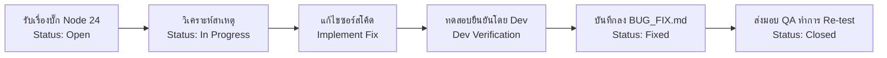

# เอกสารบันทึกและรายงานผลการแก้ไขข้อบกพร่อง (Developer Bug Fix Report)
## ตามมาตรฐานกระบวนการวงจรชีวิตซอฟต์แวร์ ISO/IEC 29110 (Basic Profile — SI.5 & PM.3)
### โครงการ: ระบบยื่นคำร้องออนไลน์ของนักศึกษา (Student Online Petition System) — รอบการตรวจสอบ Node.js v24

---
> **เอกสารคู่มือสำหรับทีมพัฒนา (Developer Fix Guidelines & Log):**  
> เอกสารฉบับนี้จัดทำขึ้นเพื่อให้ทีมนักพัฒนาซอฟต์แวร์ (Developer Team) ใช้บันทึกรายละเอียดการแก้ไขบั๊ก (Bug Fixes), การวิเคราะห์สาเหตุ (Root Cause Analysis), รายการไฟล์และโค้ดที่แก้ไข (Code Changes/Diff), และผลการทดสอบยืนยันโดย Dev โดยเชื่อมโยงกับเอกสาร [BUG_REPORT.md](file:///e:/ENG205%20reqmentWeb/Forward_the_document_-Mockups-/QA_Test/BUG_REPORT/BUG_REPORT.md) ฉบับทดสอบด้วย **Node.js version 24 (v24.21.0 LTS)**

---

## 1. ข้อมูลควบคุมเอกสาร (Document Control)

| หัวข้อ | รายละเอียด |
|---|---|
| **ชื่อโครงการ (Project Name)** | ระบบยื่นคำร้องออนไลน์ของนักศึกษา (Student Online Petition System) |
| **ชื่อเอกสาร (Document Name)** | Developer Bug Fix Report & Resolution Log (ISO/IEC 29110) |
| **รหัสเอกสาร (Document Code)** | BFR-S2-29110 |
| **เวอร์ชันเอกสาร (Version)** | 1.0 (Node.js 24 Audit Edition) |
| **สภาพแวดล้อมที่ทดสอบ (Environment)** | Node.js v24.21.0 (LTS 64-bit), npm 11.19.0, Windows 11 |
| **วันที่จัดทำ (Date)** | 23 กันยายน 2569 |
| **ผู้จัดทำเอกสาร (Created By)** | QA / Developer Coordination Team (Kit.k) |
| **สถานะเอกสาร (Status)** | Active (เปิดใช้งานสำหรับการบันทึกการแก้ไขรอบ Node 24) |

---

## 2. ขั้นตอนและแนวทางปฏิบัติสำหรับทีมพัฒนา (Workflow for Developers)



1. **รับเรื่อง (Assign):** ตรวจสอบ Bug ID ที่ได้รับมอบหมายในตาราง Dashboard ด้านล่าง
2. **ปรับสถานะเริ่มทำ:** เมื่อเริ่มวิเคราะห์/แก้โค้ด ให้เปลี่ยนสถานะเป็น `In Progress` และลง **วันที่เริ่มแก้ไข**
3. **ระบุสาเหตุ (Root Cause):** บันทึกสาเหตุทางเทคนิคที่แท้จริงลงในช่อง Root Cause Analysis
4. **บันทึกการแก้โค้ด (Code Changes):** ระบุชื่อไฟล์, ฟังก์ชัน และตัวอย่างโค้ดที่ปรับแก้ (Code Diff)
5. **ทดสอบยืนยัน (Verification):** รัน Unit Test / Component Test หรือทดสอบ flow จริงบนสภาพแวดล้อม Node.js 24 และบันทึกผล
6. **ลงวันที่แก้ไขเสร็จ:** บันทึก **วันที่แก้ไขเสร็จ (Fixed Date)** และเปลี่ยนสถานะเป็น `Fixed`
7. **แจ้ง QA Re-test:** ส่งมอบงานให้ QA ทำการ Re-test ยืนยันเพื่อเปลี่ยนสถานะเป็น `Closed` ต่อไป

---

## 3. สรุปภาพรวมสถานะการแก้ไขข้อบกพร่อง (Developer Bug Fix Dashboard)

| No. | Bug ID | วันที่รายงาน | ระดับความรุนแรง | รายละเอียดข้อบกพร่อง | ผู้รับผิดชอบ (Assignee) | สถานะปัจจุบัน | วันที่เริ่มแก้ | วันที่แก้ไขเสร็จ | ลิงก์บันทึกผล |
|:---:|:---:|:---:|:---:|---|:---:|:---:|:---:|:---:|:---:|
| 1 | **BUG-001** | 07/11/2569 | High | ขาดการตรวจสอบประเภทไฟล์แนบ (File Type Validation) | Dev A | `Open` | - | - | [บันทึกผล](#bug-001-ขาดการตรวจสอบประเภทไฟล์ที่แนบ-file-type-validation) |
| 2 | **BUG-002** | 07/11/2569 | High | ขาดการตรวจสอบขนาดไฟล์สูงสุด (File Size Validation) | Dev A | `Open` | - | - | [บันทึกผล](#bug-002-ขาดการตรวจสอบขนาดไฟล์สูงสุด-file-size-validation) |
| 3 | **BUG-003** | 07/11/2569 | Critical | กดยกเลิกคำร้องแล้วระบบลบข้อมูลทิ้งถาวรแทนที่จะเปลี่ยนสถานะ | Dev B | `Open` | - | - | [บันทึกผล](#bug-003-กดยกเลิกคำร้องแล้วระบบลบข้อมูลทิ้งถาวรแทนที่จะเปลี่ยนสถานะเป็น-ยกเลิก) |
| 4 | **BUG-004** | 07/11/2569 | Medium | ไม่มีฟังก์ชันแก้ไขคำร้องที่รอตรวจสอบ (Pending) ก่อนเจ้าหน้าที่ดำเนินการ | Dev A | `Open` | - | - | [บันทึกผล](#bug-004-ไม่มีฟังก์ชันแก้ไขคำร้องที่รอตรวจสอบ-pending-ก่อนเจ้าหน้าที่ดำเนินการ) |
| 5 | **BUG-005** | 07/11/2569 | Medium | หน้าแรกหลัง Login ไม่แสดงรายการคำร้อง และเมนูไม่อยู่ที่ Taskbar ซ้าย | Dev A | `Open` | - | - | [บันทึกผล](#bug-005-หน้าแรกหลัง-login-ไม่แสดงรายการคำร้อง-และปุ่มนำทางไม่อยู่ที่-taskbar-ด้านซ้าย) |
| 6 | **BUG-006** | 07/11/2569 | Critical | ขาดการตรวจสอบสิทธิ์การเข้าถึงข้อมูลคำร้อง (Broken Access Control) | Dev B | `Open` | - | - | [บันทึกผล](#bug-006-ขาดการตรวจสอบสิทธิ์การเข้าถึงข้อมูลคำร้อง-broken-access-control-on-api) |
| 7 | **BUG-007** | 07/11/2569 | Low | ข้อความแจ้งเตือนกรณีไม่พบรหัสนักศึกษาไม่ตรงตามข้อกำหนด | Dev B | `Open` | - | - | [บันทึกผล](#bug-007-ข้อความแจ้งเตือนกรณีไม่พบรหัสนักศึกษาไม่ตรงตามข้อกำหนด) |
| 8 | **BUG-008** | 07/11/2569 | High | เจ้าหน้าที่เห็นรายการคำร้องทั้งหมด ไม่จำกัดเฉพาะส่วนที่ตนรับผิดชอบ | Dev A | `Open` | - | - | [บันทึกผล](#bug-008-เจ้าหน้าที่เห็นรายการคำร้องทั้งหมด-ไม่จำกัดเฉพาะส่วนที่ตนรับผิดชอบ) |
| 9 | **BUG-009** | 08/11/2569 | Medium | ขาด Pop-up แจ้งเตือนข้อผิดพลาดร้ายแรง (Worst Case) พร้อมรหัสอ้างอิง | Dev A | `Open` | - | - | [บันทึกผล](#bug-009-ขาด-pop-up-แจ้งเตือนข้อผิดพลาดร้ายแรง-worst-case-พร้อมรหัสอ้างอิง) |
| 10 | **BUG-010** | 08/11/2569 | Medium | แสดงสถานะคำร้องไม่ครบ 4 สถานะตามข้อกำหนด (ขาด In Progress และ Fix) | Dev B | `Open` | - | - | [บันทึกผล](#bug-010-แสดงสถานะคำร้องไม่ครบ-4-สถานะตามข้อกำหนด-ขาด-in-progress-และ-fix) |
| 11 | **BUG-011** | 08/11/2569 | Medium | ไม่มีการแสดงสีสถานะแยกช่องทางดำเนินการ (Online / Onsite) ในหน้ารายการ | Dev A | `Open` | - | - | [บันทึกผล](#bug-011-ไม่มีการแสดงสีสถานะแยกช่องทางดำเนินการ-online--onsite-ในหน้ารายการคำร้อง) |
| 12 | **BUG-012** | 08/11/2569 | Medium | ขาดระบบส่งการแจ้งเตือนภายนอกผ่าน Email หรือ SMS เมื่อสถานะเปลี่ยน | Dev B | `Open` | - | - | [บันทึกผล](#bug-012-ขาดระบบส่งการแจ้งเตือนภายนอกผ่าน-email-หรือ-sms-เมื่อสถานะคำร้องเปลี่ยนแปลง) |
| 13 | **BUG-013** | 08/11/2569 | High | เจ้าหน้าที่สามารถกดปฏิเสธคำร้องได้โดยไม่ต้องกรอกเหตุผล | Dev A | `Open` | - | - | [บันทึกผล](#bug-013-เจ้าหน้าที่สามารถกดปฏิเสธคำร้องได้โดยไม่ต้องกรอกเหตุผล-ระบบไม่แจ้งเตือนบังคับ) |


---

## 4. บันทึกรายละเอียดการแก้ไขรายข้อ (Developer Fix Logs)

*(หมายเหตุสำหรับ DEV: เมื่อทำการแก้ไข ให้กรอกข้อมูลลงในฟิลด์ที่มีสัญลักษณ์ `[ ... ]`)*

---

### BUG-001: ขาดการตรวจสอบประเภทไฟล์ที่แนบ (File Type Validation)
- **วันที่รายงานบั๊ก:** 07/11/2569 (ตรวจพบในรอบทดสอบ Node 24)
- **สภาพแวดล้อมที่พบ:** Node.js v24.21.0 (LTS 64-bit), npm 11.19.0, Windows 11
- **ระดับความรุนแรง:** High | **ผู้รับผิดชอบ:** Dev A
- **ไฟล์/โมดูลเป้าหมาย:** `FeatureUser/src/components/dashboard/RequestForm.jsx`
- **แนวทางที่แนะนำจาก QA:** เพิ่มเงื่อนไขตรวจสอบ `allowedTypes = ['image/jpeg', 'image/png', 'application/pdf']` ใน `handleImageChange` ปฏิเสธไฟล์สคริปต์/โปรแกรมทันที

#### 📝 บันทึกผลการแก้ไขโดย DEV:
- **วันที่เริ่มแก้ไข:** `[ วว/ดด/ปปปป ]`
- **วันที่แก้ไขเสร็จ:** `[ วว/ดด/ปปปป ]`
- **ผู้ดำเนินการแก้ไข:** `[ Dev A / ระบุชื่อ ]`
- **สถานะ:** `[ ] Open` | `[ ] In Progress` | `[ ] Fixed (รอ QA Re-test)`
- **สาเหตุที่แท้จริง (Root Cause):**
  > `[ ระบุสาเหตุ เช่น Component ใช้เพียง input accept attribute โดยไม่ได้ validate MIME type ที่ e.target.files[0] ]`
- **สรุปโค้ดที่แก้ไข (Code Changes / Diff):**
  ```javascript
  // [ นำโค้ดที่แก้ไขแล้วมาวางที่นี่ ]
  ```
- **ผลการทดสอบยืนยันโดย Dev (Verification):**
  > `[ ระบุผลการทดสอบ เช่น ทดลองอัปโหลดไฟล์ .bat และ .exe บน Node 24 ระบบแจ้งเตือนปฏิเสธไฟล์ และไม่อนุญาตให้ Submit ]`

---

### BUG-002: ขาดการตรวจสอบขนาดไฟล์สูงสุด (File Size Validation)
- **วันที่รายงานบั๊ก:** 07/11/2569 (ตรวจพบในรอบทดสอบ Node 24)
- **สภาพแวดล้อมที่พบ:** Node.js v24.21.0 (LTS 64-bit), npm 11.19.0, Windows 11
- **ระดับความรุนแรง:** High | **ผู้รับผิดชอบ:** Dev A
- **ไฟล์/โมดูลเป้าหมาย:** `FeatureUser/src/components/dashboard/RequestForm.jsx`
- **แนวทางที่แนะนำจาก QA:** ตรวจสอบ `file.size > 5 * 1024 * 1024` (5MB) หากเกินให้แจ้งเตือนและล้างค่าใน input ก่อนส่ง Base64

#### 📝 บันทึกผลการแก้ไขโดย DEV:
- **วันที่เริ่มแก้ไข:** `[ วว/ดด/ปปปป ]`
- **วันที่แก้ไขเสร็จ:** `[ วว/ดด/ปปปป ]`
- **ผู้ดำเนินการแก้ไข:** `[ Dev A / ระบุชื่อ ]`
- **สถานะ:** `[ ] Open` | `[ ] In Progress` | `[ ] Fixed (รอ QA Re-test)`
- **สาเหตุที่แท้จริง (Root Cause):**
  > `[ ระบุสาเหตุ ]`
- **สรุปโค้ดที่แก้ไข (Code Changes / Diff):**
  ```javascript
  // [ นำโค้ดที่แก้ไขแล้วมาวางที่นี่ ]
  ```
- **ผลการทดสอบยืนยันโดย Dev (Verification):**
  > `[ ระบุผลการทดสอบ เช่น ทดลองแนบไฟล์ 10MB ระบบแจ้งเตือนขนาดเกินกำหนดและเคลียร์ input ]`

---

### BUG-003: กดยกเลิกคำร้องแล้วระบบลบข้อมูลทิ้งถาวรแทนที่จะเปลี่ยนสถานะเป็น "ยกเลิก"
- **วันที่รายงานบั๊ก:** 07/11/2569 (ตรวจพบในรอบทดสอบ Node 24)
- **สภาพแวดล้อมที่พบ:** Node.js v24.21.0 (LTS 64-bit), npm 11.19.0, Windows 11
- **ระดับความรุนแรง:** Critical (Data Loss) | **ผู้รับผิดชอบ:** Dev B
- **ไฟล์/โมดูลเป้าหมาย:** 
  - `FeatureBackend/server.js` (Event: `delete_request` / `cancel_request`)
  - `FeatureUser/src/components/dashboard/StatusTracking.jsx`
- **แนวทางที่แนะนำจาก QA:** เปลี่ยนจากการ filter ลบแถวใน `requests.json` เป็นการเปลี่ยน `status = 'cancelled'` พร้อมบันทึกประวัติไว้

#### 📝 บันทึกผลการแก้ไขโดย DEV:
- **วันที่เริ่มแก้ไข:** `[ วว/ดด/ปปปป ]`
- **วันที่แก้ไขเสร็จ:** `[ วว/ดด/ปปปป ]`
- **ผู้ดำเนินการแก้ไข:** `[ Dev B / ระบุชื่อ ]`
- **สถานะ:** `[ ] Open` | `[ ] In Progress` | `[ ] Fixed (รอ QA Re-test)`
- **สาเหตุที่แท้จริง (Root Cause):**
  > `[ ระบุสาเหตุ เช่น Server ทำ Array.filter ลบไอเทมทิ้งจาก requests.json เมื่อได้รับ delete_request ]`
- **สรุปโค้ดที่แก้ไข (Code Changes / Diff):**
  ```javascript
  // [ นำโค้ดที่แก้ไขแล้วมาวางที่นี่ ]
  ```
- **ผลการทดสอบยืนยันโดย Dev (Verification):**
  > `[ ระบุผลการทดสอบ เช่น กดยกเลิกแล้ว รายการยังคงอยู่ใน requests.json โดยมีสถานะเป็น cancelled และแสดงในแท็บประวัติ ]`

---

### BUG-004: ไม่มีฟังก์ชันแก้ไขคำร้องที่รอตรวจสอบ (Pending) ก่อนเจ้าหน้าที่ดำเนินการ
- **วันที่รายงานบั๊ก:** 07/11/2569 (ตรวจพบในรอบทดสอบ Node 24)
- **สภาพแวดล้อมที่พบ:** Node.js v24.21.0 (LTS 64-bit), npm 11.19.0, Windows 11
- **ระดับความรุนแรง:** Medium | **ผู้รับผิดชอบ:** Dev A
- **ไฟล์/โมดูลเป้าหมาย:** `FeatureUser/src/components/dashboard/StatusTracking.jsx` & `RequestHistory.jsx`
- **แนวทางที่แนะนำจาก QA:** เพิ่มปุ่ม "✏️ แก้ไขคำร้อง" สำหรับคำร้องที่ยังมีสถานะ `pending` เพื่อดึงข้อมูลเดิมกลับมาใส่ใน `RequestForm` และอัปเดตคำร้องเดิม

#### 📝 บันทึกผลการแก้ไขโดย DEV:
- **วันที่เริ่มแก้ไข:** `[ วว/ดด/ปปปป ]`
- **วันที่แก้ไขเสร็จ:** `[ วว/ดด/ปปปป ]`
- **ผู้ดำเนินการแก้ไข:** `[ Dev A / ระบุชื่อ ]`
- **สถานะ:** `[ ] Open` | `[ ] In Progress` | `[ ] Fixed (รอ QA Re-test)`
- **สาเหตุที่แท้จริง (Root Cause):**
  > `[ ระบุสาเหตุ ]`
- **สรุปโค้ดที่แก้ไข (Code Changes / Diff):**
  ```javascript
  // [ นำโค้ดที่แก้ไขแล้วมาวางที่นี่ ]
  ```
- **ผลการทดสอบยืนยันโดย Dev (Verification):**
  > `[ ระบุผลการทดสอบ ]`

---

### BUG-005: หน้าแรกหลัง Login ไม่แสดงรายการคำร้อง และปุ่มนำทางไม่อยู่ที่ Taskbar ด้านซ้าย
- **วันที่รายงานบั๊ก:** 07/11/2569 (ตรวจพบในรอบทดสอบ Node 24)
- **สภาพแวดล้อมที่พบ:** Node.js v24.21.0 (LTS 64-bit), npm 11.19.0, Windows 11
- **ระดับความรุนแรง:** Medium | **ผู้รับผิดชอบ:** Dev A
- **ไฟล์/โมดูลเป้าหมาย:** `FeatureUser/src/components/dashboard/StudentDashboard.jsx` & `StudentHome.jsx`
- **แนวทางที่แนะนำจาก QA:** ปรับปรุง UI Sidebar ด้านซ้ายและหน้าแดชบอร์ดหลักให้แสดงรายการคำร้องล่าสุดตาม SRS

#### 📝 บันทึกผลการแก้ไขโดย DEV:
- **วันที่เริ่มแก้ไข:** `[ วว/ดด/ปปปป ]`
- **วันที่แก้ไขเสร็จ:** `[ วว/ดด/ปปปป ]`
- **ผู้ดำเนินการแก้ไข:** `[ Dev A / ระบุชื่อ ]`
- **สถานะ:** `[ ] Open` | `[ ] In Progress` | `[ ] Fixed (รอ QA Re-test)`
- **สาเหตุที่แท้จริง (Root Cause):**
  > `[ ระบุสาเหตุ ]`
- **สรุปโค้ดที่แก้ไข (Code Changes / Diff):**
  ```javascript
  // [ นำโค้ดที่แก้ไขแล้วมาวางที่นี่ ]
  ```
- **ผลการทดสอบยืนยันโดย Dev (Verification):**
  > `[ ระบุผลการทดสอบ ]`

---

### BUG-006: ขาดการตรวจสอบสิทธิ์การเข้าถึงข้อมูลคำร้อง (Broken Access Control on API)
- **วันที่รายงานบั๊ก:** 07/11/2569 (ตรวจพบในรอบทดสอบ Node 24)
- **สภาพแวดล้อมที่พบ:** Node.js v24.21.0 (LTS 64-bit), npm 11.19.0, Windows 11
- **ระดับความรุนแรง:** Critical (Security) | **ผู้รับผิดชอบ:** Dev B
- **ไฟล์/โมดูลเป้าหมาย:** `FeatureBackend/server.js` (`/api/requests`, `/api/requests/:id`, Socket Handlers)
- **แนวทางที่แนะนำจาก QA:** เพิ่ม Middleware ตรวจสอบ Identity/Session ของผู้ใช้ อนุญาตให้นักศึกษาเข้าถึงและจัดการได้เฉพาะคำร้องของ `studentId` ตนเองเท่านั้น

#### 📝 บันทึกผลการแก้ไขโดย DEV:
- **วันที่เริ่มแก้ไข:** `[ วว/ดด/ปปปป ]`
- **วันที่แก้ไขเสร็จ:** `[ วว/ดด/ปปปป ]`
- **ผู้ดำเนินการแก้ไข:** `[ Dev B / ระบุชื่อ ]`
- **สถานะ:** `[ ] Open` | `[ ] In Progress` | `[ ] Fixed (รอ QA Re-test)`
- **สาเหตุที่แท้จริง (Root Cause):**
  > `[ ระบุสาเหตุ ]`
- **สรุปโค้ดที่แก้ไข (Code Changes / Diff):**
  ```javascript
  // [ นำโค้ดที่แก้ไขแล้วมาวางที่นี่ ]
  ```
- **ผลการทดสอบยืนยันโดย Dev (Verification):**
  > `[ ระบุผลการทดสอบ ]`

---

### BUG-007: ข้อความแจ้งเตือนกรณีไม่พบรหัสนักศึกษาไม่ตรงตามข้อกำหนด
- **วันที่รายงานบั๊ก:** 07/11/2569 (ตรวจพบในรอบทดสอบ Node 24)
- **สภาพแวดล้อมที่พบ:** Node.js v24.21.0 (LTS 64-bit), npm 11.19.0, Windows 11
- **ระดับความรุนแรง:** Low | **ผู้รับผิดชอบ:** Dev B
- **ไฟล์/โมดูลเป้าหมาย:** `FeatureBackend/server.js` & `FeatureUser/src/components/auth/LoginUi.jsx`
- **แนวทางที่แนะนำจาก QA:** หากตรวจสอบพบว่าไม่พบชื่อผู้ใช้/รหัสนักศึกษา ให้ส่งข้อความแจ้งเตือนว่า "ไม่พบผู้ใช้งาน" ตามข้อกำหนด REQ-F01-01

#### 📝 บันทึกผลการแก้ไขโดย DEV:
- **วันที่เริ่มแก้ไข:** `[ วว/ดด/ปปปป ]`
- **วันที่แก้ไขเสร็จ:** `[ วว/ดด/ปปปป ]`
- **ผู้ดำเนินการแก้ไข:** `[ Dev B / ระบุชื่อ ]`
- **สถานะ:** `[ ] Open` | `[ ] In Progress` | `[ ] Fixed (รอ QA Re-test)`
- **สาเหตุที่แท้จริง (Root Cause):**
  > `[ ระบุสาเหตุ ]`
- **สรุปโค้ดที่แก้ไข (Code Changes / Diff):**
  ```javascript
  // [ นำโค้ดที่แก้ไขแล้วมาวางที่นี่ ]
  ```
- **ผลการทดสอบยืนยันโดย Dev (Verification):**
  > `[ ระบุผลการทดสอบ ]`

---

### BUG-008: เจ้าหน้าที่เห็นรายการคำร้องทั้งหมด ไม่จำกัดเฉพาะส่วนที่ตนรับผิดชอบ
- **วันที่รายงานบั๊ก:** 07/11/2569 (ตรวจพบในรอบทดสอบ Node 24)
- **สภาพแวดล้อมที่พบ:** Node.js v24.21.0 (LTS 64-bit), npm 11.19.0, Windows 11
- **ระดับความรุนแรง:** High | **ผู้รับผิดชอบ:** Dev A
- **ไฟล์/โมดูลเป้าหมาย:** `FeatureAdmin/src/components/AdminLandingPage.jsx`
- **แนวทางที่แนะนำจาก QA:** เพิ่ม Role/Department Filter ในหน้า Admin เช่น เจ้าหน้าที่สำนักทะเบียนเห็นเฉพาะเอกสารการศึกษา เจ้าหน้าที่อาคารเห็นเฉพาะแจ้งซ่อม

#### 📝 บันทึกผลการแก้ไขโดย DEV:
- **วันที่เริ่มแก้ไข:** `[ วว/ดด/ปปปป ]`
- **วันที่แก้ไขเสร็จ:** `[ วว/ดด/ปปปป ]`
- **ผู้ดำเนินการแก้ไข:** `[ Dev A / ระบุชื่อ ]`
- **สถานะ:** `[ ] Open` | `[ ] In Progress` | `[ ] Fixed (รอ QA Re-test)`
- **สาเหตุที่แท้จริง (Root Cause):**
  > `[ ระบุสาเหตุ ]`
- **สรุปโค้ดที่แก้ไข (Code Changes / Diff):**
  ```javascript
  // [ นำโค้ดที่แก้ไขแล้วมาวางที่นี่ ]
  ```
- **ผลการทดสอบยืนยันโดย Dev (Verification):**
  > `[ ระบุผลการทดสอบ ]`

---

### BUG-009: ขาด Pop-up แจ้งเตือนข้อผิดพลาดร้ายแรง (Worst Case) พร้อมรหัสอ้างอิง
- **วันที่รายงานบั๊ก:** 08/11/2569 (ตรวจพบในรอบทดสอบ Node 24)
- **สภาพแวดล้อมที่พบ:** Node.js v24.21.0 (LTS 64-bit), npm 11.19.0, Windows 11
- **ระดับความรุนแรง:** Medium | **ผู้รับผิดชอบ:** Dev A
- **ไฟล์/โมดูลเป้าหมาย:** `FeatureAdmin/src/components/AdminLandingPage.jsx`
- **แนวทางที่แนะนำจาก QA:** สร้าง Modal Dialog สำหรับแจ้งเตือนข้อผิดพลาดร้ายแรง พร้อมระบุรหัส Error Code (เช่น `ERR-5001`, `ERR-CONN-FAILED`)

#### 📝 บันทึกผลการแก้ไขโดย DEV:
- **วันที่เริ่มแก้ไข:** `[ วว/ดด/ปปปป ]`
- **วันที่แก้ไขเสร็จ:** `[ วว/ดด/ปปปป ]`
- **ผู้ดำเนินการแก้ไข:** `[ Dev A / ระบุชื่อ ]`
- **สถานะ:** `[ ] Open` | `[ ] In Progress` | `[ ] Fixed (รอ QA Re-test)`
- **สาเหตุที่แท้จริง (Root Cause):**
  > `[ ระบุสาเหตุ ]`
- **สรุปโค้ดที่แก้ไข (Code Changes / Diff):**
  ```javascript
  // [ นำโค้ดที่แก้ไขแล้วมาวางที่นี่ ]
  ```
- **ผลการทดสอบยืนยันโดย Dev (Verification):**
  > `[ ระบุผลการทดสอบ ]`

---

### BUG-010: แสดงสถานะคำร้องไม่ครบ 4 สถานะตามข้อกำหนด (ขาด In Progress และ Fix)
- **วันที่รายงานบั๊ก:** 08/11/2569 (ตรวจพบในรอบทดสอบ Node 24)
- **สภาพแวดล้อมที่พบ:** Node.js v24.21.0 (LTS 64-bit), npm 11.19.0, Windows 11
- **ระดับความรุนแรง:** Medium | **ผู้รับผิดชอบ:** Dev B
- **ไฟล์/โมดูลเป้าหมาย:** `FeatureBackend/server.js`, `FeatureAdmin`, `FeatureUser`
- **แนวทางที่แนะนำจาก QA:** เพิ่มและรองรับ Status Enum ให้ครบ 4 สถานะ: `pending`, `in_progress`, `approved` (Done), `rejected` / `fix`

#### 📝 บันทึกผลการแก้ไขโดย DEV:
- **วันที่เริ่มแก้ไข:** `[ วว/ดด/ปปปป ]`
- **วันที่แก้ไขเสร็จ:** `[ วว/ดด/ปปปป ]`
- **ผู้ดำเนินการแก้ไข:** `[ Dev B / ระบุชื่อ ]`
- **สถานะ:** `[ ] Open` | `[ ] In Progress` | `[ ] Fixed (รอ QA Re-test)`
- **สาเหตุที่แท้จริง (Root Cause):**
  > `[ ระบุสาเหตุ ]`
- **สรุปโค้ดที่แก้ไข (Code Changes / Diff):**
  ```javascript
  // [ นำโค้ดที่แก้ไขแล้วมาวางที่นี่ ]
  ```
- **ผลการทดสอบยืนยันโดย Dev (Verification):**
  > `[ ระบุผลการทดสอบ ]`

---

### BUG-011: ไม่มีการแสดงสีสถานะแยกช่องทางดำเนินการ (Online / Onsite) ในหน้ารายการคำร้อง
- **วันที่รายงานบั๊ก:** 08/11/2569 (ตรวจพบในรอบทดสอบ Node 24)
- **สภาพแวดล้อมที่พบ:** Node.js v24.21.0 (LTS 64-bit), npm 11.19.0, Windows 11
- **ระดับความรุนแรง:** Medium | **ผู้รับผิดชอบ:** Dev A
- **ไฟล์/โมดูลเป้าหมาย:** `FeatureAdmin/src/components/AdminLandingPage.jsx` & `FeatureUser/.../StatusTracking.jsx`
- **แนวทางที่แนะนำจาก QA:** เพิ่ม Badge หรือ Chip แสดงช่องทางดำเนินการ เช่น สีฟ้าสำหรับ Online และสีส้มสำหรับ Onsite ตาม SRS FR-14

#### 📝 บันทึกผลการแก้ไขโดย DEV:
- **วันที่เริ่มแก้ไข:** `[ วว/ดด/ปปปป ]`
- **วันที่แก้ไขเสร็จ:** `[ วว/ดด/ปปปป ]`
- **ผู้ดำเนินการแก้ไข:** `[ Dev A / ระบุชื่อ ]`
- **สถานะ:** `[ ] Open` | `[ ] In Progress` | `[ ] Fixed (รอ QA Re-test)`
- **สาเหตุที่แท้จริง (Root Cause):**
  > `[ ระบุสาเหตุ ]`
- **สรุปโค้ดที่แก้ไข (Code Changes / Diff):**
  ```javascript
  // [ นำโค้ดที่แก้ไขแล้วมาวางที่นี่ ]
  ```
- **ผลการทดสอบยืนยันโดย Dev (Verification):**
  > `[ ระบุผลการทดสอบ ]`

---

### BUG-012: ขาดระบบส่งการแจ้งเตือนภายนอกผ่าน Email หรือ SMS เมื่อสถานะคำร้องเปลี่ยนแปลง
- **วันที่รายงานบั๊ก:** 08/11/2569 (ตรวจพบในรอบทดสอบ Node 24)
- **สภาพแวดล้อมที่พบ:** Node.js v24.21.0 (LTS 64-bit), npm 11.19.0, Windows 11
- **ระดับความรุนแรง:** Medium | **ผู้รับผิดชอบ:** Dev B
- **ไฟล์/โมดูลเป้าหมาย:** `FeatureBackend/server.js`
- **แนวทางที่แนะนำจาก QA:** ติดตั้ง Nodemailer หรือจำลอง Mock Email/SMS Service เมื่อเกิด Event `update_status`

#### 📝 บันทึกผลการแก้ไขโดย DEV:
- **วันที่เริ่มแก้ไข:** `[ วว/ดด/ปปปป ]`
- **วันที่แก้ไขเสร็จ:** `[ วว/ดด/ปปปป ]`
- **ผู้ดำเนินการแก้ไข:** `[ Dev B / ระบุชื่อ ]`
- **สถานะ:** `[ ] Open` | `[ ] In Progress` | `[ ] Fixed (รอ QA Re-test)`
- **สาเหตุที่แท้จริง (Root Cause):**
  > `[ ระบุสาเหตุ ]`
- **สรุปโค้ดที่แก้ไข (Code Changes / Diff):**
  ```javascript
  // [ นำโค้ดที่แก้ไขแล้วมาวางที่นี่ ]
  ```
- **ผลการทดสอบยืนยันโดย Dev (Verification):**
  > `[ ระบุผลการทดสอบ ]`

---

### BUG-013: เจ้าหน้าที่สามารถกดปฏิเสธคำร้องได้โดยไม่ต้องกรอกเหตุผล ระบบไม่แจ้งเตือนบังคับ
- **วันที่รายงานบั๊ก:** 08/11/2569 (ตรวจพบในรอบทดสอบ Node 24)
- **สภาพแวดล้อมที่พบ:** Node.js v24.21.0 (LTS 64-bit), npm 11.19.0, Windows 11
- **ระดับความรุนแรง:** High | **ผู้รับผิดชอบ:** Dev A
- **ไฟล์/โมดูลเป้าหมาย:** `FeatureAdmin/src/components/AdminLandingPage.jsx`
- **แนวทางที่แนะนำจาก QA:** เพิ่มการตรวจสอบ `rejectGeneralReason.trim()` หรือ `fieldFeedbacks` ต้องมีค่าอย่างน้อย 1 รายการก่อนส่งคำสั่งปฏิเสธ

#### 📝 บันทึกผลการแก้ไขโดย DEV:
- **วันที่เริ่มแก้ไข:** `[ วว/ดด/ปปปป ]`
- **วันที่แก้ไขเสร็จ:** `[ วว/ดด/ปปปป ]`
- **ผู้ดำเนินการแก้ไข:** `[ Dev A / ระบุชื่อ ]`
- **สถานะ:** `[ ] Open` | `[ ] In Progress` | `[ ] Fixed (รอ QA Re-test)`
- **สาเหตุที่แท้จริง (Root Cause):**
  > `[ ระบุสาเหตุ ]`
- **สรุปโค้ดที่แก้ไข (Code Changes / Diff):**
  ```javascript
  // [ นำโค้ดที่แก้ไขแล้วมาวางที่นี่ ]
  ```
- **ผลการทดสอบยืนยันโดย Dev (Verification):**
  > `[ ระบุผลการทดสอบ ]`

---


#### 📝 บันทึกผลการแก้ไขโดย DEV:
- **วันที่เริ่มแก้ไข:** `[ วว/ดด/ปปปป ]`
- **วันที่แก้ไขเสร็จ:** `[ วว/ดด/ปปปป ]`
- **ผู้ดำเนินการแก้ไข:** `[ Dev A / ระบุชื่อ ]`
- **สถานะ:** `[ ] Open` | `[ ] In Progress` | `[ ] Fixed (รอ QA Re-test)`
- **สาเหตุที่แท้จริง (Root Cause):**
  > `[ ระบุสาเหตุ ]`
- **สรุปโค้ดที่แก้ไข (Code Changes / Diff):**
  ```json
  // [ นำ package.json ที่ปรับแก้มาวางที่นี่ ]
  ```
- **ผลการทดสอบยืนยันโดย Dev (Verification):**
  > `[ ระบุผลการทดสอบ เช่น รัน npm run dev บน Node 24 แล้วไม่พบข้อความ Deprecation Warning DEP0060 ]`

---

## 5. แบบฟอร์มบันทึกสำหรับข้อบกพร่องใหม่ที่พบเพิ่มเติม (Blank Template for New Bugs)

*(หากตรวจพบบั๊กเพิ่มเติม สามารถคัดลอกบล็อกด้านล่างนี้เพื่อใช้รายงานและบันทึกผลได้ทันที)*

```markdown
### BUG-[XXX]: [หัวข้อข้อบกพร่อง]
- **วันที่รายงานบั๊ก:** [ วว/ดด/ปปปป ]
- **สภาพแวดล้อมที่พบ:** Node.js v24.21.0 (LTS 64-bit), npm 11.19.0, Windows 11
- **ระดับความรุนแรง:** [ Critical / High / Medium / Low ] | **ผู้รับผิดชอบ:** [ ระบุชื่อหรือ Role ]
- **ไฟล์/โมดูลเป้าหมาย:** [ ระบุชื่อไฟล์และตำแหน่ง ]
- **แนวทางที่แนะนำจาก QA:** [ รายละเอียดคำแนะนำ ]

#### 📝 บันทึกผลการแก้ไขโดย DEV:
- **วันที่เริ่มแก้ไข:** [ วว/ดด/ปปปป ]
- **วันที่แก้ไขเสร็จ:** [ วว/ดด/ปปปป ]
- **ผู้ดำเนินการแก้ไข:** [ ระบุชื่อผู้แก้ ]
- **สถานะ:** [ ] Open | [ ] In Progress | [ ] Fixed (รอ QA Re-test)
- **สาเหตุที่แท้จริง (Root Cause):** [ อธิบายสาเหตุทางเทคนิค ]
- **สรุปโค้ดที่แก้ไข (Code Changes / Diff):**
  [ วางโค้ดที่แก้ไข ]
- **ผลการทดสอบยืนยันโดย Dev (Verification):** [ ผลการทดสอบยืนยัน ]
```

---

## 6. การลงนามส่งมอบงานแก้ไข (Dev Sign-off & Handover)

| บทบาท (Role) | ชื่อ-นามสกุล | วันที่ส่งมอบงาน | สถานะการส่งมอบ |
|---|---|---|---|
| ตัวแทนทีมพัฒนา (Lead Developer) | Dev A | `[ วันที่ส่งมอบ ]` | `[ รอ Re-test / ส่งมอบแล้ว ]` |
| ตัวแทนทีม QA (QA Lead / Tester) | Kit.k | 09/11/2569 | รับเรื่องเข้าสู่คลังเอกสาร |
