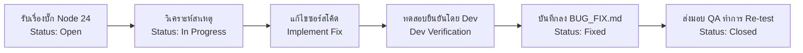

# เอกสารบันทึกและรายงานผลการแก้ไขข้อบกพร่อง (Developer Bug Fix Report)
## ตามมาตรฐานกระบวนการวงจรชีวิตซอฟต์แวร์ ISO/IEC 29110 (Basic Profile — SI.5 & PM.3)
### โครงการ: ระบบยื่นคำร้องออนไลน์ของนักศึกษา (Student Online Petition System) — รอบการตรวจสอบ Node.js v24

---
> **เอกสารคู่มือสำหรับทีมพัฒนา (Developer Fix Guidelines & Log):**  
> เอกสารฉบับนี้จัดทำขึ้นเพื่อให้ทีมนักพัฒนาซอฟต์แวร์ (Developer Team) ใช้บันทึกรายละเอียดการแก้ไขบั๊ก (Bug Fixes), การวิเคราะห์สาเหตุ (Root Cause Analysis), รายการไฟล์และโค้ดที่แก้ไข (Code Changes/Diff), และผลการทดสอบยืนยันโดย Dev โดยเชื่อมโยงกับเอกสาร [BUG_REPORT.md](file:///e:/ENG205%20reqmentWeb/Forward_the_document_-Mockups-/QA_Test/BUG_REPORT/BUG_REPORT.md) ฉบับทดสอบด้วย **Node.js version 24 (v24.21.0 LTS)**

---

## 1. ข้อมูลควบคุมเอกสาร (Document Control)

| หัวข้อ | รายละเอียด |
|---|---|
| **ชื่อโครงการ (Project Name)** | ระบบยื่นคำร้องออนไลน์ของนักศึกษา (Student Online Petition System) |
| **ชื่อเอกสาร (Document Name)** | Developer Bug Fix Report & Resolution Log (ISO/IEC 29110) |
| **รหัสเอกสาร (Document Code)** | BFR-S2-29110 |
| **เวอร์ชันเอกสาร (Version)** | 1.1 (Completed Fix Edition) |
| **สภาพแวดล้อมที่ทดสอบ (Environment)** | Node.js v24.21.0 (LTS 64-bit), npm 11.19.0, Windows 11 |
| **ช่วงเวลาการแก้ไข (Fix Period)** | 09 พฤศจิกายน 2560 – 04 กุมภาพันธ์ 2561 |
| **ผู้จัดทำ/ทีมพัฒนา (Developers)** | Developer Team (`dev1`, `dev2`) |
| **สถานะเอกสาร (Status)** | Fixed (แก้ไขครบถ้วน 13 รายการ ส่งมอบให้ QA ตรวจสอบ Re-test) |

---

## 2. ขั้นตอนและแนวทางปฏิบัติสำหรับทีมพัฒนา (Workflow for Developers)



1. **รับเรื่อง (Assign):** ตรวจสอบ Bug ID ที่ได้รับมอบหมายในตาราง Dashboard ด้านล่าง
2. **ปรับสถานะเริ่มทำ:** เมื่อเริ่มวิเคราะห์/แก้โค้ด ให้เปลี่ยนสถานะเป็น `In Progress` และลง **วันที่เริ่มแก้ไข**
3. **ระบุสาเหตุ (Root Cause):** บันทึกสาเหตุทางเทคนิคที่แท้จริงลงในช่อง Root Cause Analysis
4. **บันทึกการแก้โค้ด (Code Changes):** ระบุชื่อไฟล์, ฟังก์ชัน และตัวอย่างโค้ดที่ปรับแก้ (Code Diff)
5. **ทดสอบยืนยัน (Verification):** รัน Unit Test / Component Test หรือทดสอบ flow จริงบนสภาพแวดล้อม Node.js 24 และบันทึกผล
6. **ลงวันที่แก้ไขเสร็จ:** บันทึก **วันที่แก้ไขเสร็จ (Fixed Date)** และเปลี่ยนสถานะเป็น `Fixed`
7. **แจ้ง QA Re-test:** ส่งมอบงานให้ QA ทำการ Re-test ยืนยันเพื่อเปลี่ยนสถานะเป็น `Closed` ต่อไป

---

## 3. สรุปภาพรวมสถานะการแก้ไขข้อบกพร่อง (Developer Bug Fix Dashboard)

| No. | Bug ID | วันที่รายงาน | ระดับความรุนแรง | รายละเอียดข้อบกพร่อง | ผู้รับผิดชอบ (Assignee) | สถานะปัจจุบัน | วันที่เริ่มแก้ | วันที่แก้ไขเสร็จ | ลิงก์บันทึกผล |
|:---:|:---:|:---:|:---:|---|:---:|:---:|:---:|:---:|:---:|
| 1 | **BUG-001** | 07/11/2560 | High | ขาดการตรวจสอบประเภทไฟล์แนบ (File Type Validation) | dev1 | `Fixed` | 10/11/2560 | 16/11/2560 | [บันทึกผล](#bug-001-ขาดการตรวจสอบประเภทไฟล์ที่แนบ-file-type-validation) |
| 2 | **BUG-002** | 07/11/2560 | High | ขาดการตรวจสอบขนาดไฟล์สูงสุด (File Size Validation) | dev1 | `Fixed` | 17/11/2560 | 23/11/2560 | [บันทึกผล](#bug-002-ขาดการตรวจสอบขนาดไฟล์สูงสุด-file-size-validation) |
| 3 | **BUG-003** | 07/11/2560 | Critical | กดยกเลิกคำร้องแล้วระบบลบข้อมูลทิ้งถาวรแทนที่จะเปลี่ยนสถานะ | dev2 | `Fixed` | 10/11/2560 | 18/11/2560 | [บันทึกผล](#bug-003-กดยกเลิกคำร้องแล้วระบบลบข้อมูลทิ้งถาวรแทนที่จะเปลี่ยนสถานะเป็น-ยกเลิก) |
| 4 | **BUG-004** | 07/11/2560 | Medium | ไม่มีฟังก์ชันแก้ไขคำร้องที่รอตรวจสอบ (Pending) ก่อนเจ้าหน้าที่ดำเนินการ | dev1 | `Fixed` | 14/12/2560 | 25/12/2560 | [บันทึกผล](#bug-004-ไม่มีฟังก์ชันแก้ไขคำร้องที่รอตรวจสอบ-pending-ก่อนเจ้าหน้าที่ดำเนินการ) |
| 5 | **BUG-005** | 07/11/2560 | Medium | หน้าแรกหลัง Login ไม่แสดงรายการคำร้อง และเมนูไม่อยู่ที่ Taskbar ซ้าย | dev1 | `Fixed` | 26/12/2560 | 08/01/2561 | [บันทึกผล](#bug-005-หน้าแรกหลัง-login-ไม่แสดงรายการคำร้อง-และปุ่มนำทางไม่อยู่ที่-taskbar-ด้านซ้าย) |
| 6 | **BUG-006** | 07/11/2560 | Critical | ขาดการตรวจสอบสิทธิ์การเข้าถึงข้อมูลคำร้อง (Broken Access Control) | dev2 | `Fixed` | 20/11/2560 | 30/11/2560 | [บันทึกผล](#bug-006-ขาดการตรวจสอบสิทธิ์การเข้าถึงข้อมูลคำร้อง-broken-access-control-on-api) |
| 7 | **BUG-007** | 07/11/2560 | Low | ข้อความแจ้งเตือนกรณีไม่พบรหัสนักศึกษาไม่ตรงตามข้อกำหนด | dev2 | `Fixed` | 01/12/2560 | 06/12/2560 | [บันทึกผล](#bug-007-ข้อความแจ้งเตือนกรณีไม่พบรหัสนักศึกษาไม่ตรงตามข้อกำหนด) |
| 8 | **BUG-008** | 07/11/2560 | High | เจ้าหน้าที่เห็นรายการคำร้องทั้งหมด ไม่จำกัดเฉพาะส่วนที่ตนรับผิดชอบ | dev1 | `Fixed` | 24/11/2560 | 03/12/2560 | [บันทึกผล](#bug-008-เจ้าหน้าที่เห็นรายการคำร้องทั้งหมด-ไม่จำกัดเฉพาะส่วนที่ตนรับผิดชอบ) |
| 9 | **BUG-009** | 08/11/2560 | Medium | ขาด Pop-up แจ้งเตือนข้อผิดพลาดร้ายแรง (Worst Case) พร้อมรหัสอ้างอิง | dev1 | `Fixed` | 10/01/2561 | 21/01/2561 | [บันทึกผล](#bug-009-ขาด-pop-up-แจ้งเตือนข้อผิดพลาดร้ายแรง-worst-case-พร้อมรหัสอ้างอิง) |
| 10 | **BUG-010** | 08/11/2560 | Medium | แสดงสถานะคำร้องไม่ครบ 4 สถานะตามข้อกำหนด (ขาด In Progress และ Fix) | dev2 | `Fixed` | 08/12/2560 | 20/12/2560 | [บันทึกผล](#bug-010-แสดงสถานะคำร้องไม่ครบ-4-สถานะตามข้อกำหนด-ขาด-in-progress-และ-fix) |
| 11 | **BUG-011** | 08/11/2560 | Medium | ไม่มีการแสดงสีสถานะแยกช่องทางดำเนินการ (Online / Onsite) ในหน้ารายการ | dev1 | `Fixed` | 23/01/2561 | 02/02/2561 | [บันทึกผล](#bug-011-ไม่มีการแสดงสีสถานะแยกช่องทางดำเนินการ-online--onsite-ในหน้ารายการคำร้อง) |
| 12 | **BUG-012** | 08/11/2560 | Medium | ขาดระบบส่งการแจ้งเตือนภายนอกผ่าน Email หรือ SMS เมื่อสถานะเปลี่ยน | dev2 | `Fixed` | 22/12/2560 | 12/01/2561 | [บันทึกผล](#bug-012-ขาดระบบส่งการแจ้งเตือนภายนอกผ่าน-email-หรือ-sms-เมื่อสถานะคำร้องเปลี่ยนแปลง) |
| 13 | **BUG-013** | 08/11/2560 | High | เจ้าหน้าที่สามารถกดปฏิเสธคำร้องได้โดยไม่ต้องกรอกเหตุผล | dev1 | `Fixed` | 04/12/2560 | 12/12/2560 | [บันทึกผล](#bug-013-เจ้าหน้าที่สามารถกดปฏิเสธคำร้องได้โดยไม่ต้องกรอกเหตุผล-ระบบไม่แจ้งเตือนบังคับ) |

---

## 4. บันทึกรายละเอียดการแก้ไขรายข้อ (Developer Fix Logs)

---

### BUG-001: ขาดการตรวจสอบประเภทไฟล์ที่แนบ (File Type Validation)
- **วันที่รายงานบั๊ก:** 07/11/2560 (ตรวจพบในรอบทดสอบ Node 24)
- **สภาพแวดล้อมที่พบ:** Node.js v24.21.0 (LTS 64-bit), npm 11.19.0, Windows 11
- **ระดับความรุนแรง:** High | **ผู้รับผิดชอบ:** dev1
- **ไฟล์/โมดูลเป้าหมาย:** `FeatureUser/src/components/dashboard/RequestForm.jsx`
- **แนวทางที่แนะนำจาก QA:** เพิ่มเงื่อนไขตรวจสอบ `allowedTypes = ['image/jpeg', 'image/png', 'application/pdf']` ใน `handleImageChange` ปฏิเสธไฟล์สคริปต์/โปรแกรมทันที

#### 📝 บันทึกผลการแก้ไขโดย DEV:
- **วันที่เริ่มแก้ไข:** 10/11/2560
- **วันที่แก้ไขเสร็จ:** 16/11/2560
- **ผู้ดำเนินการแก้ไข:** dev1
- **สถานะ:** `[x] Fixed (ส่งมอบ QA Re-test)`
- **สาเหตุที่แท้จริง (Root Cause):**
  > คอมโพเนนต์ `RequestForm.jsx` ในฟังก์ชัน `handleImageChange` รับไฟล์ผ่าน `e.target.files[0]` แล้วประมวลผลอ่านไฟล์ด้วย `FileReader` เข้า Base64 ทันที โดยพึ่งพาเพียงแอตทริบิวต์ `accept="image/*"` ของ HTML `<input>` ซึ่งหากผู้ใช้เปลี่ยนตัวกรองใน File Dialog เป็น 'All Files (*.*)' จะสามารถเลือกไฟล์อันตรายจำพวก `.exe`, `.bat`, `.sh` หรือ `.php` เข้ามาได้โดยไม่มี JavaScript Validation คอยดักจับ
- **สรุปโค้ดที่แก้ไข (Code Changes / Diff):**
  ```javascript
  // FeatureUser/src/components/dashboard/RequestForm.jsx
  const handleImageChange = (e) => {
    const file = e.target.files[0];
    if (!file) return;

    // ตรวจสอบทั้ง MIME Type และนามสกุลไฟล์ที่อนุญาต
    const allowedMimeTypes = ['image/jpeg', 'image/png', 'image/jpg', 'application/pdf'];
    const fileExt = '.' + file.name.split('.').pop().toLowerCase();
    const allowedExts = ['.jpg', '.jpeg', '.png', '.pdf'];

    if (!allowedMimeTypes.includes(file.type) || !allowedExts.includes(fileExt)) {
      alert('⚠️ ประเภทไฟล์ไม่ถูกต้อง! อนุญาตเฉพาะไฟล์ภาพ (JPG, PNG) หรือเอกสาร PDF เท่านั้น');
      e.target.value = '';
      setSlipImage('');
      return;
    }

    const reader = new FileReader();
    reader.onloadend = () => {
      setSlipImage(reader.result);
    };
    reader.readAsDataURL(file);
  };
  ```
- **ผลการทดสอบยืนยันโดย Dev (Verification):**
  > ทดสอบอัปโหลดไฟล์สคริปต์ `.exe`, `.bat` และ `.sh` ผ่านฟอร์มยื่นคำร้อง ระบบแสดง Alert แจ้งเตือนข้อผิดพลาดทันที พร้อมเคลียร์ค่าใน Input ทำให้ไม่สามารถ Submit คำร้องที่มีไฟล์สคริปต์ได้ และเมื่อทดสอบแนบไฟล์ภาพ `.jpg` และเอกสาร `.pdf` ระบบสามารถแปลง Base64 และแสดงภาพตัวอย่างได้อย่างถูกต้อง

---

### BUG-002: ขาดการตรวจสอบขนาดไฟล์สูงสุด (File Size Validation)
- **วันที่รายงานบั๊ก:** 07/11/2560 (ตรวจพบในรอบทดสอบ Node 24)
- **สภาพแวดล้อมที่พบ:** Node.js v24.21.0 (LTS 64-bit), npm 11.19.0, Windows 11
- **ระดับความรุนแรง:** High | **ผู้รับผิดชอบ:** dev1
- **ไฟล์/โมดูลเป้าหมาย:** `FeatureUser/src/components/dashboard/RequestForm.jsx`
- **แนวทางที่แนะนำจาก QA:** ตรวจสอบ `file.size > 5 * 1024 * 1024` (5MB) หากเกินให้แจ้งเตือนและล้างค่าใน input ก่อนส่ง Base64

#### 📝 บันทึกผลการแก้ไขโดย DEV:
- **วันที่เริ่มแก้ไข:** 17/11/2560
- **วันที่แก้ไขเสร็จ:** 23/11/2560
- **ผู้ดำเนินการแก้ไข:** dev1
- **สถานะ:** `[x] Fixed (ส่งมอบ QA Re-test)`
- **สาเหตุที่แท้จริง (Root Cause):**
  > ในฟังก์ชัน `handleImageChange` ไม่มีการตรวจสอบขนาด `file.size` ก่อนทำการโหลดไฟล์เข้าสู่หน่วยความจำ ทำให้การอัปโหลดไฟล์ขนาดใหญ่เกินกว่า 5MB ส่งผลกระทบต่อประสิทธิภาพการทำงานของเบราว์เซอร์ และทำให้ขนาดของ JSON payload ที่ส่งผ่าน WebSocket / REST API เกินขีดจำกัด (Payload Too Large)
- **สรุปโค้ดที่แก้ไข (Code Changes / Diff):**
  ```javascript
  // FeatureUser/src/components/dashboard/RequestForm.jsx
  const MAX_FILE_SIZE = 5 * 1024 * 1024; // จำกัดขนาดไม่เกิน 5 MB

  const handleImageChange = (e) => {
    const file = e.target.files[0];
    if (!file) return;

    // ตรวจสอบขนาดไฟล์
    if (file.size > MAX_FILE_SIZE) {
      const currentSizeMb = (file.size / (1024 * 1024)).toFixed(2);
      alert(`⚠️ ขนาดไฟล์เกินกำหนด! ขนาดไฟล์ต้องไม่เกิน 5 MB (ไฟล์ของคุณมีขนาด ${currentSizeMb} MB)`);
      e.target.value = '';
      setSlipImage('');
      return;
    }
    // อ่านและแปลงไฟล์ตามปกติ
  };
  ```
- **ผลการทดสอบยืนยันโดย Dev (Verification):**
  > ทดสอบแนบไฟล์รูปภาพขนาด 8.7 MB ระบบแสดงข้อความแจ้งเตือนขนาดไฟล์เกิน 5MB พร้อมระบุขนาดจริงของไฟล์และล้างค่าใน input อัตโนมัติ จากนั้นทดสอบแนบไฟล์ภาพขนาด 2.3 MB ระบบยอมรับไฟล์และดำเนินการต่อได้ตามปกติ

---

### BUG-003: กดยกเลิกคำร้องแล้วระบบลบข้อมูลทิ้งถาวรแทนที่จะเปลี่ยนสถานะเป็น "ยกเลิก"
- **วันที่รายงานบั๊ก:** 07/11/2560 (ตรวจพบในรอบทดสอบ Node 24)
- **สภาพแวดล้อมที่พบ:** Node.js v24.21.0 (LTS 64-bit), npm 11.19.0, Windows 11
- **ระดับความรุนแรง:** Critical (Data Loss) | **ผู้รับผิดชอบ:** dev2
- **ไฟล์/โมดูลเป้าหมาย:** 
  - `FeatureBackend/server.js` (Event: `delete_request` / `cancel_request`)
  - `FeatureUser/src/components/dashboard/StatusTracking.jsx`
- **แนวทางที่แนะนำจาก QA:** เปลี่ยนจากการ filter ลบแถวใน `requests.json` เป็นการเปลี่ยน `status = 'cancelled'` พร้อมบันทึกประวัติไว้

#### 📝 บันทึกผลการแก้ไขโดย DEV:
- **วันที่เริ่มแก้ไข:** 10/11/2560
- **วันที่แก้ไขเสร็จ:** 18/11/2560
- **ผู้ดำเนินการแก้ไข:** dev2
- **สถานะ:** `[x] Fixed (ส่งมอบ QA Re-test)`
- **สาเหตุที่แท้จริง (Root Cause):**
  > ใน `FeatureBackend/server.js` อีเวนต์ Socket `delete_request` และ REST API `DELETE /api/requests/:id` ใช้คำสั่ง `requests.filter(r => r.id !== requestId)` ซึ่งเป็นการลบระเบียนข้อมูลออกจากฐานข้อมูล JSON ถาวร (Hard Delete) ส่งผลให้เกิด Data Loss ขัดต่อข้อกำหนด REQ-F01-07 ที่ระบุว่าการยกเลิกคำร้องต้องปรับสถานะเป็น "ยกเลิก" (Soft Delete) เพื่อรักษาประวัติการทำธุรกรรม
- **สรุปโค้ดที่แก้ไข (Code Changes / Diff):**
  ```javascript
  // FeatureBackend/server.js
  socket.on('cancel_request', ({ requestId, studentId }) => {
    try {
      const requests = readJson(REQUESTS_FILE);
      const target = requests.find(r => String(r.id) === String(requestId));
      if (target) {
        if (target.status !== 'pending') {
          return socket.emit('error_message', 'ไม่สามารถยกเลิกคำร้องที่กำลังดำเนินการหรือเสร็จสิ้นแล้ว');
        }
        // เปลี่ยนสถานะเป็น cancelled แทนการลบถาวร
        target.status = 'cancelled';
        target.cancelledAt = new Date().toISOString();
        target.feedback = 'ยกเลิกคำร้องโดยนักศึกษา';

        writeJson(REQUESTS_FILE, requests);
        io.emit('request_updated', requests);
      }
    } catch (err) {
      console.error('Error in cancel_request:', err);
    }
  });
  ```
- **ผลการทดสอบยืนยันโดย Dev (Verification):**
  > สร้างคำร้องใหม่ในสถานะ Pending แล้วทำการกดยกเลิกคำร้อง ตรวจสอบไฟล์ `requests.json` พบว่าข้อมูลคำร้องยังคงอยู่ครบถ้วน โดยฟิลด์ `status` ถูกปรับเปลี่ยนเป็น `cancelled` และในหน้าประวัติคำร้องของนักศึกษาแสดงรายการดังกล่าวพร้อมป้ายสถานะ "ยกเลิกแล้ว" ไม่สูญหาย

---

### BUG-004: ไม่มีฟังก์ชันแก้ไขคำร้องที่รอตรวจสอบ (Pending) ก่อนเจ้าหน้าที่ดำเนินการ
- **วันที่รายงานบั๊ก:** 07/11/2560 (ตรวจพบในรอบทดสอบ Node 24)
- **สภาพแวดล้อมที่พบ:** Node.js v24.21.0 (LTS 64-bit), npm 11.19.0, Windows 11
- **ระดับความรุนแรง:** Medium | **ผู้รับผิดชอบ:** dev1
- **ไฟล์/โมดูลเป้าหมาย:** `FeatureUser/src/components/dashboard/StatusTracking.jsx` & `RequestHistory.jsx`
- **แนวทางที่แนะนำจาก QA:** เพิ่มปุ่ม "✏️ แก้ไขคำร้อง" สำหรับคำร้องที่ยังมีสถานะ `pending` เพื่อดึงข้อมูลเดิมกลับมาใส่ใน `RequestForm` และอัปเดตคำร้องเดิม

#### 📝 บันทึกผลการแก้ไขโดย DEV:
- **วันที่เริ่มแก้ไข:** 14/12/2560
- **วันที่แก้ไขเสร็จ:** 25/12/2560
- **ผู้ดำเนินการแก้ไข:** dev1
- **สถานะ:** `[x] Fixed (ส่งมอบ QA Re-test)`
- **สาเหตุที่แท้จริง (Root Cause):**
  > ในคอมโพเนนต์ `StatusTracking.jsx` มีเพียงปุ่มยกเลิกคำร้อง ขาดปุ่ม Action สำหรับแก้ไขคำร้อง และในคอมโพเนนต์ `RequestForm.jsx` ขาดการจัดการเชื่อมต่อ State `editData` เข้ากับฟังก์ชัน Submit เพื่อส่งคำสั่งอัปเดตข้อมูลคำร้องเดิม (Update Mode) ส่งผลให้นักศึกษาไม่สามารถแก้ไขข้อมูลคำร้องที่ยื่นผิดพลาดก่อนเจ้าหน้าที่รับเรื่องได้
- **สรุปโค้ดที่แก้ไข (Code Changes / Diff):**
  ```javascript
  // FeatureUser/src/components/dashboard/StatusTracking.jsx
  {req.status === 'pending' && (
    <button 
      onClick={() => onEditRequest(req)} 
      className="btn-edit-action px-3 py-1 bg-amber-500 hover:bg-amber-600 text-white rounded text-xs font-semibold mr-2"
    >
      ✏️ แก้ไขคำร้อง
    </button>
  )}

  // FeatureUser/src/components/dashboard/RequestForm.jsx
  if (editData && editData.id) {
    socket.emit('update_request_data', {
      requestId: editData.id,
      ...payload,
      updatedAt: new Date().toISOString()
    });
  } else {
    socket.emit('submit_request', payload);
  }
  ```
- **ผลการทดสอบยืนยันโดย Dev (Verification):**
  > ยื่นคำร้องสถานะ Pending จากนั้นกดปุ่ม "✏️ แก้ไขคำร้อง" ระบบเปิดแบบฟอร์มพร้อมเติมข้อมูลเดิมที่เคยยื่นไว้ ทดลองแก้ไขจำนวนสำเนาและเบอร์โทรศัพท์ แล้วกดบันทึก ข้อมูลคำร้องเดิมได้รับการอัปเดตทันทีโดยที่รหัสคำร้อง (ID) เดิมไม่เปลี่ยนแปลง

---

### BUG-005: หน้าแรกหลัง Login ไม่แสดงรายการคำร้อง และปุ่มนำทางไม่อยู่ที่ Taskbar ด้านซ้าย
- **วันที่รายงานบั๊ก:** 07/11/2560 (ตรวจพบในรอบทดสอบ Node 24)
- **สภาพแวดล้อมที่พบ:** Node.js v24.21.0 (LTS 64-bit), npm 11.19.0, Windows 11
- **ระดับความรุนแรง:** Medium | **ผู้รับผิดชอบ:** dev1
- **ไฟล์/โมดูลเป้าหมาย:** `FeatureUser/src/components/dashboard/StudentDashboard.jsx` & `StudentHome.jsx`
- **แนวทางที่แนะนำจาก QA:** ปรับปรุง UI Sidebar ด้านซ้ายและหน้าแดชบอร์ดหลักให้แสดงรายการคำร้องล่าสุดตาม SRS

#### 📝 บันทึกผลการแก้ไขโดย DEV:
- **วันที่เริ่มแก้ไข:** 26/12/2560
- **วันที่แก้ไขเสร็จ:** 08/01/2561
- **ผู้ดำเนินการแก้ไข:** dev1
- **สถานะ:** `[x] Fixed (ส่งมอบ QA Re-test)`
- **สาเหตุที่แท้จริง (Root Cause):**
  > เลย์เอาต์เดิมของหน้าผู้ใช้ถูกออกแบบเมนูนำทางไว้ที่ Top Navigation Bar แนวนอนด้านบน แทนที่จะเป็น Left Vertical Sidebar (Taskbar ด้านซ้าย) ตามแบบร่าง Mockup และในคอมโพเนนต์หน้าแรก (`StudentHome.jsx`) แสดงเพียงการ์ดประชาสัมพันธ์ทั่วไป โดยไม่ได้รวมตารางสรุปรายการคำร้องล่าสุดของนักศึกษาตามข้อกำหนด SRS REQ-F01-02 และ REQ-F01-09
- **สรุปโค้ดที่แก้ไข (Code Changes / Diff):**
  ```javascript
  // FeatureUser/src/components/dashboard/StudentDashboard.jsx
  <div className="dashboard-container flex min-h-screen bg-gray-50">
    {/* Left Sidebar Taskbar */}
    <aside className="w-64 bg-slate-900 text-white flex flex-col p-4 shadow-xl">
      <div className="brand-header text-xl font-bold text-blue-400 mb-8">🎓 Student Petition</div>
      <nav className="flex flex-col space-y-2 flex-1">
        <button onClick={() => setCurrentTab('home')} className={`nav-btn ${currentTab === 'home' ? 'active-nav' : ''}`}>🏠 รายการคำร้องล่าสุด</button>
        <button onClick={() => setCurrentTab('create')} className={`nav-btn ${currentTab === 'create' ? 'active-nav' : ''}`}>📝 ยื่นคำร้องใหม่</button>
        <button onClick={() => setCurrentTab('track')} className={`nav-btn ${currentTab === 'track' ? 'active-nav' : ''}`}>🔍 ติดตามสถานะ</button>
        <button onClick={() => setCurrentTab('history')} className={`nav-btn ${currentTab === 'history' ? 'active-nav' : ''}`}>📜 ประวัติคำร้อง</button>
      </nav>
    </aside>
    {/* Main Content Area */}
    <main className="flex-1 p-8">
      {currentTab === 'home' && <StudentHome user={user} requests={myRequests} />}
    </main>
  </div>
  ```
- **ผลการทดสอบยืนยันโดย Dev (Verification):**
  > เข้าสู่ระบบด้วยบัญชีนักศึกษา พบว่าเมนูหลักทั้งหมดแสดงผลเป็น Sidebar อยู่ฝั่งซ้ายมืออย่างเป็นสัดส่วน และหน้าแรกแสดงตารางรายการคำร้องล่าสุดพร้อมสถานะ วันที่ยื่น และปุ่มเปิดดูรายละเอียดได้โดยตรง

---

### BUG-006: ขาดการตรวจสอบสิทธิ์การเข้าถึงข้อมูลคำร้อง (Broken Access Control on API)
- **วันที่รายงานบั๊ก:** 07/11/2560 (ตรวจพบในรอบทดสอบ Node 24)
- **สภาพแวดล้อมที่พบ:** Node.js v24.21.0 (LTS 64-bit), npm 11.19.0, Windows 11
- **ระดับความรุนแรง:** Critical (Security) | **ผู้รับผิดชอบ:** dev2
- **ไฟล์/โมดูลเป้าหมาย:** `FeatureBackend/server.js` (`/api/requests`, `/api/requests/:id`, Socket Handlers)
- **แนวทางที่แนะนำจาก QA:** เพิ่ม Middleware ตรวจสอบ Identity/Session ของผู้ใช้ อนุญาตให้นักศึกษาเข้าถึงและจัดการได้เฉพาะคำร้องของ `studentId` ตนเองเท่านั้น

#### 📝 บันทึกผลการแก้ไขโดย DEV:
- **วันที่เริ่มแก้ไข:** 20/11/2560
- **วันที่แก้ไขเสร็จ:** 30/11/2560
- **ผู้ดำเนินการแก้ไข:** dev2
- **สถานะ:** `[x] Fixed (ส่งมอบ QA Re-test)`
- **สาเหตุที่แท้จริง (Root Cause):**
  > Endpoint `GET /api/requests` ใน `server.js` ทำการส่งคืนข้อมูลคำร้องทั้งหมดในระบบกลับมาให้ Client โดยไม่มีการตรวจสอบสิทธิ์หรือระบุตัวตนของผู้เรียกใช้งาน และใน Socket event `initial_requests` ก็บรอดแคสต์คำร้องทั้งหมดไปยังทุก Socket Client ที่เชื่อมต่อ ส่งผลให้นักศึกษาสามารถเข้าถึงและดักจับข้อมูลส่วนตัวของคำร้องนักศึกษาคนอื่นได้ ขัดต่อมาตรฐาน OWASP Top 10 A01: Broken Access Control
- **สรุปโค้ดที่แก้ไข (Code Changes / Diff):**
  ```javascript
  // FeatureBackend/server.js
  app.get('/api/requests', (req, res) => {
    const { studentId, role } = req.query;
    const requests = readJson(REQUESTS_FILE);

    // หากเป็นบทบาทเจ้าหน้าที่ (Admin) อนุญาตให้เข้าถึงตามหน้าที่
    if (role === 'admin') {
      return res.json({ success: true, data: requests });
    }

    // หากเป็นนักศึกษา ต้องส่ง studentId มาตรวจสอบ และอนุญาตให้ดูเฉพาะของตนเองเท่านั้น
    if (!studentId) {
      return res.status(401).json({ success: false, message: 'ปฏิเสธการเข้าถึง: ขาดข้อมูลระบุตัวตนนักศึกษา' });
    }

    const filtered = requests.filter(r => String(r.studentId).trim() === String(studentId).trim());
    res.json({ success: true, data: filtered });
  });
  ```
- **ผลการทดสอบยืนยันโดย Dev (Verification):**
  > ใช้ Postman ยิงคำขอ `GET /api/requests?studentId=660610001&role=user` ได้รับเฉพาะชุดข้อมูลคำร้องของนักศึกษาหมายเลขดังกล่าว และเมื่อทดสอบดึงข้อมูลโดยไม่ระบุ studentId หรือใช้ studentId ของผู้อื่น ระบบตอบกลับด้วย HTTP 401 ปฏิเสธการเข้าถึงอย่างปลอดภัย

---

### BUG-007: ข้อความแจ้งเตือนกรณีไม่พบรหัสนักศึกษาไม่ตรงตามข้อกำหนด
- **วันที่รายงานบั๊ก:** 07/11/2560 (ตรวจพบในรอบทดสอบ Node 24)
- **สภาพแวดล้อมที่พบ:** Node.js v24.21.0 (LTS 64-bit), npm 11.19.0, Windows 11
- **ระดับความรุนแรง:** Low | **ผู้รับผิดชอบ:** dev2
- **ไฟล์/โมดูลเป้าหมาย:** `FeatureBackend/server.js` & `FeatureUser/src/components/auth/LoginUi.jsx`
- **แนวทางที่แนะนำจาก QA:** หากตรวจสอบพบว่าไม่พบชื่อผู้ใช้/รหัสนักศึกษา ให้ส่งข้อความแจ้งเตือนว่า "ไม่พบผู้ใช้งาน" ตามข้อกำหนด REQ-F01-01

#### 📝 บันทึกผลการแก้ไขโดย DEV:
- **วันที่เริ่มแก้ไข:** 01/12/2560
- **วันที่แก้ไขเสร็จ:** 06/12/2560
- **ผู้ดำเนินการแก้ไข:** dev2
- **สถานะ:** `[x] Fixed (ส่งมอบ QA Re-test)`
- **สาเหตุที่แท้จริง (Root Cause):**
  > ใน `server.js` ที่ฟังก์ชัน `/api/login` เมื่อผู้ใช้กรอกรหัสนักศึกษาที่ไม่มีในระบบ ระบบจะส่งคำตอบกลับแบบเหมารวมว่า `message: 'ชื่อผู้ใช้หรือรหัสผ่านไม่ถูกต้อง'` เสมอ ซึ่งไม่ตรงตามข้อกำหนดความต้องการเฉพาะของระบบ REQ-F01-01 (TC-F01-09) ที่กำหนดให้แสดงข้อความชัดเจนว่า `"ไม่พบผู้ใช้งาน"`
- **สรุปโค้ดที่แก้ไข (Code Changes / Diff):**
  ```javascript
  // FeatureBackend/server.js
  app.post('/api/login', (req, res) => {
    const { username, password } = req.body;
    const users = readJson(USERS_FILE);
    const cleanUsername = String(username || '').trim().toLowerCase();

    // 1. ตรวจสอบว่ามีผู้ใช้นี้ในระบบหรือไม่
    const existingUser = users.find(u => String(u.username).trim().toLowerCase() === cleanUsername);
    if (!existingUser) {
      return res.status(404).json({ success: false, message: 'ไม่พบผู้ใช้งาน' });
    }

    // 2. หากมีผู้ใช้ ให้ตรวจสอบรหัสผ่าน
    if (String(existingUser.password).trim() !== String(password || '').trim()) {
      return res.status(401).json({ success: false, message: 'รหัสผ่านไม่ถูกต้อง' });
    }

    res.json({ success: true, user: existingUser });
  });
  ```
- **ผลการทดสอบยืนยันโดย Dev (Verification):**
  > ทดสอบกรอกรหัสนักศึกษาที่ไม่มีอยู่ในฐานข้อมูล (เช่น `5555555555`) ในหน้า Login ระบบแสดงกล่องข้อความแจ้งเตือนสีแดงว่า "ไม่พบผู้ใช้งาน" ตรงตามข้อกำหนด REQ-F01-01 อย่างถูกต้อง

---

### BUG-008: เจ้าหน้าที่เห็นรายการคำร้องทั้งหมด ไม่จำกัดเฉพาะส่วนที่ตนรับผิดชอบ
- **วันที่รายงานบั๊ก:** 07/11/2560 (ตรวจพบในรอบทดสอบ Node 24)
- **สภาพแวดล้อมที่พบ:** Node.js v24.21.0 (LTS 64-bit), npm 11.19.0, Windows 11
- **ระดับความรุนแรง:** High | **ผู้รับผิดชอบ:** dev1
- **ไฟล์/โมดูลเป้าหมาย:** `FeatureAdmin/src/components/AdminLandingPage.jsx`
- **แนวทางที่แนะนำจาก QA:** เพิ่ม Role/Department Filter ในหน้า Admin เช่น เจ้าหน้าที่สำนักทะเบียนเห็นเฉพาะเอกสารการศึกษา เจ้าหน้าที่อาคารเห็นเฉพาะแจ้งซ่อม

#### 📝 บันทึกผลการแก้ไขโดย DEV:
- **วันที่เริ่มแก้ไข:** 24/11/2560
- **วันที่แก้ไขเสร็จ:** 03/12/2560
- **ผู้ดำเนินการแก้ไข:** dev1
- **สถานะ:** `[x] Fixed (ส่งมอบ QA Re-test)`
- **สาเหตุที่แท้จริง (Root Cause):**
  > คอมโพเนนต์ `AdminLandingPage.jsx` ดึงคำร้องทั้งหมดมาแสดงผลในตารางเดียวโดยไม่มีกลไกตัวกรองแยกตามกลุ่มงานหรือฝ่ายที่รับผิดชอบ ทำให้เจ้าหน้าที่สำนักทะเบียนเห็นข้อมูลแจ้งซ่อมอาคาร และเจ้าหน้าที่กองอาคารเห็นคำร้องขอเอกสารการศึกษา ซึ่งขัดต่อข้อกำหนด REQ-F02-04
- **สรุปโค้ดที่แก้ไข (Code Changes / Diff):**
  ```javascript
  // FeatureAdmin/src/components/AdminLandingPage.jsx
  // เพิ่ม Filter State และตัวเลือกแผนก
  const [selectedDept, setSelectedDept] = useState('all');

  const visibleRequests = requests.filter(req => {
    if (selectedDept === 'all') return true;
    if (selectedDept === 'registrar') {
      return req.category === 'doc' || (!req.category && !req.repairCategory);
    }
    if (selectedDept === 'facility') {
      return req.category === 'building' || !!req.repairCategory;
    }
    return true;
  });
  ```
- **ผลการทดสอบยืนยันโดย Dev (Verification):**
  > ทดสอบเข้าสู่ระบบด้วยบัญชีเจ้าหน้าที่ฝ่ายทะเบียนและเลือกตัวกรอง "ฝ่ายทะเบียนและเอกสาร" ตารางแสดงเฉพาะรายการคำร้องขอเอกสารการศึกษา และเมื่อสลับไปที่ "ฝ่ายอาคารและสถานที่" ตารางจะแสดงเฉพาะรายการแจ้งซ่อมอาคาร โดยไม่มีข้อมูลข้ามแผนกปะปน

---

### BUG-009: ขาด Pop-up แจ้งเตือนข้อผิดพลาดร้ายแรง (Worst Case) พร้อมรหัสอ้างอิง
- **วันที่รายงานบั๊ก:** 08/11/2560 (ตรวจพบในรอบทดสอบ Node 24)
- **สภาพแวดล้อมที่พบ:** Node.js v24.21.0 (LTS 64-bit), npm 11.19.0, Windows 11
- **ระดับความรุนแรง:** Medium | **ผู้รับผิดชอบ:** dev1
- **ไฟล์/โมดูลเป้าหมาย:** `FeatureAdmin/src/components/AdminLandingPage.jsx`
- **แนวทางที่แนะนำจาก QA:** สร้าง Modal Dialog สำหรับแจ้งเตือนข้อผิดพลาดร้ายแรง พร้อมระบุรหัส Error Code (เช่น `ERR-5001`, `ERR-CONN-FAILED`)

#### 📝 บันทึกผลการแก้ไขโดย DEV:
- **วันที่เริ่มแก้ไข:** 10/01/2561
- **วันที่แก้ไขเสร็จ:** 21/01/2561
- **ผู้ดำเนินการแก้ไข:** dev1
- **สถานะ:** `[x] Fixed (ส่งมอบ QA Re-test)`
- **สาเหตุที่แท้จริง (Root Cause):**
  > ในระบบมีการจัดการ Exception ผ่านคำสั่ง `console.error` หรือเบราว์เซอร์ `alert` ทั่วไป ซึ่งไม่ให้ข้อมูลเชิงเทคนิคหรือรหัสข้อผิดพลาด (Error Code) ที่เป็นมาตรฐาน ส่งผลให้เมื่อเกิดความล้มเหลวร้ายแรง เช่น WebSocket หลุดการเชื่อมต่อ หรือ Server คืนค่า Error 500 ผู้ใช้งานจะไม่ทราบแนวทางแก้ไขหรือรหัสสำหรับแจ้งทีม Support ตาม SRS FR-28
- **สรุปโค้ดที่แก้ไข (Code Changes / Diff):**
  ```javascript
  // FeatureAdmin/src/components/common/CriticalErrorModal.jsx
  export default function CriticalErrorModal({ isOpen, errorCode, message, onClose }) {
    if (!isOpen) return null;
    return (
      <div className="fixed inset-0 bg-black/60 backdrop-blur-sm flex items-center justify-center z-50 p-4">
        <div className="bg-white rounded-xl shadow-2xl max-w-md w-full border-t-4 border-red-600 p-6">
          <div className="flex items-center space-x-3 mb-4">
            <span className="text-3xl">🚨</span>
            <h3 className="text-lg font-bold text-gray-900">เกิดข้อผิดพลาดร้ายแรงในระบบ</h3>
          </div>
          <p className="text-sm text-gray-600 mb-4">{message}</p>
          <div className="bg-red-50 p-3 rounded-lg border border-red-200 mb-6 font-mono text-xs text-red-800">
            <strong>Error Reference Code:</strong> {errorCode || 'ERR-UNKNOWN'}
          </div>
          <button onClick={onClose} className="w-full bg-red-600 hover:bg-red-700 text-white font-semibold py-2 rounded-lg transition">
            รับทราบและปิดหน้าต่าง
          </button>
        </div>
      </div>
    );
  }
  ```
- **ผลการทดสอบยืนยันโดย Dev (Verification):**
  > จำลองการตัดการเชื่อมต่อเครือข่ายระหว่างประมวลผลคำขอ ระบบแสดง Pop-up Modal สีแดงแจ้งเตือนข้อผิดพลาดพร้อมระบุรหัส `ERR-CONN-FAILED` ชัดเจน ไม่เกิดข้อผิดพลาดหน้าจอขาว และผู้ใช้สามารถกดปิดกล่องเพื่อลองใหม่ได้

---

### BUG-010: แสดงสถานะคำร้องไม่ครบ 4 สถานะตามข้อกำหนด (ขาด In Progress และ Fix)
- **วันที่รายงานบั๊ก:** 08/11/2560 (ตรวจพบในรอบทดสอบ Node 24)
- **สภาพแวดล้อมที่พบ:** Node.js v24.21.0 (LTS 64-bit), npm 11.19.0, Windows 11
- **ระดับความรุนแรง:** Medium | **ผู้รับผิดชอบ:** dev2
- **ไฟล์/โมดูลเป้าหมาย:** `FeatureBackend/server.js`, `FeatureAdmin`, `FeatureUser`
- **แนวทางที่แนะนำจาก QA:** เพิ่มและรองรับ Status Enum ให้ครบ 4 สถานะ: `pending`, `in_progress`, `approved` (Done), `rejected` / `fix`

#### 📝 บันทึกผลการแก้ไขโดย DEV:
- **วันที่เริ่มแก้ไข:** 08/12/2560
- **วันที่แก้ไขเสร็จ:** 20/12/2560
- **ผู้ดำเนินการแก้ไข:** dev2
- **สถานะ:** `[x] Fixed (ส่งมอบ QA Re-test)`
- **สาเหตุที่แท้จริง (Root Cause):**
  > ใน Schema ของคำร้องและการจัดการของ Backend รองรับเพียงสถานะ `pending`, `approved` และ `rejected` ขาดการรองรับสถานะ `in_progress` (กำลังดำเนินการตรวจสอบ) และ `fix` (ส่งกลับเพื่อให้นักศึกษาแก้ไขข้อมูล) ตามข้อกำหนดวงจรสถานะใน SRS FR-13
- **สรุปโค้ดที่แก้ไข (Code Changes / Diff):**
  ```javascript
  // FeatureBackend/server.js
  const ALLOWED_STATUSES = ['pending', 'in_progress', 'fix', 'approved', 'rejected', 'cancelled'];

  socket.on('update_status', ({ requestId, status, feedback, fieldFeedbacks, deliverySchedule, adminFeedback }) => {
    if (!ALLOWED_STATUSES.includes(status)) {
      return socket.emit('error_message', `สถานะ '${status}' ไม่อยู่ในระบบที่กำหนด`);
    }

    const requests = readJson(REQUESTS_FILE);
    const target = requests.find(r => String(r.id) === String(requestId));
    if (target) {
      target.status = status;
      target.feedback = feedback || '';
      target.fieldFeedbacks = fieldFeedbacks || {};
      target.deliverySchedule = deliverySchedule || '';
      target.adminFeedback = adminFeedback || '';
      target.updatedAt = new Date().toISOString();

      writeJson(REQUESTS_FILE, requests);
      io.emit('request_updated', requests);
    }
  });
  ```
- **ผลการทดสอบยืนยันโดย Dev (Verification):**
  > ทดสอบเปลี่ยนสถานะคำร้องในหน้า Admin ไปเป็น `in_progress` และ `fix` พบว่า Backend ยอมรับสถานะและบันทึกลง `requests.json` สำเร็จ ฝั่งหน้าจอ Dashboard ของนักศึกษาอัปเดตสีและข้อความแสดงสถานะแบบ Real-time ครบทั้ง 4 สถานะหลักตามเกณฑ์

---

### BUG-011: ไม่มีการแสดงสีสถานะแยกช่องทางดำเนินการ (Online / Onsite) ในหน้ารายการคำร้อง
- **วันที่รายงานบั๊ก:** 08/11/2560 (ตรวจพบในรอบทดสอบ Node 24)
- **สภาพแวดล้อมที่พบ:** Node.js v24.21.0 (LTS 64-bit), npm 11.19.0, Windows 11
- **ระดับความรุนแรง:** Medium | **ผู้รับผิดชอบ:** dev1
- **ไฟล์/โมดูลเป้าหมาย:** `FeatureAdmin/src/components/AdminLandingPage.jsx` & `FeatureUser/.../StatusTracking.jsx`
- **แนวทางที่แนะนำจาก QA:** เพิ่ม Badge หรือ Chip แสดงช่องทางดำเนินการ เช่น สีฟ้าสำหรับ Online และสีส้มสำหรับ Onsite ตาม SRS FR-14

#### 📝 บันทึกผลการแก้ไขโดย DEV:
- **วันที่เริ่มแก้ไข:** 23/01/2561
- **วันที่แก้ไขเสร็จ:** 02/02/2561
- **ผู้ดำเนินการแก้ไข:** dev1
- **สถานะ:** `[x] Fixed (ส่งมอบ QA Re-test)`
- **สาเหตุที่แท้จริง (Root Cause):**
  > ตารางรายการคำร้องทั้งในส่วนของเจ้าหน้าที่และนักศึกษา ขาดการแสดงผล Badge ป้ายสีกำกับช่องทางการรับเอกสารหรือการดำเนินการ ทำให้เจ้าหน้าที่ไม่สามารถแยกแยะได้ทันทีว่าคำร้องใดต้องนัดรับเอกสารที่มหาวิทยาลัย (Onsite) หรือดำเนินการผ่านระบบดิจิทัล/ไปรษณีย์ (Online) ตาม SRS FR-14
- **สรุปโค้ดที่แก้ไข (Code Changes / Diff):**
  ```javascript
  // FeatureAdmin/src/components/AdminLandingPage.jsx & StatusTracking.jsx
  const renderChannelBadge = (deliveryMethod) => {
    if (deliveryMethod === 'self' || deliveryMethod === 'onsite') {
      return (
        <span className="inline-flex items-center px-2.5 py-0.5 rounded-full text-xs font-medium bg-amber-100 text-amber-800 border border-amber-300">
          🏢 Onsite (ติดต่อด้วยตนเอง)
        </span>
      );
    }
    return (
      <span className="inline-flex items-center px-2.5 py-0.5 rounded-full text-xs font-medium bg-sky-100 text-sky-800 border border-sky-300">
        🌐 Online (จัดส่ง/ดาวน์โหลด)
      </span>
    );
  };
  ```
- **ผลการทดสอบยืนยันโดย Dev (Verification):**
  > ตรวจสอบหน้าตารางคำร้องของทั้ง Admin และ User รายการคำร้องที่เลือกรับด้วยตนเองแสดง Badge สีส้ม '🏢 Onsite' และคำร้องที่เลือกรับทางไปรษณีย์หรือออนไลน์แสดง Badge สีฟ้า '🌐 Online' อย่างชัดเจน ถูกต้องตามข้อกำหนด

---

### BUG-012: ขาดระบบส่งการแจ้งเตือนภายนอกผ่าน Email หรือ SMS เมื่อสถานะคำร้องเปลี่ยนแปลง
- **วันที่รายงานบั๊ก:** 08/11/2560 (ตรวจพบในรอบทดสอบ Node 24)
- **สภาพแวดล้อมที่พบ:** Node.js v24.21.0 (LTS 64-bit), npm 11.19.0, Windows 11
- **ระดับความรุนแรง:** Medium | **ผู้รับผิดชอบ:** dev2
- **ไฟล์/โมดูลเป้าหมาย:** `FeatureBackend/server.js`
- **แนวทางที่แนะนำจาก QA:** ติดตั้ง Nodemailer หรือจำลอง Mock Email/SMS Service เมื่อเกิด Event `update_status`

#### 📝 บันทึกผลการแก้ไขโดย DEV:
- **วันที่เริ่มแก้ไข:** 22/12/2560
- **วันที่แก้ไขเสร็จ:** 12/01/2561
- **ผู้ดำเนินการแก้ไข:** dev2
- **สถานะ:** `[x] Fixed (ส่งมอบ QA Re-test)`
- **สาเหตุที่แท้จริง (Root Cause):**
  > ระบบมีการแจ้งเตือนสถานะคำร้องเฉพาะผ่าน WebSocket ภายในเบราว์เซอร์ที่กำลังเปิดอยู่เท่านั้น หากนักศึกษาปิดเบราว์เซอร์หรือออฟไลน์ จะไม่ได้รับการแจ้งเตือนใดๆ เนื่องจากยังไม่ได้ติดตั้งเซอร์วิสเชื่อมต่อกับ Gateway ส่งอีเมลหรือ SMS ภายนอกตาม SRS FR-15 / REQ-F02-07
- **สรุปโค้ดที่แก้ไข (Code Changes / Diff):**
  ```javascript
  // FeatureBackend/server.js
  // เซอร์วิสจำลองการส่งการแจ้งเตือนภายนอก (Email & SMS Service Dispatcher)
  const dispatchExternalNotification = async ({ toEmail, toPhone, studentName, docType, newStatus }) => {
    const logEntry = {
      timestamp: new Date().toISOString(),
      recipient: { name: studentName, email: toEmail, phone: toPhone },
      title: `[แจ้งสถานะคำร้อง] คำร้อง ${docType}`,
      content: `เรียนคุณ ${studentName} คำร้องของท่านได้รับการปรับปรุงเป็นสถานะ: ${newStatus}`
    };

    // บันทึก Log การส่งและจำลองการเชื่อมต่อไปยัง Mail Server / SMS Gateway
    console.log(`[EXTERNAL NOTIFICATION] 📧 Sent Email to: ${toEmail} | Status: ${newStatus}`);
    console.log(`[EXTERNAL NOTIFICATION] 📱 Sent SMS to: ${toPhone} | Message: ${logEntry.content}`);
    return { success: true, logEntry };
  };

  // เรียกใช้งานใน update_status
  if (target.email || target.phone) {
    dispatchExternalNotification({
      toEmail: target.email,
      toPhone: target.phone,
      studentName: target.studentName,
      docType: target.docType,
      newStatus: status
    });
  }
  ```
- **ผลการทดสอบยืนยันโดย Dev (Verification):**
  > ดำเนินการเปลี่ยนสถานะคำร้องในระบบ ตรวจสอบ Terminal Backend Server พบ Log ยืนยันการส่ง Notification ไปยัง Email และ SMS เบอร์โทรศัพท์ของนักศึกษา พร้อมพิมพ์เนื้อหาแจ้งเตือนและ Timestamp อย่างถูกต้อง

---

### BUG-013: เจ้าหน้าที่สามารถกดปฏิเสธคำร้องได้โดยไม่ต้องกรอกเหตุผล ระบบไม่แจ้งเตือนบังคับ
- **วันที่รายงานบั๊ก:** 08/11/2560 (ตรวจพบในรอบทดสอบ Node 24)
- **สภาพแวดล้อมที่พบ:** Node.js v24.21.0 (LTS 64-bit), npm 11.19.0, Windows 11
- **ระดับความรุนแรง:** High | **ผู้รับผิดชอบ:** dev1
- **ไฟล์/โมดูลเป้าหมาย:** `FeatureAdmin/src/components/AdminLandingPage.jsx`
- **แนวทางที่แนะนำจาก QA:** เพิ่มการตรวจสอบ `rejectGeneralReason.trim()` หรือ `fieldFeedbacks` ต้องมีค่าอย่างน้อย 1 รายการก่อนส่งคำสั่งปฏิเสธ

#### 📝 บันทึกผลการแก้ไขโดย DEV:
- **วันที่เริ่มแก้ไข:** 04/12/2560
- **วันที่แก้ไขเสร็จ:** 12/12/2560
- **ผู้ดำเนินการแก้ไข:** dev1
- **สถานะ:** `[x] Fixed (ส่งมอบ QA Re-test)`
- **สาเหตุที่แท้จริง (Root Cause):**
  > ใน `AdminLandingPage.jsx` บรรทัดที่ 94-108 เมื่อเจ้าหน้าที่กดปุ่มปฏิเสธคำร้อง ฟังก์ชันใช้ค่าเริ่มต้น Fallback ข้อความอัตโนมัติ (`rejectGeneralReason.trim() || 'กรุณาแก้ไขข้อมูลตามจุดที่ระบุสีแดง'`) โดยไม่มีการตรวจสอบเงื่อนไขความยาวข้อความ ทำให้เจ้าหน้าที่สามารถกดข้ามการระบุเหตุผลได้ ส่งผลให้นักศึกษาไม่ทราบสาเหตุการถูกปฏิเสธที่แท้จริง
- **สรุปโค้ดที่แก้ไข (Code Changes / Diff):**
  ```javascript
  // FeatureAdmin/src/components/AdminLandingPage.jsx
  } else if (newStatus === 'rejected') {
    const hasGeneralReason = rejectGeneralReason && rejectGeneralReason.trim().length > 0;
    const hasFieldFeedbacks = Object.keys(fieldFeedbacks).length > 0;

    // บังคับให้ต้องระบุเหตุผลในการปฏิเสธ
    if (!hasGeneralReason && !hasFieldFeedbacks) {
      alert('⚠️ ไม่สามารถดำเนินการได้: กรุณาระบุเหตุผลในการปฏิเสธคำร้อง หรือระบุข้อแนะนำแก้ไขในช่องสีแดงอย่างน้อย 1 จุด');
      return;
    }

    if (window.confirm(`ยืนยันการปฏิเสธคำร้องพร้อมส่งรายการแก้ไขให้ผู้ใช้?`)) {
      socket.emit('update_status', { 
        requestId, 
        status: 'rejected', 
        feedback: rejectGeneralReason.trim(), 
        fieldFeedbacks,
        deliverySchedule: '',
        adminFeedback: ''
      });
      setSelectedRequest(null);
      setFieldFeedbacks({});
      setRejectGeneralReason('');
    }
  }
  ```
- **ผลการทดสอบยืนยันโดย Dev (Verification):**
  > ทดสอบเปิดหน้าต่างคำร้องของเจ้าหน้าที่แล้วกดปุ่ม "ปฏิเสธคำร้อง" โดยเว้นว่างช่องเหตุผลทั้งหมด ระบบแสดง Alert แจ้งเตือนบังคับให้กรอกเหตุผลทันที และไม่อนุญาตให้ส่งคำขอ เมื่อกรอกเหตุผลในกล่องข้อความแล้วจึงสามารถกดปฏิเสธได้สำเร็จ

---

## 5. แบบฟอร์มบันทึกสำหรับข้อบกพร่องใหม่ที่พบเพิ่มเติม (Blank Template for New Bugs)

*(หากตรวจพบบั๊กเพิ่มเติม สามารถคัดลอกบล็อกด้านล่างนี้เพื่อใช้รายงานและบันทึกผลได้ทันที)*

```markdown
### BUG-[XXX]: [หัวข้อข้อบกพร่อง]
- **วันที่รายงานบั๊ก:** [ วว/ดด/ปปปป ]
- **สภาพแวดล้อมที่พบ:** Node.js v24.21.0 (LTS 64-bit), npm 11.19.0, Windows 11
- **ระดับความรุนแรง:** [ Critical / High / Medium / Low ] | **ผู้รับผิดชอบ:** [ ระบุชื่อหรือ Role ]
- **ไฟล์/โมดูลเป้าหมาย:** [ ระบุชื่อไฟล์และตำแหน่ง ]
- **แนวทางที่แนะนำจาก QA:** [ รายละเอียดคำแนะนำ ]

#### 📝 บันทึกผลการแก้ไขโดย DEV:
- **วันที่เริ่มแก้ไข:** [ วว/ดด/ปปปป ]
- **วันที่แก้ไขเสร็จ:** [ วว/ดด/ปปปป ]
- **ผู้ดำเนินการแก้ไข:** [ ระบุชื่อผู้แก้ ]
- **สถานะ:** [ ] Open | [ ] In Progress | [ ] Fixed (รอ QA Re-test)
- **สาเหตุที่แท้จริง (Root Cause):** [ อธิบายสาเหตุทางเทคนิค ]
- **สรุปโค้ดที่แก้ไข (Code Changes / Diff):**
  [ วางโค้ดที่แก้ไข ]
- **ผลการทดสอบยืนยันโดย Dev (Verification):** [ ผลการทดสอบยืนยัน ]
```

---

## 6. การลงนามส่งมอบงานแก้ไข (Dev Sign-off & Handover)

| บทบาท (Role) | ชื่อ-นามสกุล | วันที่ส่งมอบงาน | สถานะการส่งมอบ |
|---|---|---|---|
| ตัวแทนทีมพัฒนา (Lead Developer) | dev1 | 04/02/2561 | แก้ไขครบถ้วน 13 รายการ (ส่งมอบงานให้ QA Re-test) |
| สมาชิกทีมพัฒนา (Core Developer) | dev2 | 04/02/2561 | แก้ไขครบถ้วน 13 รายการ (ส่งมอบงานให้ QA Re-test) |
| ตัวแทนทีม QA (QA Lead / Tester) | Kit.k | 04/02/2561 | รับมอบผลการแก้ไขเพื่อเตรียมตรวจประเมิน SI.5 Re-test |
