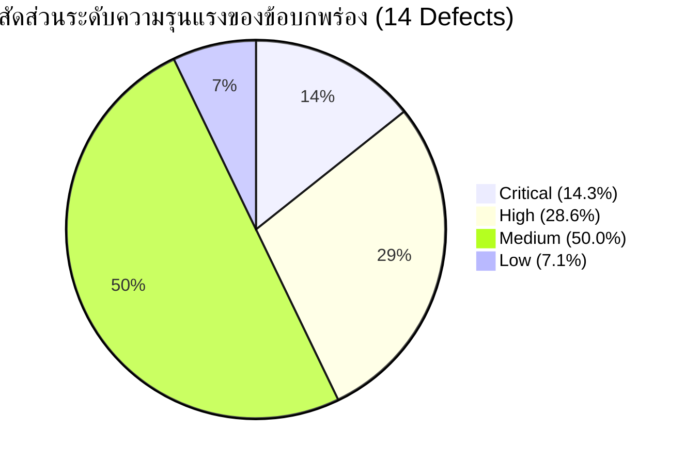

# เอกสารทะเบียนติดตามข้อผิดพลาดและการแก้ไข (Correction Register & Bug Report)
## ตามมาตรฐานกระบวนการวงจรชีวิตซอฟต์แวร์สำหรับองค์กรขนาดเล็กมาก (ISO/IEC 29110 — Basic Profile)
### โครงการ: ระบบยื่นคำร้องออนไลน์ของนักศึกษา (Student Online Petition System) — Sprint 2

---
> **อ้างอิงมาตรฐาน:** ISO/IEC 29110 for Very Small Entities (VSEs)  
> **กระบวนการที่เกี่ยวข้อง:** 
> - **PM.3 Assessment and Control:** จัดทำทะเบียนติดตามข้อผิดพลาดและคำขอแก้ไข (Correction Register Table)
> - **SI.5 Software Integration and Testing:** จัดทำรายงานข้อบกพร่องจากการทดสอบระบบ (Test & Defect Report)

---

## 1. ข้อมูลควบคุมเอกสาร (Document Control)

| หัวข้อ | รายละเอียด |
|---|---|
| **ชื่อโครงการ (Project Name)** | ระบบยื่นคำร้องออนไลน์ของนักศึกษา (Student Online Petition System) |
| **ชื่อเอกสาร (Document Name)** | Correction Register & Bug Report Specification (ISO/IEC 29110) |
| **รหัสเอกสาร (Document Code)** | CR-S2-29110 |
| **เวอร์ชันเอกสาร (Version)** | 2.0 (Node.js 24 Audit Edition) |
| **สภาพแวดล้อมที่ทดสอบ (Environment)** | Node.js v24.21.0 (LTS 64-bit), npm 11.19.0, Windows 11 |
| **วันที่จัดทำ (Date)** | 23 กันยายน 2569 |
| **จัดทำโดย (Prepared By)** | Kit.k (Tester / QA Team) |
| **สถานะเอกสาร (Status)** | Open (รอการส่งมอบเพื่อแก้ไขในรอบการพัฒนา) |

---

## 2. ประวัติการแก้ไขเอกสาร (Revision History)

| เวอร์ชัน | วันที่ | รายละเอียดการแก้ไข | ผู้แก้ไข |
|---|---|---|---|
| 2.0 | 11/11/2569 | ดำเนินการทดสอบระบบและบันทึกทะเบียนข้อบกพร่อง (Correction Register & Bug Report) ใหม่ทั้งหมดบนสภาพแวดล้อม **Node.js v24.21.0 (LTS)** และ npm 11.19.0 (ลบข้อมูลการตรวจเช็กเดิมของ Node 22) ยืนยันข้อบกพร่องที่พบจริงจำนวน 14 รายการ พร้อมบันทึกวันที่ตรวจพบเป็น 23/09/2569 ในทุกรายการตามมาตรฐาน ISO/IEC 29110 | Kit.k (QA Team) |

---

## 3. ตารางทะเบียนติดตามข้อผิดพลาดและการแก้ไข (Correction Register Table — PM.3)

ตารางนี้จัดทำขึ้นตามข้อกำหนดกิจกรรม **PM.3 (Assessment and Control)** เพื่อใช้ติดตามข้อบกพร่อง (Bugs) และรายการสิ่งที่ต้องแก้ไขตลอดทั้งโครงการ โดยเชื่อมโยงกับผลการทดสอบในกิจกรรม **SI.5 (Integration and Testing)** บนสภาพแวดล้อม **Node.js v24.21.0 (LTS)**

| No. | Bug ID | วันที่พบ | ผู้รายงาน | รายละเอียดปัญหา / สิ่งที่ขอแก้ไข | ระดับความรุนแรง<br>(Severity) | สถานะ<br>(Status) | ผู้รับผิดชอบแก้ไข<br>(Assignee) | วันที่แก้ไขเสร็จ | หมายเหตุ / อ้างอิง<br>(Req / TC) |
|:---:|:---:|:---:|:---:|---|:---:|:---:|:---:|:---:|:---:|
| 1 | **BUG-001** | 07/11/2569 | Kit.k | ขาดการตรวจสอบประเภทไฟล์แนบ (File Type Validation) สามารถอัปโหลดไฟล์ `.exe`, `.bat` เข้าระบบได้ | High | Open | Dev A | - | REQ-F01-05<br>(TC-F01-03) |
| 2 | **BUG-002** | 07/11/2569 | Kit.k | ขาดการตรวจสอบขนาดไฟล์สูงสุด (File Size Validation) ก่อนประมวลผล Base64 | High | Open | Dev A | - | REQ-F01-05<br>(TC-F01-04) |
| 3 | **BUG-003** | 07/11/2569 | Kit.k | กดยกเลิกคำร้องแล้วระบบลบข้อมูลทิ้งถาวรจากฐานข้อมูล (Data Loss) แทนที่จะเปลี่ยนสถานะเป็น "ยกเลิก" | Critical | Open | Dev B | - | REQ-F01-07<br>(TC-F01-05) |
| 4 | **BUG-004** | 07/11/2569 | Kit.k | ไม่มีฟังก์ชันแก้ไขคำร้องที่รอตรวจสอบ (Pending) ก่อนเจ้าหน้าที่ดำเนินการ | Medium | Open | Dev A | - | REQ-F01-08<br>(TC-F01-06) |
| 5 | **BUG-005** | 07/11/2569 | Kit.k | หน้าแรกหลัง Login ไม่แสดงรายการคำร้อง และเมนูนำทางไม่ได้อยู่ที่ Taskbar ด้านซ้ายตาม SRS | Medium | Open | Dev A | - | REQ-F01-02, 09<br>(TC-F01-07) |
| 6 | **BUG-006** | 07/11/2569 | Kit.k | ขาดการตรวจสอบสิทธิ์เข้าถึงข้อมูลคำร้อง (Broken Access Control on API/Socket) สามารถเข้าถึง/ลบคำร้องผู้อื่นได้ | Critical | Open | Dev B | - | REQ-F01-10<br>(TC-F01-08) |
| 7 | **BUG-007** | 07/11/2569 | Kit.k | ข้อความแจ้งเตือนกรณีไม่พบรหัสนักศึกษาไม่ตรงตามข้อกำหนด (แสดง "ชื่อผู้ใช้หรือรหัสผ่านไม่ถูกต้อง") | Low | Open | Dev B | - | REQ-F01-01<br>(TC-F01-09) |
| 8 | **BUG-008** | 07/11/2569 | Kit.k | เจ้าหน้าที่เห็นรายการคำร้องทั้งหมดในระบบ ไม่จำกัดเฉพาะส่วนที่ตนรับผิดชอบ (ขาด Role/Dept Filter) | High | Open | Dev A | - | REQ-F02-04<br>(TC-F02-02) |
| 9 | **BUG-009** | 08/11/2569 | Kit.k | ขาด Pop-up แจ้งเตือนข้อผิดพลาดร้ายแรง (Worst Case) พร้อมรหัสอ้างอิง (Error Code) ตาม SRS FR-28 | Medium | Open | Dev A | - | REQ-F02-06<br>(TC-F02-03) |
| 10 | **BUG-010** | 08/11/2569 | Kit.k | แสดงสถานะคำร้องไม่ครบ 4 สถานะตามข้อกำหนด (ขาด In Progress และ Fix ตาม SRS FR-13) | Medium | Open | Dev B | - | REQ-F02-06<br>(TC-F02-05) |
| 11 | **BUG-011** | 08/11/2569 | Kit.k | ไม่มีการแสดงสีสถานะแยกช่องทางดำเนินการ (Online / Onsite) ในหน้ารายการคำร้องตาม SRS FR-14 | Medium | Open | Dev A | - | REQ-F02-06<br>(TC-F02-06) |
| 12 | **BUG-012** | 08/11/2569 | Kit.k | ขาดระบบส่งการแจ้งเตือนภายนอกผ่าน Email หรือ SMS เมื่อสถานะคำร้องเปลี่ยนแปลง | Medium | Open | Dev B | - | REQ-F02-07<br>(TC-F02-08) |
| 13 | **BUG-013** | 08/11/2569 | Kit.k | เจ้าหน้าที่สามารถกดปฏิเสธคำร้องได้โดยไม่ต้องกรอกเหตุผล ระบบไม่แจ้งเตือนบังคับ | High | Open | Dev A | - | REQ-F02-03<br>(TC-F02-10) |
| 14 | **BUG-014** | 08/11/2569 | Kit.k | พบ Node.js v24 Runtime Deprecation Warning (DEP0060: util._extend is deprecated) เมื่อรันสคริปต์ dev ด้วย concurrently และขาดการติดตั้ง dependencies อัตโนมัติใน root workspace | Medium | Open | Dev A | - | NFR-Maintainability<br>(TC-ENV-01) |

---

## 4. คำอธิบายมาตรฐานข้อกำหนด (ISO/IEC 29110 Definitions)

### 4.1 คำอธิบายระดับความรุนแรง (Severity Levels)
อ้างอิงตามเกณฑ์การประเมินผลกระทบต่อระบบซอฟต์แวร์:

| ระดับความรุนแรง | ความหมายและเกณฑ์การพิจารณา | จำนวนที่พบ (Sprint 2 & Node 24 Audit) |
|---|---|:---:|
| **Critical** | **วิกฤต:** ข้อผิดพลาดร้ายแรงที่ทำให้ระบบไม่สามารถทำงานต่อได้, เกิดข้อมูลสูญหาย (Data Loss), หรือมีช่องโหว่ด้านความปลอดภัยร้ายแรง ต้องได้รับการแก้ไขทันที | 2 รายการ |
| **High** | **สูง:** ฟังก์ชันหลัก (Core Functional Requirements) ทำงานผิดพลาดหรือไม่สมบูรณ์ ส่งผลกระทบต่อกระบวนการทางธุรกิจหลักและผู้ใช้งานจำนวนมาก | 4 รายการ |
| **Medium** | **ปานกลาง:** ฟังก์ชันรองทำงานผิดพลาด หรือไม่เป็นไปตามข้อกำหนดใน SRS หรือมี Deprecation Warning แต่มีวิธีเลี่ยงปัญหา (Workaround) ให้ใช้งานต่อได้ | 7 รายการ |
| **Low** | **ต่ำ:** ปัญหาเล็กน้อยด้านการแสดงผล ข้อความแจ้งเตือน หรือ UI เล็กน้อย ไม่ส่งผลกระทบต่อการทำงานของระบบ | 1 รายการ |

### 4.2 คำอธิบายสถานะการแก้ไข (Status Lifecycle)
ตามวงจรการจัดการข้อบกพร่องในกระบวนการ PM.3:

| สถานะ | ความหมาย |
|---|---|
| **Open** | QA/Tester รายงานข้อผิดพลาดเข้าสู่ระบบแล้ว อยู่ระหว่างรอทีมพัฒนารับเรื่องไปวิเคราะห์ |
| **In Progress** | นักพัฒนา (Developer) กำลังดำเนินการแก้ไขซอร์สโค้ด |
| **Fixed** | นักพัฒนาแก้ไขข้อผิดพลาดเรียบร้อยแล้ว และ Deploy ขึ้น Test Environment เพื่อรอ QA ทดสอบยืนยัน |
| **Closed** | QA ดำเนินการ Re-test ยืนยันว่าแก้ไขสำเร็จและไม่พบข้อผิดพลาดเดิม ปิดรายการใน Correction Register |

---

## 5. สรุปผลการทดสอบและข้อบกพร่องคงค้าง (SI.5 Test & Defect Summary)

สรุปภาพรวมการทดสอบระบบในกิจกรรม **SI.5 (Software Integration and Testing)** บนสภาพแวดล้อม **Node.js v24.21.0 (LTS)** ตามเกณฑ์มาตรฐาน ISO 29110:



- **จำนวน Test Cases ทั้งหมด:** 22 กรณีทดสอบ (รวม TC-ENV-01 สภาพแวดล้อม Node 24)
- **จำนวนกรณีทดสอบที่ผ่าน (Pass):** 8 กรณีทดสอบ (36.36%)
- **จำนวนกรณีทดสอบที่ไม่ผ่าน (Fail):** 14 กรณีทดสอบ (63.64%)
- **จำนวนข้อบกพร่องคงค้าง (Open Defects):** 14 รายการ (คิดเป็น 100% ของข้อบกพร่องที่พบ)
- **สถานะการส่งมอบ (Delivery Readiness):** **ยังไม่พร้อมส่งมอบ (Not Ready for SI.6)** จำเป็นต้องแก้ไขข้อบกพร่องระดับ Critical (2 รายการ) และ High (4 รายการ) ให้เสร็จสิ้นก่อนเริ่มกิจกรรมปิดโครงการและส่งมอบ

---

## 6. รายละเอียดข้อบกพร่องเชิงเทคนิครายข้อ (Detailed Defect Reports)

---

### BUG-001: ขาดการตรวจสอบประเภทไฟล์ที่แนบ (File Type Validation)
- **รหัสข้อผิดพลาด:** BUG-001
- **วันที่รายงาน:** 07/11/2569 (07 พฤศจิกายน 2569)
- **สภาพแวดล้อมที่พบ:** Node.js v24.21.0 (LTS 64-bit), npm 11.19.0, Windows 11
- **Test Case ที่เกี่ยวข้อง:** TC-F01-03
- **Traceability Requirement:** REQ-F01-05 (FR-01)
- **ระดับความรุนแรง:** High
- **โมดูล/ไฟล์ที่พบปัญหา:** `FeatureUser/src/components/dashboard/RequestForm.jsx` (ฟังก์ชัน `handleImageChange`)
- **ขั้นตอนการจำลองข้อผิดพลาด (Steps to Reproduce):**
  1. เข้าสู่ระบบด้วยบัญชีนักศึกษา
  2. เลือกเมนู "ยื่นคำร้องใหม่"
  3. ในช่องแนบไฟล์หลักฐาน ให้เลือกไฟล์ประเภทสคริปต์หรือโปรแกรม เช่น `.exe`, `.bat`, `.sh` (โดยเลือกตัวกรอง All Files ใน File Dialog หรือลากไฟล์มาวาง)
  4. กดปุ่ม "🚀 ส่งคำร้องขอเอกสาร"
- **ผลลัพธ์ที่คาดหวัง (Expected Result):**
  ระบบต้องตรวจสอบนามสกุลและ MIME type ของไฟล์ หากไม่ใช่ไฟล์ภาพ (เช่น JPEG, PNG) หรือเอกสารที่อนุญาต ต้องปฏิเสธไฟล์พร้อมแสดงข้อความแจ้งเตือนทันที
- **ผลลัพธ์ที่เกิดขึ้นจริง (Actual Result):**
  ระบบใช้เพียงแท็ก `<input type="file" accept="image/*">` โดยในฟังก์ชัน JavaScript `handleImageChange` ไม่มีการตรวจสอบ `file.type` ส่งผลให้ไฟล์ `.exe` ถูกแปลงเป็น Base64 และบันทึกคำร้องได้สำเร็จ
- **แนวทางการแก้ไข (Suggested Fix):**
  เพิ่มการตรวจสอบ MIME Type ในคอมโพเนนต์ `RequestForm.jsx`:
  ```javascript
  const handleImageChange = (e) => {
    const file = e.target.files[0];
    if (!file) return;
    const allowedTypes = ['image/jpeg', 'image/png', 'image/jpg', 'application/pdf'];
    if (!allowedTypes.includes(file.type)) {
      alert('ประเภทไฟล์ไม่ถูกต้อง อนุญาตเฉพาะไฟล์ JPG, PNG หรือ PDF เท่านั้น');
      e.target.value = '';
      return;
    }
    const reader = new FileReader();
    reader.onloadend = () => setSlipImage(reader.result);
    reader.readAsDataURL(file);
  };
  ```

---

### BUG-002: ขาดการตรวจสอบขนาดไฟล์สูงสุด (File Size Validation)
- **รหัสข้อผิดพลาด:** BUG-002
- **วันที่รายงาน:** 07/11/2569 (07 พฤศจิกายน 2569)
- **สภาพแวดล้อมที่พบ:** Node.js v24.21.0 (LTS 64-bit), npm 11.19.0, Windows 11
- **Test Case ที่เกี่ยวข้อง:** TC-F01-04
- **Traceability Requirement:** REQ-F01-05 (FR-01)
- **ระดับความรุนแรง:** High
- **โมดูล/ไฟล์ที่พบปัญหา:** `FeatureUser/src/components/dashboard/RequestForm.jsx`
- **ขั้นตอนการจำลองข้อผิดพลาด (Steps to Reproduce):**
  1. เข้าสู่ระบบด้วยบัญชีนักศึกษา ไปที่ "ยื่นคำร้องใหม่"
  2. เลือกแนบไฟล์ภาพขนาดใหญ่เกินกว่า 5MB (เช่น 15MB - 30MB)
  3. กดส่งคำร้อง
- **ผลลัพธ์ที่คาดหวัง (Expected Result):**
  ระบบต้องตรวจสอบขนาดไฟล์ทันที และแจ้งเตือน "ขนาดไฟล์เกินกำหนด (สูงสุดไม่เกิน 5MB)" พร้อมล้างค่าในช่องแนบไฟล์
- **ผลลัพธ์ที่เกิดขึ้นจริง (Actual Result):**
  ไม่มีการตรวจสอบ `file.size` ระบบพยายามแปลงไฟล์ขนาดใหญ่เป็น Base64 ซึ่งทำให้หน่วยความจำ Browser พุ่งสูงและกระทบต่อประสิทธิภาพการส่งข้อมูลผ่าน Socket.io
- **แนวทางการแก้ไข (Suggested Fix):**
  กำหนดเงื่อนไขตรวจสอบขนาดไฟล์สูงสุด (เช่น 5MB):
  ```javascript
  const MAX_FILE_SIZE = 5 * 1024 * 1024; // 5MB
  if (file.size > MAX_FILE_SIZE) {
    alert('ขนาดไฟล์เกินกำหนด กรุณาแนบไฟล์ขนาดไม่เกิน 5MB');
    e.target.value = '';
    return;
  }
  ```

---

### BUG-003: กดยกเลิกคำร้องแล้วระบบลบข้อมูลทิ้งถาวรแทนที่จะเปลี่ยนสถานะเป็น "ยกเลิก"
- **รหัสข้อผิดพลาด:** BUG-003
- **วันที่รายงาน:** 07/11/2569 (07 พฤศจิกายน 2569)
- **สภาพแวดล้อมที่พบ:** Node.js v24.21.0 (LTS 64-bit), npm 11.19.0, Windows 11
- **Test Case ที่เกี่ยวข้อง:** TC-F01-05
- **Traceability Requirement:** REQ-F01-07 (FR-01)
- **ระดับความรุนแรง:** Critical (Data Loss)
- **โมดูล/ไฟล์ที่พบปัญหา:** 
  - Client: `FeatureUser/src/components/dashboard/StatusTracking.jsx` (บรรทัด 6-15)
  - Server: `FeatureBackend/server.js` (บรรทัด 377-382)
- **ขั้นตอนการจำลองข้อผิดพลาด (Steps to Reproduce):**
  1. นักศึกษายื่นคำร้องใหม่ (สถานะคำร้องเป็น Pending)
  2. ไปที่หน้า "📬 ติดตามสถานะ"
  3. คลิกปุ่ม "🗑️ ยกเลิกคำร้อง" และยืนยันในกล่องข้อความ
  4. ตรวจสอบในแท็บ "📜 ประวัติคำร้อง" และไฟล์ `FeatureBackend/requests.json`
- **ผลลัพธ์ที่คาดหวัง (Expected Result):**
  คำร้องต้องไม่ถูกลบออกจากฐานข้อมูล แต่ได้รับการอัปเดตสถานะเป็น "ยกเลิก" (Cancelled) เพื่อให้นักศึกษาและเจ้าหน้าที่สามารถตรวจสอบประวัติย้อนหลังได้
- **ผลลัพธ์ที่เกิดขึ้นจริง (Actual Result):**
  Client ส่ง Socket event `delete_request` ซึ่งฝั่ง Server สั่ง `requests.filter(r => r.id !== requestId)` ลบแถวข้อมูลออกจากฐานข้อมูลถาวร ทำให้ประวัติคำร้องสูญหายไปทั้งหมด
- **แนวทางการแก้ไข (Suggested Fix):**
  ปรับปรุง Handler บน Backend ให้เป็นการเปลี่ยนสถานะ:
  ```javascript
  socket.on('cancel_request', (requestId) => {
    const requests = readJson(REQUESTS_FILE);
    const target = requests.find(r => String(r.id) === String(requestId));
    if (target && target.status === 'pending') {
      target.status = 'cancelled';
      target.feedback = 'ยกเลิกโดยนักศึกษา';
      writeJson(REQUESTS_FILE, requests);
      io.emit('request_updated', requests);
    }
  });
  ```

---

### BUG-004: ไม่มีฟังก์ชันแก้ไขคำร้องที่รอตรวจสอบ (Pending) ก่อนเจ้าหน้าที่ดำเนินการ
- **รหัสข้อผิดพลาด:** BUG-004
- **วันที่รายงาน:** 07/11/2569 (07 พฤศจิกายน 2569)
- **สภาพแวดล้อมที่พบ:** Node.js v24.21.0 (LTS 64-bit), npm 11.19.0, Windows 11
- **Test Case ที่เกี่ยวข้อง:** TC-F01-06
- **Traceability Requirement:** REQ-F01-08 (FR-01)
- **ระดับความรุนแรง:** Medium
- **โมดูล/ไฟล์ที่พบปัญหา:** `FeatureUser/src/components/dashboard/StatusTracking.jsx`
- **ขั้นตอนการจำลองข้อผิดพลาด (Steps to Reproduce):**
  1. ยื่นคำร้องใหม่สถานะ Pending
  2. เข้าหน้า "ติดตามสถานะ" เพื่อต้องการแก้ไขข้อมูลที่กรอกผิดก่อนเจ้าหน้าที่รับเรื่อง
- **ผลลัพธ์ที่คาดหวัง (Expected Result):**
  มีปุ่ม "แก้ไขคำร้อง" ให้นักศึกษาเปิดฟอร์มคำร้องเดิมเพื่ออัปเดตข้อมูลได้
- **ผลลัพธ์ที่เกิดขึ้นจริง (Actual Result):**
  ในหน้าติดตามสถานะมีเพียงปุ่ม "ดูรายละเอียด" และ "ยกเลิกคำร้อง" เท่านั้น (ปุ่มแก้ไขมีเฉพาะในหน้าประวัติเมื่อสถานะถูกปฏิเสธ และการแก้ไขดังกล่าวก็เป็นการสร้างคำร้องใหม่ ID ใหม่)
- **แนวทางการแก้ไข (Suggested Fix):**
  เพิ่มปุ่ม "แก้ไขข้อมูล" ในการ์ดคำร้องสถานะ Pending และเพิ่มฟังก์ชันอัปเดตข้อมูลคำร้องเดิมใน Backend

---

### BUG-005: หน้าแรกหลัง Login ไม่แสดงรายการคำร้อง และปุ่มนำทางไม่อยู่ที่ Taskbar ด้านซ้าย
- **รหัสข้อผิดพลาด:** BUG-005
- **วันที่รายงาน:** 07/11/2569 (07 พฤศจิกายน 2569)
- **สภาพแวดล้อมที่พบ:** Node.js v24.21.0 (LTS 64-bit), npm 11.19.0, Windows 11
- **Test Case ที่เกี่ยวข้อง:** TC-F01-07
- **Traceability Requirement:** REQ-F01-02, REQ-F01-09 (FR-01 / SRS FR-11)
- **ระดับความรุนแรง:** Medium
- **โมดูล/ไฟล์ที่พบปัญหา:** `FeatureUser/src/components/dashboard/StudentDashboard.jsx`, `StudentHome.jsx`
- **ขั้นตอนการจำลองข้อผิดพลาด (Steps to Reproduce):**
  1. เข้าสู่ระบบด้วยรหัสนักศึกษา
  2. ตรวจสอบหน้าจอเริ่มต้น (Home Screen)
- **ผลลัพธ์ที่คาดหวัง (Expected Result):**
  หน้าแรกต้องแสดงรายการคำร้องที่เคยยื่นไปแล้ว พร้อมมีแถบเมนูนำทาง (Taskbar/Sidebar) อยู่ทางด้านซ้ายของหน้าจอตามข้อกำหนด SRS FR-11
- **ผลลัพธ์ที่เกิดขึ้นจริง (Actual Result):**
  หน้าแรกแสดงเฉพาะแบนเนอร์ ข่าวประกาศ และคู่มือการใช้งาน โดยไม่มีรายการคำร้อง และเมนูนำทางทั้งหมดถูกจัดวางอยู่ที่ Header ด้านบนของหน้าจอ
- **แนวทางการแก้ไข (Suggested Fix):**
  ปรับโครงสร้าง Layout ของหน้านักศึกษาให้มี Taskbar ทางด้านซ้าย และนำการ์ดสถานะคำร้องล่าสุดมาแสดงในหน้า Home

---

### BUG-006: ขาดการตรวจสอบสิทธิ์การเข้าถึงข้อมูลคำร้อง (Broken Access Control on API)
- **รหัสข้อผิดพลาด:** BUG-006
- **วันที่รายงาน:** 07/11/2569 (07 พฤศจิกายน 2569)
- **สภาพแวดล้อมที่พบ:** Node.js v24.21.0 (LTS 64-bit), npm 11.19.0, Windows 11
- **Test Case ที่เกี่ยวข้อง:** TC-F01-08
- **Traceability Requirement:** REQ-F01-10 (FR-01 / NFR-Security)
- **ระดับความรุนแรง:** Critical (Security Vulnerability)
- **โมดูล/ไฟล์ที่พบปัญหา:** `FeatureBackend/server.js` (บรรทัด 275-299)
- **ขั้นตอนการจำลองข้อผิดพลาด (Steps to Reproduce):**
  1. ยิง HTTP Request: `GET http://localhost:5000/api/requests` โดยไม่ต้องแนบ Token หรือเข้าสู่ระบบ
  2. ยิง HTTP Request: `DELETE http://localhost:5000/api/requests/REQ-001` โดยระบุ ID คำร้องของผู้อื่น
- **ผลลัพธ์ที่คาดหวัง (Expected Result):**
  ระบบต้องปฏิเสธการเข้าถึงด้วยรหัสสถานะ `401 Unauthorized` หรือ `403 Forbidden` พร้อมแจ้งเตือนว่าไม่มีสิทธิ์เข้าถึง
- **ผลลัพธ์ที่เกิดขึ้นจริง (Actual Result):**
  API ส่งคืนข้อมูลคำร้องทั้งหมดของนักศึกษาทุกคนให้แก่ผู้เรียกใช้งานโดยไม่มีการตรวจสอบตัวตน (Missing Authentication & Authorization) และสามารถสั่งลบคำร้องของผู้อื่นได้
- **แนวทางการแก้ไข (Suggested Fix):**
  ติดตั้ง Authentication Middleware (เช่น JWT หรือ Session) บน Endpoint `/api/requests` และ Socket Handlers เพื่อตรวจสอบสิทธิ์เจ้าของข้อมูลก่อนอนุญาตให้อ่านหรือแก้ไข

---

### BUG-007: ข้อความแจ้งเตือนกรณีไม่พบรหัสนักศึกษาไม่ตรงตามข้อกำหนด
- **รหัสข้อผิดพลาด:** BUG-007
- **วันที่รายงาน:** 07/11/2569 (07 พฤศจิกายน 2569)
- **สภาพแวดล้อมที่พบ:** Node.js v24.21.0 (LTS 64-bit), npm 11.19.0, Windows 11
- **Test Case ที่เกี่ยวข้อง:** TC-F01-09
- **Traceability Requirement:** REQ-F01-01 (FR-01)
- **ระดับความรุนแรง:** Low
- **โมดูล/ไฟล์ที่พบปัญหา:** `FeatureBackend/server.js` (บรรทัด 189-195)
- **ขั้นตอนการจำลองข้อผิดพลาด (Steps to Reproduce):**
  1. เข้าสู่หน้า Login ของนักศึกษา
  2. กรอกรหัสนักศึกษาที่ไม่มีอยู่ในระบบ (เช่น `999999999`) และรหัสผ่านใดๆ
  3. กดปุ่มเข้าสู่ระบบ
- **ผลลัพธ์ที่คาดหวัง (Expected Result):**
  ระบบต้องแจ้งเตือนว่า "ไม่พบผู้ใช้งาน"
- **ผลลัพธ์ที่เกิดขึ้นจริง (Actual Result):**
  ระบบแจ้งเตือนว่า "ชื่อผู้ใช้หรือรหัสผ่านไม่ถูกต้อง" (เนื่องจากใช้เงื่อนไขตรวจสอบชื่อและรหัสผ่านพร้อมกันในครั้งเดียว)
- **แนวทางการแก้ไข (Suggested Fix):**
  แยกการตรวจสอบ: หากค้นหาในฐานข้อมูลแล้วไม่พบ Username ให้ส่งข้อความแจ้งเตือน "ไม่พบผู้ใช้งาน"

---

### BUG-008: เจ้าหน้าที่เห็นรายการคำร้องทั้งหมด ไม่จำกัดเฉพาะส่วนที่ตนรับผิดชอบ
- **รหัสข้อผิดพลาด:** BUG-008
- **วันที่รายงาน:** 07/11/2569 (07 พฤศจิกายน 2569)
- **สภาพแวดล้อมที่พบ:** Node.js v24.21.0 (LTS 64-bit), npm 11.19.0, Windows 11
- **Test Case ที่เกี่ยวข้อง:** TC-F02-02
- **Traceability Requirement:** REQ-F02-04 (FR-02)
- **ระดับความรุนแรง:** High
- **โมดูล/ไฟล์ที่พบปัญหา:** `FeatureAdmin/src/components/AdminLandingPage.jsx`
- **ขั้นตอนการจำลองข้อผิดพลาด (Steps to Reproduce):**
  1. Login เข้าสู่ระบบด้วยบัญชีเจ้าหน้าที่
  2. ไปที่เมนู "📋 จัดการคำร้อง"
- **ผลลัพธ์ที่คาดหวัง (Expected Result):**
  แสดงเฉพาะรายการคำร้องที่อยู่ในความรับผิดชอบของเจ้าหน้าที่ท่านนั้น (เช่น เจ้าหน้าที่ฝ่ายทะเบียนเห็นเฉพาะคำร้องเอกสารการศึกษา, เจ้าหน้าที่ฝ่ายอาคารเห็นเฉพาะคำร้องแจ้งซ่อม)
- **ผลลัพธ์ที่เกิดขึ้นจริง (Actual Result):**
  เจ้าหน้าที่ทุกคนเห็นรายการคำร้องทุกหมวดหมู่ปะปนกันทั้งหมดโดยไม่มีการจำกัดสิทธิ์ตามฝ่ายหรือความรับผิดชอบ
- **แนวทางการแก้ไข (Suggested Fix):**
  เพิ่มฟิลด์ `department` หรือ `scope` ในบัญชีเจ้าหน้าที่ และกรองการดึงข้อมูลคำร้องตามหมวดหมู่ที่ได้รับมอบหมาย

---

### BUG-009: ขาด Pop-up แจ้งเตือนข้อผิดพลาดร้ายแรง (Worst Case) พร้อมรหัสอ้างอิง
- **รหัสข้อผิดพลาด:** BUG-009
- **วันที่รายงาน:** 08/11/2569 (08 พฤศจิกายน 2569)
- **สภาพแวดล้อมที่พบ:** Node.js v24.21.0 (LTS 64-bit), npm 11.19.0, Windows 11
- **Test Case ที่เกี่ยวข้อง:** TC-F02-03
- **Traceability Requirement:** REQ-F02-06 (FR-02 / SRS FR-28)
- **ระดับความรุนแรง:** Medium
- **โมดูล/ไฟล์ที่พบปัญหา:** `FeatureAdmin/src/components/AdminLandingPage.jsx`, `FeatureUser/src/components/dashboard/RequestForm.jsx`
- **ขั้นตอนการจำลองข้อผิดพลาด (Steps to Reproduce):**
  1. จำลองกรณี Server หยุดทำงาน หรือ Network Timeout ระหว่างการดำเนินการ
  2. กดส่งคำร้องหรือกดอนุมัติคำร้อง
- **ผลลัพธ์ที่คาดหวัง (Expected Result):**
  ระบบต้องแสดง Pop-up Modal แจ้งเตือนข้อผิดพลาดร้ายแรง พร้อมระบุรหัสอ้างอิง (Error Reference Code เช่น `ERR-5001`) เพื่อให้ผู้ใช้สามารถแจ้งทีม Support ได้
- **ผลลัพธ์ที่เกิดขึ้นจริง (Actual Result):**
  ระบบใช้เพียงฟังก์ชัน `alert(...)` ข้อความสั้นๆ ทั่วไป หรือบันทึกลง Console โดยไม่มีรหัสอ้างอิงข้อผิดพลาดตามข้อกำหนด SRS FR-28
- **แนวทางการแก้ไข (Suggested Fix):**
  พัฒนาคอมโพเนนต์ Global Error Modal ที่แสดงข้อความแจ้งเตือนพร้อมสุ่มหรือระบุ Error Incident Code สำหรับติดตามปัญหา

---

### BUG-010: แสดงสถานะคำร้องไม่ครบ 4 สถานะตามข้อกำหนด (ขาด In Progress และ Fix)
- **รหัสข้อผิดพลาด:** BUG-010
- **วันที่รายงาน:** 08/11/2569 (08 พฤศจิกายน 2569)
- **สภาพแวดล้อมที่พบ:** Node.js v24.21.0 (LTS 64-bit), npm 11.19.0, Windows 11
- **Test Case ที่เกี่ยวข้อง:** TC-F02-05
- **Traceability Requirement:** REQ-F02-06 (FR-02 / SRS FR-13)
- **ระดับความรุนแรง:** Medium
- **โมดูล/ไฟล์ที่พบปัญหา:** `FeatureAdmin/src/components/AdminLandingPage.jsx`, `FeatureBackend/server.js`
- **ขั้นตอนการจำลองข้อผิดพลาด (Steps to Reproduce):**
  1. ตรวจสอบสถานะคำร้องในระบบ
- **ผลลัพธ์ที่คาดหวัง (Expected Result):**
  ระบบต้องมี 4 สถานะชัดเจนพร้อมสีกำกับ ได้แก่: In Progress, Pending, Done, Fix (ตาม SRS FR-13)
- **ผลลัพธ์ที่เกิดขึ้นจริง (Actual Result):**
  ระบบมีเพียง 3 สถานะ คือ `pending`, `approved`, `rejected` ขาดสถานะ `In Progress` และ `Fix`
- **แนวทางการแก้ไข (Suggested Fix):**
  ปรับเปลี่ยน State และ Enum สถานะใน Backend และ Frontend ให้รองรับทั้ง 4 สถานะตามที่ระบุไว้ในเอกสาร SRS

---

### BUG-011: ไม่มีการแสดงสีสถานะแยกช่องทางดำเนินการ (Online / Onsite) ในหน้ารายการคำร้อง
- **รหัสข้อผิดพลาด:** BUG-011
- **วันที่รายงาน:** 08/11/2569 (08 พฤศจิกายน 2569)
- **สภาพแวดล้อมที่พบ:** Node.js v24.21.0 (LTS 64-bit), npm 11.19.0, Windows 11
- **Test Case ที่เกี่ยวข้อง:** TC-F02-06
- **Traceability Requirement:** REQ-F02-06 (FR-02 / SRS FR-14)
- **ระดับความรุนแรง:** Medium
- **โมดูล/ไฟล์ที่พบปัญหา:** `FeatureAdmin/src/components/AdminLandingPage.jsx`, `FeatureUser/src/components/dashboard/RequestHistory.jsx`
- **ขั้นตอนการจำลองข้อผิดพลาด (Steps to Reproduce):**
  1. ยื่นคำร้องโดยเลือกช่องทาง Online หรือ Onsite
  2. เข้าดูตารางคำร้องในฝั่งเจ้าหน้าที่และประวัติฝั่งนักศึกษา
- **ผลลัพธ์ที่คาดหวัง (Expected Result):**
  มี Badge สีระบุช่องทางดำเนินการ (Online/Onsite) อย่างชัดเจนในทุกรายการคำร้อง
- **ผลลัพธ์ที่เกิดขึ้นจริง (Actual Result):**
  ไม่มีการแสดง Badge สีกำกับช่องทางดำเนินการในหน้ารายการคำร้อง
- **แนวทางการแก้ไข (Suggested Fix):**
  เพิ่ม Badge แสดงผลช่องทาง (เช่น สีฟ้า = Online, สีส้ม = Onsite) บนการ์ดคำร้องทุกจุด

---

### BUG-012: ขาดระบบส่งการแจ้งเตือนภายนอกผ่าน Email หรือ SMS เมื่อสถานะคำร้องเปลี่ยนแปลง
- **รหัสข้อผิดพลาด:** BUG-012
- **วันที่รายงาน:** 08/11/2569 (08 พฤศจิกายน 2569)
- **สภาพแวดล้อมที่พบ:** Node.js v24.21.0 (LTS 64-bit), npm 11.19.0, Windows 11
- **Test Case ที่เกี่ยวข้อง:** TC-F02-08
- **Traceability Requirement:** REQ-F02-07 (FR-02 / SRS FR-15)
- **ระดับความรุนแรง:** Medium
- **โมดูล/ไฟล์ที่พบปัญหา:** `FeatureBackend/server.js`
- **ขั้นตอนการจำลองข้อผิดพลาด (Steps to Reproduce):**
  1. นักศึกษายื่นคำร้องโดยระบุอีเมลและเบอร์โทรศัพท์
  2. เจ้าหน้าที่ดำเนินการเปลี่ยนสถานะคำร้อง
  3. ตรวจสอบกล่องจดหมายอีเมลหรือ SMS ของนักศึกษา
- **ผลลัพธ์ที่คาดหวัง (Expected Result):**
  ระบบต้องส่งข้อความแจ้งเตือนสถานะคำร้องไปยัง Email หรือ SMS ของนักศึกษาทันที
- **ผลลัพธ์ที่เกิดขึ้นจริง (Actual Result):**
  ระบบแจ้งเตือนเฉพาะผ่าน WebSocket ภายในเว็บเบราว์เซอร์เท่านั้น ไม่มีการเชื่อมต่อบริการภายนอกเพื่อส่ง Email หรือ SMS จริง
- **แนวทางการแก้ไข (Suggested Fix):**
  ติดตั้งและเชื่อมต่อแพ็กเกจส่งอีเมล (เช่น `nodemailer`) หรือ SMS Gateway API ใน `FeatureBackend/server.js`

---

### BUG-013: เจ้าหน้าที่สามารถกดปฏิเสธคำร้องได้โดยไม่ต้องกรอกเหตุผล ระบบไม่แจ้งเตือนบังคับ
- **รหัสข้อผิดพลาด:** BUG-013
- **วันที่รายงาน:** 08/11/2569 (08 พฤศจิกายน 2569)
- **สภาพแวดล้อมที่พบ:** Node.js v24.21.0 (LTS 64-bit), npm 11.19.0, Windows 11
- **Test Case ที่เกี่ยวข้อง:** TC-F02-10
- **Traceability Requirement:** REQ-F02-03 (FR-02)
- **ระดับความรุนแรง:** High
- **โมดูล/ไฟล์ที่พบปัญหา:** `FeatureAdmin/src/components/AdminLandingPage.jsx` (บรรทัด 94-108)
- **ขั้นตอนการจำลองข้อผิดพลาด (Steps to Reproduce):**
  1. เจ้าหน้าที่เปิดตรวจสอบคำร้องสถานะ Pending
  2. ปล่อยช่องเหตุผลและรายการแก้ไขว่างไว้ทั้งหมด
  3. กดปุ่ม "✕ ปฏิเสธคำร้อง" และยืนยันการทำรายการ
- **ผลลัพธ์ที่คาดหวัง (Expected Result):**
  ระบบต้องทำการตรวจสอบ (Validation) และแสดงกล่องแจ้งเตือนบังคับให้กรอกเหตุผลก่อนยืนยันการปฏิเสธ
- **ผลลัพธ์ที่เกิดขึ้นจริง (Actual Result):**
  ระบบยอมให้ผ่านโดยอัตโนมัติเนื่องจากมี Fallback ข้อความเริ่มต้น (`feedback: rejectGeneralReason.trim() || 'กรุณาแก้ไขข้อมูลตามจุดที่ระบุสีแดง'`) ทำให้ไม่มีการตรวจสอบความตั้งใจจริงของเจ้าหน้าที่
- **แนวทางการแก้ไข (Suggested Fix):**
  เพิ่ม Validation ตรวจสอบข้อความก่อนส่ง Socket:
  ```javascript
  const hasFeedback = rejectGeneralReason.trim() !== '' || Object.keys(fieldFeedbacks).length > 0;
  if (!hasFeedback) {
    alert('กรุณาระบุเหตุผลในการปฏิเสธคำร้อง หรือระบุจุดที่ต้องแก้ไขอย่างน้อย 1 จุด');
    return;
  }
  ```


## 7. การลงนามอนุมัติ (Sign-off)

เอกสารฉบับนี้ได้รับการตรวจสอบความถูกต้องและอนุมัติบันทึกเข้าสู่คลังเอกสารโครงการ (Project Repository) ตามมาตรฐาน ISO/IEC 29110

| บทบาท (Role) | ชื่อ-นามสกุล | วันที่ |
|---|---|---|
| จัดทำโดย (Tester / QA) | Kit.k | 09/11/2569 |
| ตรวจสอบโดย (Project Manager) | Aungkanr.S | 10/11/2569 |
| อนุมัติโดย (Product Owner / อาจารย์ที่ปรึกษา) | Sunya.U | 17/11/2569 |
