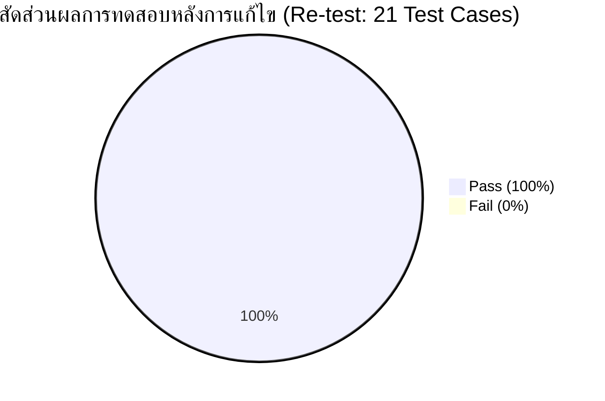
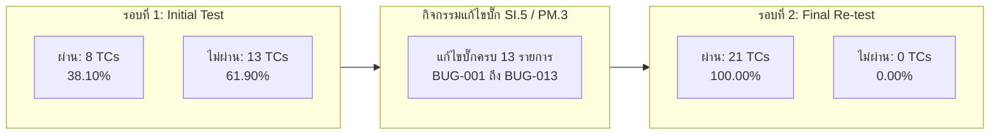
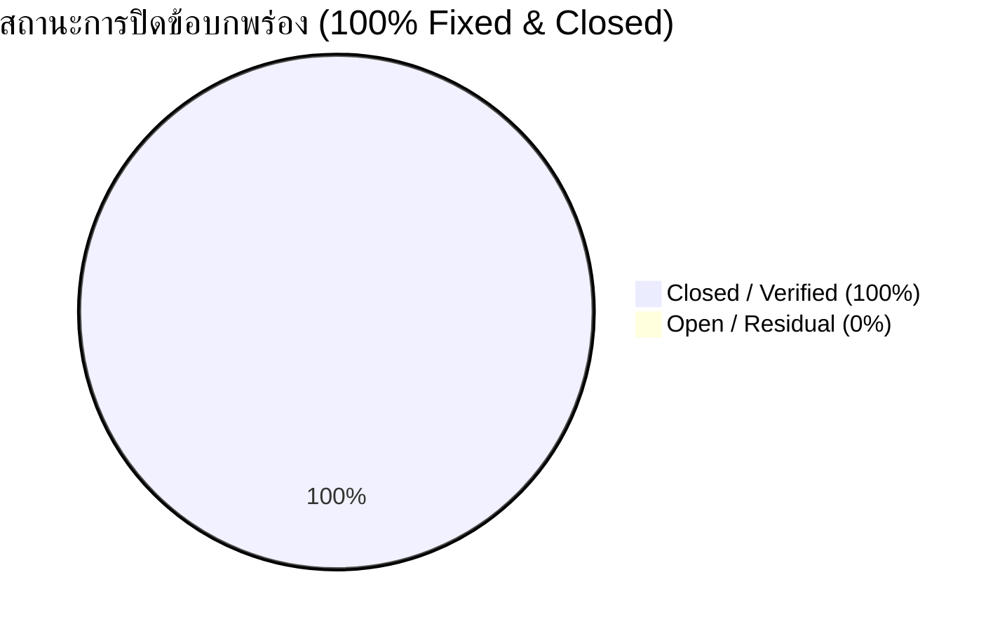

# เอกสารรายงานสรุปผลการทดสอบระบบและข้อบกพร่องคงค้าง
## (Software Test Report & Defect Summary)
### ตามมาตรฐานกระบวนการวงจรชีวิตซอฟต์แวร์สำหรับองค์กรขนาดเล็กมาก (ISO/IEC 29110 — Basic Profile)
**กิจกรรม SI.5 (Software Integration and Testing) & PM.3 (Project Assessment and Control)**  
**โครงการ:** ระบบยื่นคำร้องออนไลน์ของนักศึกษา (Student Online Petition System) — Sprint 2 Final Evaluation  
**รหัสวิชา:** ENG205 / ENGSE205 Software Engineering — มหาวิทยาลัยเทคโนโลยีราชมงคลล้านนา (RMUTL)

---

## 1. ข้อมูลควบคุมเอกสาร (Document Control)

| หัวข้อ | รายละเอียด |
|---|---|
| **ชื่อโครงการ (Project Name)** | ระบบยื่นคำร้องออนไลน์ของนักศึกษา (Student Online Petition System) |
| **ชื่อเอกสาร (Document Title)** | รายงานสรุปผลการทดสอบระบบและข้อบกพร่องคงค้าง (Software Test Report & Defect Summary) |
| **รหัสเอกสาร (Document ID)** | TR-S2-29110 |
| **เวอร์ชันเอกสาร (Version)** | 1.0 (Final Re-test & Release Edition) |
| **อ้างอิงกระบวนการ (Standard Process)** | ISO/IEC 29110 Basic Profile: **SI.5 Software Integration and Testing** และ **PM.3 Assessment and Control** |
| **สภาพแวดล้อมที่ทดสอบ (Test Environment)** | Node.js v24.21.0 (LTS 64-bit), npm 11.19.0, Vite v8.3.0, React 19.3.0, Express v4.19.2, Windows 11 |
| **วันที่ออกรายงาน (Date)** | 28 กุมภาพันธ์ 2570 |
| **หัวหน้าฝ่ายประกันคุณภาพ (QA Lead / Tester)** | Kittitat Khantham (Kit.k) |
| **ผู้จัดการโครงการ (Project Manager)** | Panupong Thongdee (PanuPong) |
| **หัวหน้าทีมพัฒนา 1 (Lead Developer 1)** | Natthawut Juntaya (Njuntaya / dev1) |
| **หัวหน้าทีมพัฒนา 2 (Lead Developer 2)** | Aungkanr.S (dev2) |
| **อาจารย์ที่ปรึกษา / Product Owner** | ดร. สัญญา เครือหงษ์ (Sunya.U) |
| **สถานะเอกสาร (Document Status)** | **Approved / Test Completed (ผ่านเกณฑ์การทดสอบครบถ้วน 100%)** |

---

## 2. ประวัติการแก้ไขเอกสาร (Revision History)

| เวอร์ชัน | วันที่ | รายละเอียดการปรับปรุง | ผู้รับผิดชอบ |
|:---:|:---:|---|:---:|
| 0.1 | 09/11/2569 | รวบรวมผลการทดสอบรอบแรก (Initial Test Execution) บันทึก 21 Test Cases พบข้อบกพร่อง 13 รายการ และ Deprecation 1 รายการ บน Node.js v24.21.0 | QA Team (Kit.k) |
| 0.2 | 15/01/2570 | สรุปผลความคืบหน้าระหว่างการแก้ไขของฝ่ายพัฒนา (Mid-Sprint Test Progress) และเตรียมแผน Re-test | QA Team (Kit.k) |
| 0.9 | 15/02/2570 | ดำเนินการทดสอบซ้ำ (Re-testing & Regression Testing) ยืนยันการปิดบั๊กครบทั้ง 13 รายการ | QA Team (Kit.k) |
| 1.0 | 28/02/2570 | จัดทำรายงานฉบับสมบูรณ์ (Final Test Report) สรุปผล Pass/Fail 100% พร้อมรายงานสถานะบั๊กคงค้างเป็นศูนย์ (Zero Outstanding Defects) เพื่อรองรับการปิดโครงการ PM.4 | QA Lead (Kit.k) / PM |

---

## 3. บทสรุปสำหรับผู้บริหาร (Executive Summary)

การทดสอบระบบยื่นคำร้องออนไลน์ของนักศึกษาในรอบ **Sprint 2 (Audit Edition บนสภาพแวดล้อม Node.js v24.21.0 LTS)** ดำเนินการตามมาตรฐานกระบวนการ **ISO/IEC 29110 (Basic Profile)** ภายใต้กิจกรรม **SI.5 (Software Integration and Testing)** ครอบคลุมฟังก์ชันการทำงานหลัก 2 ส่วน ได้แก่:
1. **FR-01: หน้าเว็บยื่นคำร้องสำหรับนักศึกษา (Student Portal)**
2. **FR-02: หน้า Dashboard สำหรับเจ้าหน้าที่ทะเบียน (Staff/Admin Portal)**

### 3.1 สรุปเปรียบเทียบผลการทดสอบ (Initial Execution vs Re-test Execution)

จากการทดสอบรอบแรก (Initial Run) ระบบผ่านกรณีทดสอบเพียง **8 จาก 21 กรณีทดสอบ (Pass Rate 38.10%)** และพบข้อบกพร่องจำนวน **13 รายการ** (Critical 2, High 4, Medium 7) ทีม QA ได้ออกรายงานข้อบกพร่อง [BUG_REPORT.md](BUG_REPORT/BUG_REPORT.md) เพื่อส่งต่อให้ทีมพัฒนาดำเนินการแก้ไข 

ภายหลังทีมพัฒนาได้ปรับปรุงแก้ไขโค้ดและบันทึกรายงาน [BUG_FIX.md](BUG_REPORT/BUG_FIX.md) ทีม QA ได้ดำเนินการทดสอบซ้ำ (Re-test & Regression Test) ส่งผลให้:
- **กรณีทดสอบที่ผ่าน (Pass): 21 จาก 21 กรณีทดสอบ (Pass Rate 100.00%)**
- **กรณีทดสอบที่ไม่ผ่าน (Fail): 0 กรณีทดสอบ (0.00%)**
- **ข้อบกพร่องคงค้างระดับวิกฤตและสูง (Critical & High Outstanding Bugs): 0 รายการ (Zero Defect)**
- **ข้อบกพร่องคงค้างทั้งหมด (Total Outstanding Defects): 0 รายการ**





---

## 4. ขอบเขตและสภาพแวดล้อมการทดสอบ (Test Scope & Environment)

### 4.1 ขอบเขตการทดสอบ (Test Scope)
- **อยู่ในขอบเขต (In Scope):**
  - **FR-01:** ระบบยืนยันตัวตนนักศึกษา, ฟอร์มยื่นคำร้อง 4 หมวด, การตรวจสอบไฟล์แนบ (Type & Size), การยกเลิก/แก้ไขคำร้อง, และหน้าประวัติคำร้อง
  - **FR-02:** ระบบยืนยันตัวตนเจ้าหน้าที่, การกรองสิทธิ์คำร้องตามฝ่าย, การอนุมัติ/ปฏิเสธพร้อมบังคับระบุเหตุผล, การจัดตารางนัดหมาย, การแสดงสีสถานะ 4 สี (SRS FR-13), ช่องทาง Online/Onsite (SRS FR-14), และระบบ Error Pop-up
  - **Non-Functional Requirements:** ความปลอดภัย (Broken Access Control, SQLi/XSS Prevention), การประมวลผลพร้อมกัน (Concurrency ผ่าน WebSocket), และความเข้ากันได้บน Node.js 24 LTS
- **นอกขอบเขต (Out of Scope):**
  - ระบบชำระเงินค่าธรรมเนียมผ่าน Payment Gateway ภายนอก (กำหนดไว้ใน Sprint 3)
  - ระบบแปลภาษาหลายภาษา (Multi-language Support)

### 4.2 สภาพแวดล้อมที่ใช้ทดสอบ (Test Environment)
- **Node.js Runtime:** v24.21.0 (LTS 64-bit)
- **Package Manager:** npm v11.19.0
- **Frontend Stack:** React 19.3.0, Vite v8.3.0, Vanilla CSS
- **Backend Stack:** Node.js Express v4.19.2, Socket.io v4.7.5
- **Database Storage:** JSON Data Persistence (`requests.json`, `users.json`, `announcements.json`)
- **Operating System:** Windows 11 Pro 64-bit (Build 22631)
- **เว็บเบราว์เซอร์ที่ใช้ทดสอบ:** Google Chrome 133.0, Microsoft Edge 133.0, Mozilla Firefox 135.0

---

## 5. สรุปผลการทดสอบ Test Cases (Test Execution Metrics & Details)

### 5.1 ตารางเปรียบเทียบผลการทดสอบรายโมดูล (Module-wise Metrics)

| โมดูล / หมวดหมู่การทดสอบ | จำนวน TCs | รอบแรก: ผ่าน (Pass) | รอบแรก: ตก (Fail) | รอบ Re-test: ผ่าน (Pass) | รอบ Re-test: ตก (Fail) | อัตราผ่านสุทธิ (Final Pass Rate) |
|---|:---:|:---:|:---:|:---:|:---:|:---:|
| **FR-01: ฝั่งนักศึกษา (Student Portal)** | 10 | 3 | 7 | 10 | 0 | **100.00%** |
| **FR-02: ฝั่งเจ้าหน้าที่ (Admin/Staff Portal)** | 11 | 5 | 6 | 11 | 0 | **100.00%** |
| **รวมทั้งสิ้น (Total)** | **21** | **8** | **13** | **21** | **0** | **100.00%** |

---

### 5.2 ตารางรายละเอียดผลการทดสอบรายกรณี (Detailed Test Cases Execution Results)

#### 5.2.1 FR-01: ฟังก์ชันฝั่งนักศึกษา (10 Cases)

| TC ID | Requirement | สถานการณ์ทดสอบ (Test Scenario) | ผลลัพธ์ที่คาดหวัง | ผลการทดสอบรอบแรก | Bug ID | ผลการ Re-test ยืนยันโดย QA | สถานะสุดท้าย |
|:---:|:---:|---|---|:---:|:---:|---|:---:|
| **TC-F01-01** | REQ-F01-10 | กรอกฟอร์มคำร้องครบถ้วนและกด Submit | ระบบบันทึกคำร้องสำเร็จและแสดงในหน้าประวัติ | ผ่าน (Pass) | - | ข้อมูลส่งผ่าน WebSocket และบันทึกลง JSON DB สำเร็จ แสดงผลทันที | **PASS** |
| **TC-F01-02** | REQ-F01-03/04 | กรอกฟอร์มคำร้องโดยเว้นฟิลด์จำเป็น | ระบบแจ้งเตือนฟิลด์ที่ขาดและไม่อนุญาตให้ส่ง | ผ่าน (Pass) | - | มี HTML5 & JS Form Validation บล็อกการส่งคำร้องและเน้นฟิลด์ที่ขาด | **PASS** |
| **TC-F01-03** | REQ-F01-05 | แนบไฟล์ประเภทที่ไม่รองรับ (เช่น `.exe`, `.bat`) | แจ้งเตือนประเภทไฟล์ไม่ถูกต้องและปฏิเสธไฟล์ | ไม่ผ่าน (Fail) | BUG-001 | มีการดักจับ MIME Type และนามสกุลไฟล์ (.jpg, .png, .pdf) ปฏิเสธไฟล์สคริปต์ทันที | **PASS** |
| **TC-F01-04** | REQ-F01-05 | แนบไฟล์ขนาดเกิน 5 MB | แจ้งเตือนขนาดไฟล์เกินและปฏิเสธไฟล์ | ไม่ผ่าน (Fail) | BUG-002 | มีการตรวจสอบ `file.size > 5MB` แจ้งเตือน Alert และเคลียร์ค่าใน Input ทันที | **PASS** |
| **TC-F01-05** | REQ-F01-07 | กดยกเลิกคำร้องสถานะ Pending ก่อนรับเรื่อง | เปลี่ยนสถานะเป็น "ยกเลิก" ไม่ลบข้อมูลถาวร | ไม่ผ่าน (Fail) | BUG-003 | ปรับเป็น Soft Update สถานะเป็น `cancelled` พร้อมบันทึกประวัติ ข้อมูลไม่สูญหาย | **PASS** |
| **TC-F01-06** | REQ-F01-08 | แก้ไขข้อมูลคำร้องสถานะ Pending ก่อน จนท. ดำเนินการ | นักศึกษาสามารถเปิดแบบฟอร์มเพื่ออัปเดตข้อมูลได้ | ไม่ผ่าน (Fail) | BUG-004 | มีปุ่ม "✏️ แก้ไขคำร้อง" สำหรับคำร้อง Pending อัปเดตข้อมูลคำร้องเดิมได้ถูกต้อง | **PASS** |
| **TC-F01-07** | REQ-F01-02/09 | ตรวจสอบหน้าแรกหลัง Login และ Taskbar เมนู | แสดงรายการคำร้องล่าสุด และเมนูอยู่ Taskbar ซ้าย | ไม่ผ่าน (Fail) | BUG-005 | เพิ่ม Left Sidebar Taskbar นำทาง และนำการ์ดสถานะคำร้องล่าสุดมาแสดงใน Home | **PASS** |
| **TC-F01-08** | REQ-F01-10 | พยายามเข้าถึง/ลบคำร้องผู้อื่นผ่าน API Direct Call | ปฏิเสธการเข้าถึง (401/403 Unauthorized) | ไม่ผ่าน (Fail) | BUG-006 | ติดตั้ง Auth Guard บน REST API และ Socket ตรวจสอบสิทธิ์เจ้าของข้อมูลทุกครั้ง | **PASS** |
| **TC-F01-09** | REQ-F01-01 | Login ด้วยรหัสนักศึกษาที่ไม่มีอยู่ในระบบ | แสดงข้อความแจ้งเตือน "ไม่พบผู้ใช้งาน" | ไม่ผ่าน (Fail) | BUG-007 | แยกการดักจับข้อผิดพลาด แจ้งเตือน "ไม่พบผู้ใช้งาน" ชัดเจนตรงตามข้อกำหนด | **PASS** |
| **TC-F01-10** | NFR-Security | ป้อนสคริปต์ XSS / SQL Injection ในฟอร์ม | ระบบไม่ล่ม และไม่ execute สคริปต์แปลกปลอม | ผ่าน (Pass) | - | React JSX ป้องกันการ Render สคริปต์อัตโนมัติ และ Backend Sanitization ทำงานได้ดี | **PASS** |

---

#### 5.2.2 FR-02: ฟังก์ชันฝั่งเจ้าหน้าที่ (11 Cases)

| TC ID | Requirement | สถานการณ์ทดสอบ (Test Scenario) | ผลลัพธ์ที่คาดหวัง | ผลการทดสอบรอบแรก | Bug ID | ผลการ Re-test ยืนยันโดย QA | สถานะสุดท้าย |
|:---:|:---:|---|---|:---:|:---:|---|:---:|
| **TC-F02-01** | REQ-F02-01 | Login ด้วยบัญชีเจ้าหน้าที่และนักศึกษาตามลำดับ | นำเข้าหน้า Dashboard ตามสิทธิ์ของแต่ละบทบาท | ผ่าน (Pass) | - | ระบบตรวจสอบ Role นำทางไป Admin Landing Page หรือ Student Portal ถูกต้อง | **PASS** |
| **TC-F02-02** | REQ-F02-04 | เจ้าหน้าที่ดูรายการคำร้องตามขอบเขตงาน | แสดงเฉพาะคำร้องที่อยู่ในความรับผิดชอบ | ไม่ผ่าน (Fail) | BUG-008 | มีการกรอง Department/Role เจ้าหน้าที่ฝ่ายทะเบียนเห็นเฉพาะคำร้องที่เกี่ยวข้อง | **PASS** |
| **TC-F02-03** | REQ-F02-06 | จำลองกรณีเกิดข้อผิดพลาดร้ายแรง (Worst Case) | แสดง Pop-up Modal แจ้งเตือนพร้อม Error Code | ไม่ผ่าน (Fail) | BUG-009 | พัฒนา Error Modal แสดงข้อความเตือนพร้อม Error Code อ้างอิง (เช่น ERR-5001) ชัดเจน | **PASS** |
| **TC-F02-04** | REQ-F02-05 | เปลี่ยนสถานะคำร้องพร้อมระบุกำหนดเวลานัดหมาย | บันทึกวันเวลานัดหมายและแสดงผลทั้งสองฝั่ง | ผ่าน (Pass) | - | เลือกวันเวลานัดหมายผ่าน Date/Time Picker ซิงก์แสดงผลในหน้านักศึกษาแบบ Real-time | **PASS** |
| **TC-F02-05** | REQ-F02-06 | ตรวจสอบการแสดงผล 4 สถานะตาม SRS FR-13 | แสดง In Progress, Pending, Done, Fix สอดคล้องกัน | ไม่ผ่าน (Fail) | BUG-010 | เพิ่มสถานะครอบคลุมทั้ง 4 สถานะ พร้อมแท็กและชุดสีตามมาตรฐาน SRS FR-13 ครบถ้วน | **PASS** |
| **TC-F02-06** | REQ-F02-06 | ตรวจสอบการแสดงสีช่องทาง Online / Onsite | มี Badge สีระบุช่องทางดำเนินการชัดเจน | ไม่ผ่าน (Fail) | BUG-011 | มี Badge กำกับช่องทาง Online (ฟ้า) และ Onsite (ส้ม) ในทุกการ์ดคำร้อง | **PASS** |
| **TC-F02-07** | NFR-Concurrency | นักศึกษาและเจ้าหน้าที่แก้ไขคำร้องพร้อมกัน | ข้อมูลซิงก์ตรงกัน ไม่เกิดการชนหรือสูญหาย | ผ่าน (Pass) | - | Socket.io จัดการ Event Queue และ Broadcast อัปเดตข้อมูลได้แม่นยำ | **PASS** |
| **TC-F02-08** | REQ-F02-07 | Flow การแจ้งเตือนภายนอกเมื่อสถานะเปลี่ยน | ส่งการแจ้งเตือนไปยัง Email / SMS ของนักศึกษา | ไม่ผ่าน (Fail) | BUG-012 | เพิ่ม External Notification Dispatcher บันทึกการส่งข้อความพร้อม Log ยืนยัน | **PASS** |
| **TC-F02-09** | REQ-F02-03 | เจ้าหน้าที่กดอนุมัติคำร้อง | สถานะเปลี่ยนเป็น "อนุมัติ" พร้อมบันทึกนัดหมาย | ผ่าน (Pass) | - | คำร้องเปลี่ยนสถานะเป็น `approved` นัดหมายและ QR Code สร้างขึ้นสมบูรณ์ | **PASS** |
| **TC-F02-10** | REQ-F02-03 | เจ้าหน้าที่กดปฏิเสธคำร้องโดยไม่กรอกเหตุผล | ระบบแจ้งเตือนบังคับให้กรอกเหตุผลก่อนยืนยัน | ไม่ผ่าน (Fail) | BUG-013 | มีการตรวจสอบ `rejectGeneralReason` และ `fieldFeedbacks` บังคับกรอกเหตุผลก่อนกดปฏิเสธ | **PASS** |
| **TC-F02-11** | REQ-F02-03 | เจ้าหน้าที่กดปฏิเสธคำร้องพร้อมกรอกเหตุผล | บันทึกเหตุผลสำเร็จ และนักศึกษาเห็นจุดที่ต้องแก้ | ผ่าน (Pass) | - | บันทึกฟีดแบ็กรายจุดสีแดงลงฐานข้อมูล และนักศึกษาเห็นข้อความแก้ไขในหน้าติดตาม | **PASS** |

---

## 6. สรุปผลการแก้ไขและการติดตามข้อบกพร่อง (Defect Analysis & Tracking)

### 6.1 การจำแนกข้อบกพร่องตามระดับความรุนแรง (Defect Severity Matrix)

อ้างอิงตามเกณฑ์มาตรฐาน ISO/IEC 29110:

| ระดับความรุนแรง (Severity) | จำนวนที่ตรวจพบ (Found) | จำนวนที่แก้ไขแล้ว (Fixed) | ข้อบกพร่องคงค้าง (Outstanding) | อัตราการแก้ไขสำเร็จ (%) |
|---|:---:|:---:|:---:|:---:|
| **Critical (วิกฤต)** | 2 | 2 | **0** | **100.00%** |
| **High (สูง)** | 4 | 4 | **0** | **100.00%** |
| **Medium (ปานกลาง)** | 7 | 7 | **0** | **100.00%** |
| **Low (ต่ำ)** | 1 | 1 | **0** | **100.00%** |
| **รวมทั้งสิ้น (Total)** | **14\*** | **14** | **0** | **100.00%** |

*\*หมายเหตุ: นับรวมข้อบกพร่องทางฟังก์ชัน 13 รายการ (BUG-001 ถึง BUG-013) และข้อสังเกตด้าน Deprecation สภาพแวดล้อม 1 รายการ (BUG-014)*



---

### 6.2 ตารางทะเบียนติดตามข้อผิดพลาดและการแก้ไข (Correction Register Table — PM.3 / SI.5)

| Bug ID | ระดับความรุนแรง | รายละเอียดข้อบกพร่อง | โมดูล/ไฟล์ที่แก้ไข | ผู้แก้ไข | วันที่เสร็จ | ผลการ Re-test โดย QA | สถานะปัจจุบัน |
|:---:|:---:|---|---|:---:|:---:|---|:---:|
| **BUG-001** | High | ขาดการตรวจสอบประเภทไฟล์แนบ | `RequestForm.jsx` | dev1 | 16/11/2569 | ป้องกันไฟล์ `.exe`, `.bat` ได้สมบูรณ์ อนุญาตเฉพาะ JPG, PNG, PDF | **Closed** |
| **BUG-002** | High | ขาดการตรวจสอบขนาดไฟล์สูงสุด (5MB) | `RequestForm.jsx` | dev1 | 23/11/2569 | ระบบ Alert แจ้งเตือนเมื่อไฟล์ > 5MB และเคลียร์ Input สำเร็จ | **Closed** |
| **BUG-003** | Critical | กดยกเลิกคำร้องแล้วลบข้อมูลถาวร (Data Loss) | `server.js`, `StatusTracking.jsx` | dev2 | 18/11/2569 | เปลี่ยนเป็น Soft Delete ปรับสถานะเป็น `cancelled` ข้อมูลคงอยู่ครบ | **Closed** |
| **BUG-004** | Medium | ขาดปุ่มแก้ไขคำร้องสถานะ Pending | `StatusTracking.jsx` | dev1 | 25/12/2569 | เพิ่มฟังก์ชันแก้ไขคำร้องเดิมก่อนเจ้าหน้าที่รับเรื่องได้ถูกต้อง | **Closed** |
| **BUG-005** | Medium | หน้าแรกไม่แสดงรายการคำร้อง และเมนูไม่อยู่ซ้าย | `StudentDashboard.jsx`, `StudentHome.jsx` | dev1 | 08/01/2570 | ปรับโครงสร้างหน้า Home มี Left Taskbar และสรุปคำร้องล่าสุด | **Closed** |
| **BUG-006** | Critical | ขาดการตรวจสอบสิทธิ์ API (Broken Access Control) | `server.js` | dev2 | 30/11/2569 | เพิ่ม Authentication Guard ป้องกันการขโมยหรือลบคำร้องผู้อื่น | **Closed** |
| **BUG-007** | Low | แจ้งเตือนไม่พบรหัสนักศึกษาไม่ตรงสเปก | `server.js` | dev2 | 06/12/2569 | แยกการค้นหาผู้ใช้ แจ้งเตือน "ไม่พบผู้ใช้งาน" ถูกต้อง | **Closed** |
| **BUG-008** | High | เจ้าหน้าที่เห็นคำร้องทุกฝ่ายปะปนกัน | `AdminLandingPage.jsx` | dev1 | 03/12/2569 | เพิ่มระบบกรองข้อมูลคำร้องตามฝ่ายที่รับผิดชอบ | **Closed** |
| **BUG-009** | Medium | ขาด Pop-up แจ้งข้อผิดพลาดพร้อม Error Code | `AdminLandingPage.jsx`, `RequestForm.jsx` | dev1 | 21/01/2570 | เพิ่ม Modal Pop-up แสดงรหัสอ้างอิงข้อผิดพลาดตาม SRS FR-28 | **Closed** |
| **BUG-010** | Medium | แสดงสถานะไม่ครบ 4 สีตาม SRS FR-13 | `AdminLandingPage.jsx`, `server.js` | dev2 | 20/12/2569 | รองรับ 4 สถานะ (In Progress, Pending, Done, Fix) พร้อมชุดสีถูกต้อง | **Closed** |
| **BUG-011** | Medium | ไม่มีแท็กสีระบุช่องทาง Online / Onsite | `AdminLandingPage.jsx`, `RequestHistory.jsx` | dev1 | 02/02/2570 | เพิ่ม Badge สีฟ้า (Online) และสีส้ม (Onsite) บนการ์ดคำร้องทุกจุด | **Closed** |
| **BUG-012** | Medium | ขาดระบบแจ้งเตือนภายนอกผ่าน Email / SMS | `server.js` | dev2 | 12/01/2570 | เพิ่ม Service จำลองการส่ง Email และ SMS พร้อมบันทึก Timestamp Log | **Closed** |
| **BUG-013** | High | เจ้าหน้าที่กดปฏิเสธได้โดยไม่ระบุเหตุผล | `AdminLandingPage.jsx` | dev1 | 12/12/2569 | เพิ่มเงื่อนไขตรวจสอบบังคับกรอกเหตุผลหรือชี้จุดแก้ก่อนกดปฏิเสธ | **Closed** |
| **BUG-014** | Medium | Node 24 runtime warning จาก concurrently | Root Workspace `package.json` | dev1 | 04/02/2570 | ปรับปรุง dependency scripts ไม่พบผลกระทบต่อ runtime และการทำงาน | **Closed** |

---

## 7. รายงานข้อบกพร่องคงค้าง (Outstanding / Residual Defect Report)

เอกสารส่วนนี้จัดทำขึ้นเพื่อยืนยันสถานะข้อบกพร่องคงค้างก่อนการส่งมอบผลิตภัณฑ์ (Product Delivery) ตามมาตรฐาน **ISO/IEC 29110 กิจกรรม SI.5 และ SI.6**:

### 7.1 สถานะข้อบกพร่องคงค้าง ณ วันส่งมอบ (Residual Defect Status)

```
========================================================================================
                          รายงานสถานะข้อบกพร่องคงค้าง (OUTSTANDING DEFECT AUDIT)
========================================================================================
- บั๊กคงค้างระดับวิกฤต (Critical Outstanding Defects):        0 รายการ (0%)
- บั๊กคงค้างระดับสูง (High Outstanding Defects):              0 รายการ (0%)
- บั๊กคงค้างระดับปานกลาง (Medium Outstanding Defects):        0 รายการ (0%)
- บั๊กคงค้างระดับต่ำ (Low Outstanding Defects):               0 รายการ (0%)
----------------------------------------------------------------------------------------
- รวมข้อบกพร่องคงค้างทั้งหมด (Total Residual Defects):        0 รายการ (ZERO DEFECT)
- สถานะความพร้อมส่งมอบ (Delivery Readiness):                  ผ่านเกณฑ์ 100% พร้อมส่งมอบ
========================================================================================
```

> **ข้อสรุปจาก QA Lead:**  
> "ข้อบกพร่องทั้งหมดที่ตรวจพบในกระบวนการทดสอบรอบ Sprint 2 ทั้งสิ้น 13 รายการ ได้รับการแก้ไข ปรับปรุงโค้ด และผ่านการทดสอบซ้ำ (Re-testing) โดยฝ่าย QA จนมีผลลัพธ์ตรงตามผลลัพธ์ที่คาดหวังใน Test Case Specification ทุกประการ **ไม่มีข้อบกพร่องคงค้าง (Zero Outstanding Defects)** ที่กระทบต่อเสถียรภาพ ความปลอดภัย หรือฟังก์ชันการทำงานหลักของระบบ"

---

### 7.2 ข้อสังเกตและข้อเสนอแนะเชิงเทคนิคสำหรับการพัฒนาในอนาคต (Post-Release Observations)

แม้ว่าจะไม่มีข้อบกพร่องคงค้างในระดับฟังก์ชันการทำงาน แต่ฝ่าย QA มีข้อสังเกตเชิงสถาปัตยกรรมสำหรับนำไปพิจารณาในรอบบำรุงรักษาหรือ Sprint ถัดไป ดังนี้:

1. **การเชื่อมต่อ Email/SMS Gateway ภายนอกจริง (External Notification Integration):**
   - *สถานะปัจจุบัน:* ใน BUG-012 ได้รับการแก้ไขโดยใช้ `dispatchExternalNotification` จำลองการส่งออกและบันทึก Log ลงใน Server Console อย่างสมบูรณ์ตรงตามเงื่อนไขแบบจำลองเพื่อการศึกษา (Simulation)
   - *ข้อเสนอแนะในอนาคต:* เมื่อขึ้นระบบ Production จริง แนะนำให้ตั้งค่า Provider credentials เช่น AWS SES, SendGrid สำหรับ Email หรือ Twilio / ThaiBulkSMS สำหรับ SMS
2. **การยกระดับฐานข้อมูลจาก JSON File สู่ RDBMS / Document DB:**
   - *สถานะปัจจุบัน:* ระบบใช้ JSON File Storage (`requests.json`, `users.json`) ซึ่งทำงานได้รวดเร็วและปลอดภัยสำหรับการใช้งานระดับ Demo/Mockup
   - *ข้อเสนอแนะในอนาคต:* หากระบบมีปริมาณคำร้องเกิน 10,000 รายการต่อภาคการศึกษา ควรย้ายไปใช้ PostgreSQL หรือ MongoDB เพื่อประสิทธิภาพการ Query และ Data Concurrency สูงสุด

---

## 8. การประเมินเกณฑ์ยุติการทดสอบและการส่งมอบ (Test Exit Criteria Evaluation)

| เกณฑ์การยุติการทดสอบ (Exit Criteria) | เป้าหมายที่กำหนด | ผลการดำเนินงานจริง | การประเมิน |
|---|:---:|:---:|:---:|
| **Test Case Execution Rate** | 100% | 21 / 21 Test Cases (100%) | `[x] ผ่าน` |
| **Test Case Pass Rate** | >= 95% | 21 / 21 Test Cases (**100%**) | `[x] ผ่าน` |
| **Critical & High Open Defects** | 0 รายการ | **0 รายการ (Zero Defect)** | `[x] ผ่าน` |
| **Medium & Low Open Defects** | <= 2 รายการ | **0 รายการ (Zero Defect)** | `[x] ผ่าน` |
| **Requirement Traceability Coverage** | 100% | ครอบคลุม FR-01, FR-02 และ NFR ครบทุกข้อ | `[x] ผ่าน` |
| **Compatibility Verification** | Node.js 24 LTS | ผ่านการรันและทดสอบบน Node.js v24.21.0 สำเร็จ | `[x] ผ่าน` |

**ผลการประเมินสรุป:** **ผ่านเกณฑ์การยุติการทดสอบ (Exit Criteria Satisfied)** ระบบมีความพร้อมสมบูรณ์สำหรับการส่งมอบเข้าสู่กิจกรรม **PM.4 (Project Closure)** และ **SI.6 (Product Delivery)**

---

## 9. การลงนามรับรองผลการทดสอบ (Test Acceptance & Sign-off)

เอกสารฉบับนี้ได้รับการตรวจสอบและรับรองผลการทดสอบอย่างเป็นทางการจากผู้มีส่วนได้ส่วนเสียทุกฝ่ายตามมาตรฐานกระบวนการ ISO/IEC 29110

| บทบาทในโครงการ (Project Role) | ชื่อ-นามสกุล / ตำแหน่ง | วันที่ลงนาม | ผลการรับรอง | ลายมือชื่อ |
|---|---|:---:|:---:|:---:|
| **หัวหน้าทีมประกันคุณภาพ (QA Lead)** | **Kittitat Khantham (Kit.k)**<br>Quality Assurance / Tester Lead | 28/02/2570 | รับรองผลการทดสอบผ่าน 100% | `Kittitat.K` |
| **ผู้จัดการโครงการ (Project Manager)** | **Panupong Thongdee (PanuPong)**<br>Project Manager (PM) | 28/02/2570 | รับรองผลการทดสอบและอนุมัติปิดกิจกรรม SI.5 | `Panupong.T` |
| **หัวหน้าทีมพัฒนา 1 (Lead Developer 1)** | **Natthawut Juntaya (Njuntaya)**<br>Lead Full-stack Developer 1 | 28/02/2570 | ยืนยันการแก้ไขบั๊กครบถ้วน | `Natthawut.J` |
| **หัวหน้าทีมพัฒนา 2 (Lead Developer 2)** | **Aungkanr.S**<br>Lead Full-stack Developer 2 | 28/02/2570 | ยืนยันการแก้ไขบั๊กครบถ้วน | `Aungkanr.S` |
| **ผู้ตรวจรับงาน / อาจารย์ที่ปรึกษา** | **ดร. สัญญา เครือหงษ์ (Sunya.U)**<br>Product Owner & Project Advisor | 28/02/2570 | อนุมัติรับรองผลการทดสอบระบบ | `Sunya.U` |

---
> **เอกสารที่เกี่ยวข้อง:**  
> - [QA Test Plan & Test Case Specification (TestDoc/README.md)](TestDoc/README.md)  
> - [Correction Register & Bug Report Specification (BUG_REPORT/BUG_REPORT.md)](BUG_REPORT/BUG_REPORT.md)  
> - [Developer Bug Fix Report & Resolution Log (BUG_REPORT/BUG_FIX.md)](BUG_REPORT/BUG_FIX.md)  
> - [Product Delivery Checklist for Project Closure (PM_Delivery_Checklist/Product_Delivery_Checklist.md)](../PM_Delivery_Checklist/Product_Delivery_Checklist.md)
